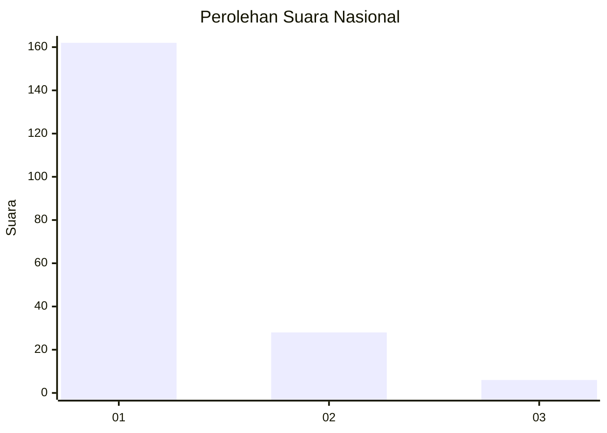
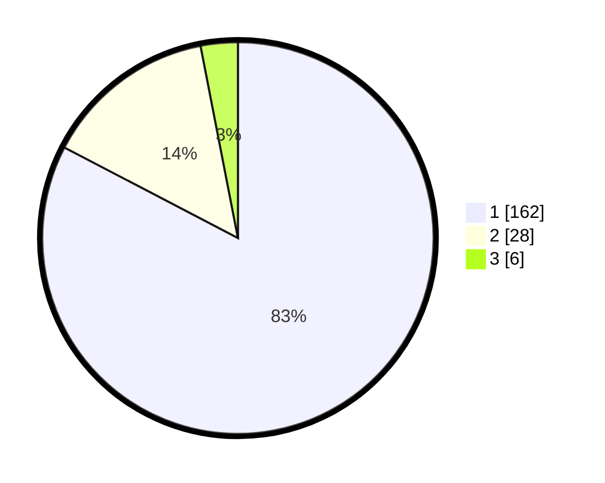

# Hasil

## Grafik

## Tabel

| No. | Nama Paslon    | Suara | Suara (raw) | Persentase |
|:--- |:-------------- | -----:| -----------:| ----------:|
| 1   | ANIES MUHAIMIN | 162   | [162][p-1]  | 82,65      |
| 2   | PRABOWO GIBRAN | 28    | [28][p-2]   | 14,29      |
| 3   | GANJAR MAHFUD  | 6     | [6][p-3]    | 3,06       |

[p-1]: https://github.com/gigit-pemilu/pemilu-2024/blob/main/pilpres/hitung-suara/sub/11-aceh/sub/18-pidie-jaya/sub/06-bandar-baru/sub/2013-peub-lueng-nibong/sub/003-tps/sub/paslon-1.txt
[p-2]: https://github.com/gigit-pemilu/pemilu-2024/blob/main/pilpres/hitung-suara/sub/11-aceh/sub/18-pidie-jaya/sub/06-bandar-baru/sub/2013-peub-lueng-nibong/sub/003-tps/sub/paslon-2.txt
[p-3]: https://github.com/gigit-pemilu/pemilu-2024/blob/main/pilpres/hitung-suara/sub/11-aceh/sub/18-pidie-jaya/sub/06-bandar-baru/sub/2013-peub-lueng-nibong/sub/003-tps/sub/paslon-3.txt

## Foto C Plano

https://sirekap-obj-formc.kpu.go.id/e7c5/pemilu/ppwp/11/18/06/20/13/1118062013003-20240215-033431--ec06314c-4637-4d4e-ba5f-1734109217bd.jpg

https://sirekap-obj-formc.kpu.go.id/e7c5/pemilu/ppwp/11/18/06/20/13/1118062013003-20240215-033729--fcfdbf5f-1504-4eb4-8d42-f67d8cd41adc.jpg

https://sirekap-obj-formc.kpu.go.id/e7c5/pemilu/ppwp/11/18/06/20/13/1118062013003-20240215-033836--45d7a4ed-a4e6-48b6-85d1-221b77712f85.jpg

## Metadata

| Key        | Value               |
| ---------- | ------------------- |
| Time Stamp | 2024-02-15 21:30:27 |

