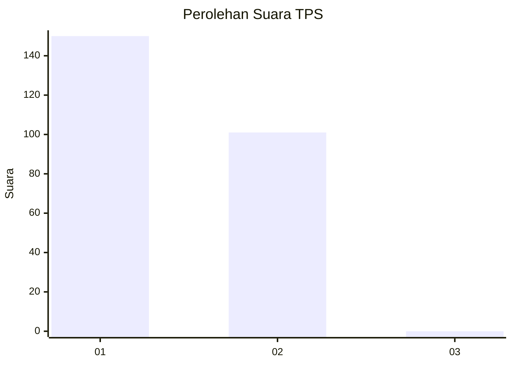
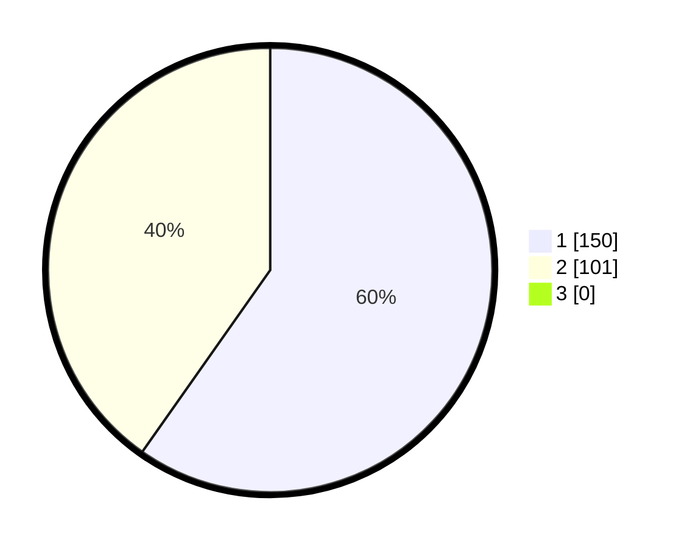

# Hasil

## Grafik

## Tabel

| No. | Nama Paslon    | Suara | Suara (raw) | Persentase |
|:--- |:-------------- | -----:| -----------:| ----------:|
| 1   | ANIES MUHAIMIN | 150   | [150][p-1]  | 59,76      |
| 2   | PRABOWO GIBRAN | 101   | [101][p-2]  | 40,24      |
| 3   | GANJAR MAHFUD  | 0     | [0][p-3]    | 0,00       |

[p-1]: https://github.com/gigit-pemilu/pemilu-2024-11-aceh/blob/main/pilpres/hitung-suara/sub/11-aceh/sub/18-pidie-jaya/sub/06-bandar-baru/sub/2014-baroh-musa/sub/001-tps/sub/paslon-1.txt
[p-2]: https://github.com/gigit-pemilu/pemilu-2024-11-aceh/blob/main/pilpres/hitung-suara/sub/11-aceh/sub/18-pidie-jaya/sub/06-bandar-baru/sub/2014-baroh-musa/sub/001-tps/sub/paslon-2.txt
[p-3]: https://github.com/gigit-pemilu/pemilu-2024-11-aceh/blob/main/pilpres/hitung-suara/sub/11-aceh/sub/18-pidie-jaya/sub/06-bandar-baru/sub/2014-baroh-musa/sub/001-tps/sub/paslon-3.txt

## Foto C Plano

https://sirekap-obj-formc.kpu.go.id/9313/pemilu/ppwp/11/18/06/20/14/1118062014001-20240215-060935--87235ed0-9514-4d18-8b7e-8aee548ea9af.jpg

https://sirekap-obj-formc.kpu.go.id/9313/pemilu/ppwp/11/18/06/20/14/1118062014001-20240215-061958--efd511f9-eba4-4891-864a-fb11c0ccd753.jpg

https://sirekap-obj-formc.kpu.go.id/9313/pemilu/ppwp/11/18/06/20/14/1118062014001-20240215-062106--a55fbd08-8f47-4101-9f0e-a21df2809359.jpg

## Metadata

| Key        | Value               |
| ---------- | ------------------- |
| Time Stamp | 2024-02-15 22:30:27 |

