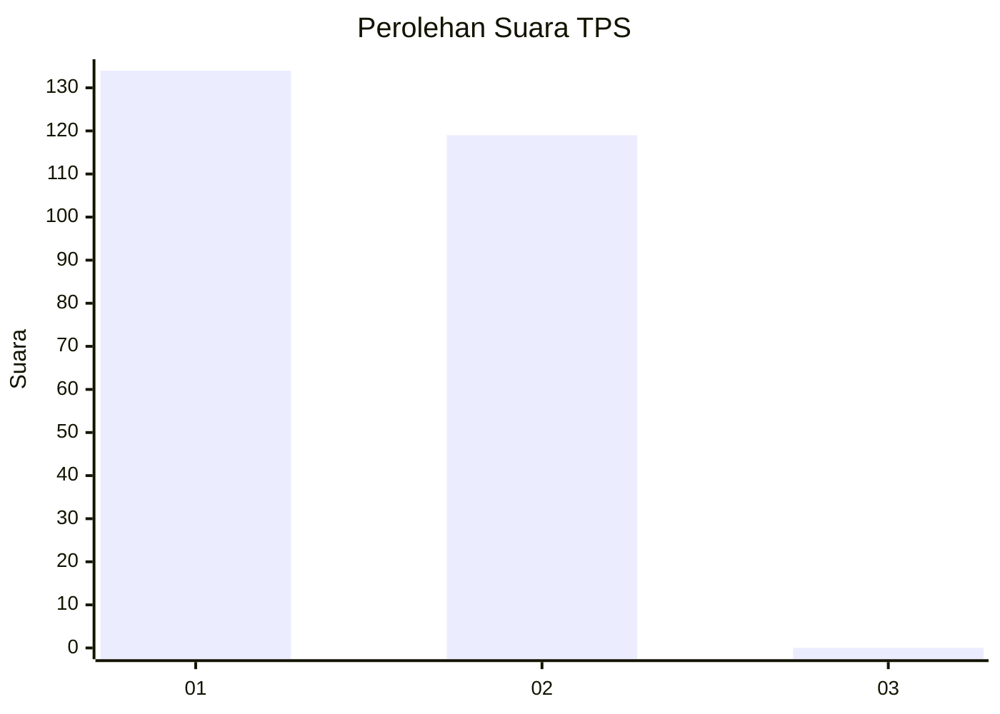
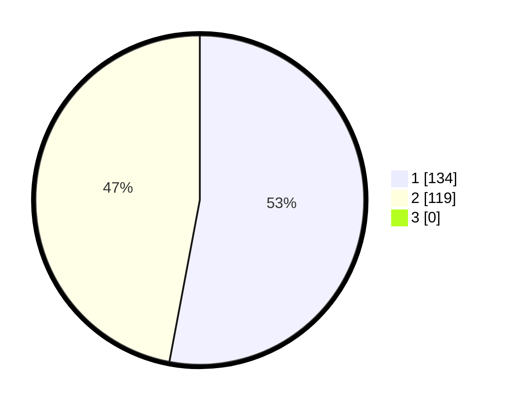

# Hasil

## Grafik

## Tabel

| No. | Nama Paslon    | Suara | Suara (raw) | Persentase |
|:--- |:-------------- | -----:| -----------:| ----------:|
| 1   | ANIES MUHAIMIN | 134   | [134][p-1]  | 52,96      |
| 2   | PRABOWO GIBRAN | 119   | [119][p-2]  | 47,04      |
| 3   | GANJAR MAHFUD  | 0     | [0][p-3]    | 0,00       |

[p-1]: https://github.com/gigit-pemilu/pemilu-2024-11-aceh/blob/main/pilpres/hitung-suara/sub/11-aceh/sub/18-pidie-jaya/sub/06-bandar-baru/sub/2014-baroh-musa/sub/002-tps/sub/paslon-1.txt
[p-2]: https://github.com/gigit-pemilu/pemilu-2024-11-aceh/blob/main/pilpres/hitung-suara/sub/11-aceh/sub/18-pidie-jaya/sub/06-bandar-baru/sub/2014-baroh-musa/sub/002-tps/sub/paslon-2.txt
[p-3]: https://github.com/gigit-pemilu/pemilu-2024-11-aceh/blob/main/pilpres/hitung-suara/sub/11-aceh/sub/18-pidie-jaya/sub/06-bandar-baru/sub/2014-baroh-musa/sub/002-tps/sub/paslon-3.txt

## Foto C Plano

https://sirekap-obj-formc.kpu.go.id/0b3a/pemilu/ppwp/11/18/06/20/14/1118062014002-20240215-063816--2a2a8f3a-b214-46ad-833a-ea0c7912286b.jpg

https://sirekap-obj-formc.kpu.go.id/0b3a/pemilu/ppwp/11/18/06/20/14/1118062014002-20240215-064027--bc62dca8-35d4-4b56-8934-e823dfd1e993.jpg

https://sirekap-obj-formc.kpu.go.id/0b3a/pemilu/ppwp/11/18/06/20/14/1118062014002-20240215-064243--c015a148-7874-4ba0-b491-40088a793b4f.jpg

## Metadata

| Key        | Value               |
| ---------- | ------------------- |
| Time Stamp | 2024-02-15 22:30:27 |

