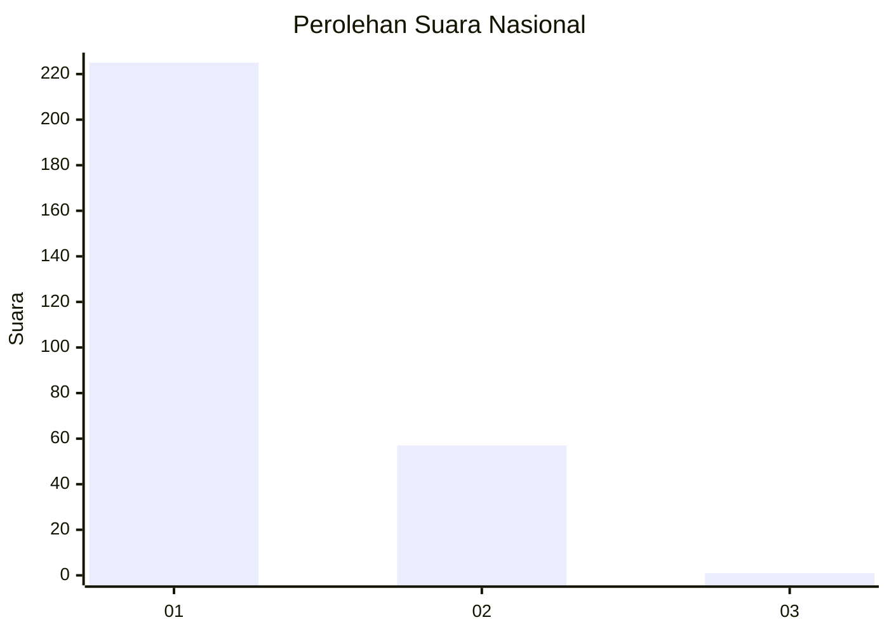
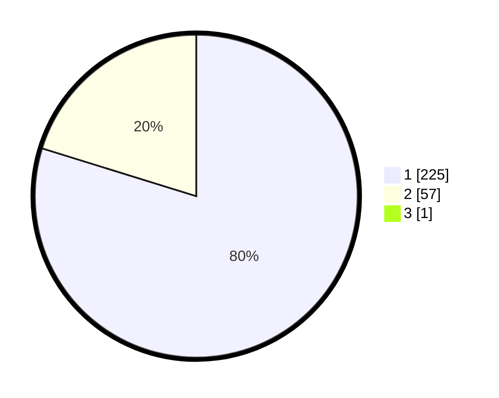

# Hasil

## Grafik

## Tabel

| No. | Nama Paslon    | Suara | Suara (raw) | Persentase |
|:--- |:-------------- | -----:| -----------:| ----------:|
| 1   | ANIES MUHAIMIN | 225   | [225][p-1]  | 79,51      |
| 2   | PRABOWO GIBRAN | 57    | [57][p-2]   | 20,14      |
| 3   | GANJAR MAHFUD  | 1     | [1][p-3]    | 0,35       |

[p-1]: https://github.com/gigit-pemilu/pemilu-2024/blob/main/pilpres/hitung-suara/sub/11-aceh/sub/18-pidie-jaya/sub/06-bandar-baru/sub/2014-baroh-musa/sub/003-tps/sub/paslon-1.txt
[p-2]: https://github.com/gigit-pemilu/pemilu-2024/blob/main/pilpres/hitung-suara/sub/11-aceh/sub/18-pidie-jaya/sub/06-bandar-baru/sub/2014-baroh-musa/sub/003-tps/sub/paslon-2.txt
[p-3]: https://github.com/gigit-pemilu/pemilu-2024/blob/main/pilpres/hitung-suara/sub/11-aceh/sub/18-pidie-jaya/sub/06-bandar-baru/sub/2014-baroh-musa/sub/003-tps/sub/paslon-3.txt

## Foto C Plano

https://sirekap-obj-formc.kpu.go.id/2d64/pemilu/ppwp/11/18/06/20/14/1118062014003-20240215-082830--fea0ccb6-9c7c-4aa0-8d9e-5969011e6238.jpg

https://sirekap-obj-formc.kpu.go.id/2d64/pemilu/ppwp/11/18/06/20/14/1118062014003-20240215-083039--6348c8d9-9ee7-4f88-9a26-66c12f7614e2.jpg

https://sirekap-obj-formc.kpu.go.id/2d64/pemilu/ppwp/11/18/06/20/14/1118062014003-20240215-083227--911461bf-87c9-4b64-bfce-b33d887fa31e.jpg

## Metadata

| Key        | Value               |
| ---------- | ------------------- |
| Time Stamp | 2024-02-15 22:30:27 |

