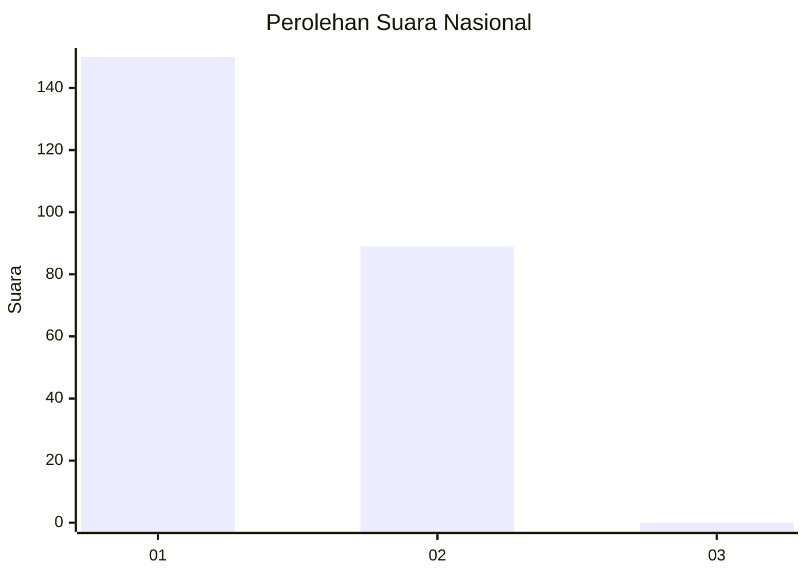
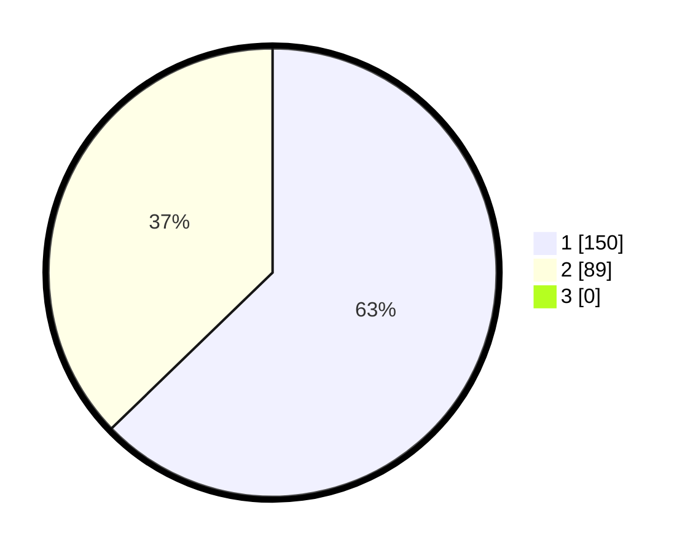

# Hasil

## Grafik

## Tabel

| No. | Nama Paslon    | Suara | Suara (raw) | Persentase |
|:--- |:-------------- | -----:| -----------:| ----------:|
| 1   | ANIES MUHAIMIN | 150   | [150][p-1]  | 62,76      |
| 2   | PRABOWO GIBRAN | 89    | [89][p-2]   | 37,24      |
| 3   | GANJAR MAHFUD  | 0     | [0][p-3]    | 0,00       |

[p-1]: https://github.com/gigit-pemilu/pemilu-2024/blob/main/pilpres/hitung-suara/sub/11-aceh/sub/18-pidie-jaya/sub/06-bandar-baru/sub/2014-baroh-musa/sub/004-tps/sub/paslon-1.txt
[p-2]: https://github.com/gigit-pemilu/pemilu-2024/blob/main/pilpres/hitung-suara/sub/11-aceh/sub/18-pidie-jaya/sub/06-bandar-baru/sub/2014-baroh-musa/sub/004-tps/sub/paslon-2.txt
[p-3]: https://github.com/gigit-pemilu/pemilu-2024/blob/main/pilpres/hitung-suara/sub/11-aceh/sub/18-pidie-jaya/sub/06-bandar-baru/sub/2014-baroh-musa/sub/004-tps/sub/paslon-3.txt

## Foto C Plano

https://sirekap-obj-formc.kpu.go.id/0faa/pemilu/ppwp/11/18/06/20/14/1118062014004-20240215-062046--a3505a9c-0ac2-42cc-87f9-6ac849b9dc30.jpg

https://sirekap-obj-formc.kpu.go.id/0faa/pemilu/ppwp/11/18/06/20/14/1118062014004-20240215-062228--c8d6846c-042d-4196-9c46-8402f6c8abc8.jpg

https://sirekap-obj-formc.kpu.go.id/0faa/pemilu/ppwp/11/18/06/20/14/1118062014004-20240215-062428--f5c33657-f3a5-4e06-ab24-a6ff312105ae.jpg

## Metadata

| Key        | Value               |
| ---------- | ------------------- |
| Time Stamp | 2024-02-15 22:40:13 |

