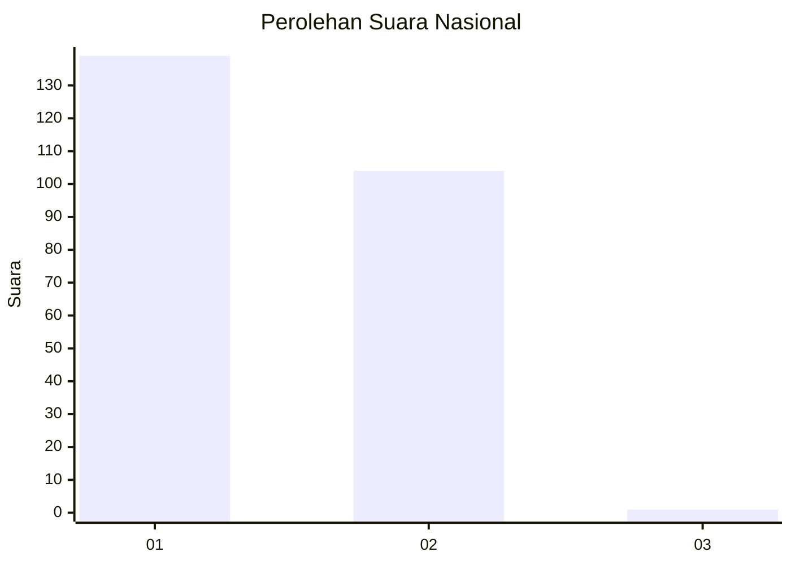
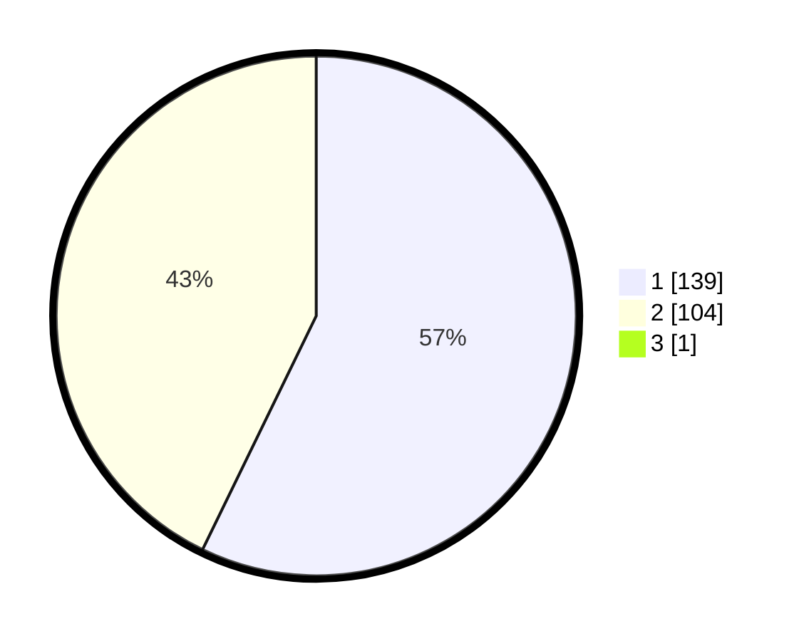

# Hasil

## Grafik

## Tabel

| No. | Nama Paslon    | Suara | Suara (raw) | Persentase |
|:--- |:-------------- | -----:| -----------:| ----------:|
| 1   | ANIES MUHAIMIN | 139   | [139][p-1]  | 56,97      |
| 2   | PRABOWO GIBRAN | 104   | [104][p-2]  | 42,62      |
| 3   | GANJAR MAHFUD  | 1     | [1][p-3]    | 0,41       |

[p-1]: https://github.com/gigit-pemilu/pemilu-2024/blob/main/pilpres/hitung-suara/sub/11-aceh/sub/18-pidie-jaya/sub/06-bandar-baru/sub/2016-balee/sub/001-tps/sub/paslon-1.txt
[p-2]: https://github.com/gigit-pemilu/pemilu-2024/blob/main/pilpres/hitung-suara/sub/11-aceh/sub/18-pidie-jaya/sub/06-bandar-baru/sub/2016-balee/sub/001-tps/sub/paslon-2.txt
[p-3]: https://github.com/gigit-pemilu/pemilu-2024/blob/main/pilpres/hitung-suara/sub/11-aceh/sub/18-pidie-jaya/sub/06-bandar-baru/sub/2016-balee/sub/001-tps/sub/paslon-3.txt

## Foto C Plano

https://sirekap-obj-formc.kpu.go.id/40f2/pemilu/ppwp/11/18/06/20/16/1118062016001-20240214-204705--78780f9c-8ef9-4944-b07d-13ade6c7fbf8.jpg

https://sirekap-obj-formc.kpu.go.id/40f2/pemilu/ppwp/11/18/06/20/16/1118062016001-20240214-204711--95bbc919-d327-425c-bfd9-ad343875f226.jpg

https://sirekap-obj-formc.kpu.go.id/40f2/pemilu/ppwp/11/18/06/20/16/1118062016001-20240214-204718--bbf1ef20-e105-46eb-af91-c46083673b0f.jpg

## Metadata

| Key        | Value               |
| ---------- | ------------------- |
| Time Stamp | 2024-02-15 21:30:27 |

