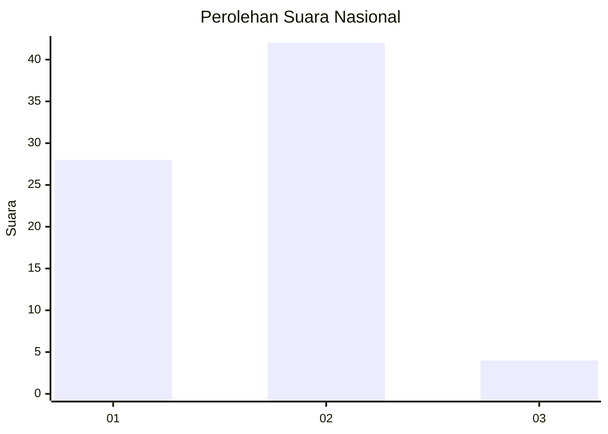
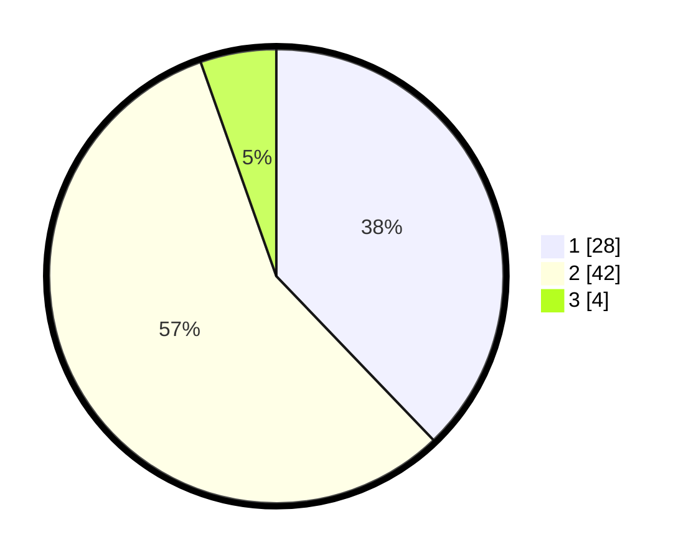

# Hasil

## Grafik

## Tabel

| No. | Nama Paslon    | Suara | Suara (raw) | Persentase |
|:--- |:-------------- | -----:| -----------:| ----------:|
| 1   | ANIES MUHAIMIN | 28    | [28][p-1]   | 37,84      |
| 2   | PRABOWO GIBRAN | 42    | [42][p-2]   | 56,76      |
| 3   | GANJAR MAHFUD  | 4     | [4][p-3]    | 5,41       |

[p-1]: https://github.com/gigit-pemilu/pemilu-2024/blob/main/pilpres/hitung-suara/sub/11-aceh/sub/18-pidie-jaya/sub/06-bandar-baru/sub/2016-balee/sub/003-tps/sub/paslon-1.txt
[p-2]: https://github.com/gigit-pemilu/pemilu-2024/blob/main/pilpres/hitung-suara/sub/11-aceh/sub/18-pidie-jaya/sub/06-bandar-baru/sub/2016-balee/sub/003-tps/sub/paslon-2.txt
[p-3]: https://github.com/gigit-pemilu/pemilu-2024/blob/main/pilpres/hitung-suara/sub/11-aceh/sub/18-pidie-jaya/sub/06-bandar-baru/sub/2016-balee/sub/003-tps/sub/paslon-3.txt

## Foto C Plano

https://sirekap-obj-formc.kpu.go.id/904c/pemilu/ppwp/11/18/06/20/16/1118062016003-20240217-142709--77b55327-1107-4fc4-844d-16dd74162f7c.jpg

https://sirekap-obj-formc.kpu.go.id/904c/pemilu/ppwp/11/18/06/20/16/1118062016003-20240217-143221--1a201d31-9ad7-4296-8a61-4e10b3888fce.jpg

https://sirekap-obj-formc.kpu.go.id/904c/pemilu/ppwp/11/18/06/20/16/1118062016003-20240217-143820--fb660cbd-097d-4d16-80b9-fe9665727c02.jpg

## Metadata

| Key        | Value               |
| ---------- | ------------------- |
| Time Stamp | 2024-02-17 14:45:18 |

## DATA PEMILIH TETAP

Jumlah pemilih dalam DPT: **177**.
 * L: **89**.
 * P: **88**.

## DATA PENGGUNA HAK PILIH

Jumlah pengguna hak pilih dalam DPT: **177**.
 * L: **89**.
 * P: **88**.

Jumlah pengguna hak pilih dalam DPTb: **177**.
 * L: **89**.
 * P: **88**.

Jumlah pengguna hak pilih dalam DPK: **177**.
 * L: **88**.
 * P: **89**.

Jumlah pengguna hak pilih: **177**.
 * L: **89**.
 * P: **88**.

## JUMLAH SUARA SAH DAN TIDAK SAH

JUMLAH SELURUH SUARA SAH: **972**.

JUMLAH SUARA TIDAK SAH: **885**.

JUMLAH SELURUH SUARA SAH DAN SUARA TIDAK SAH: **277**.

