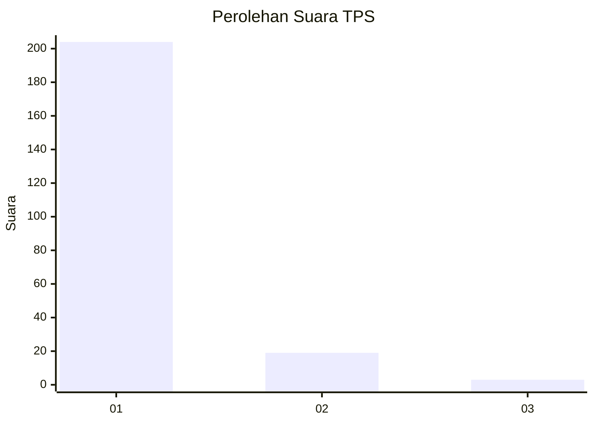
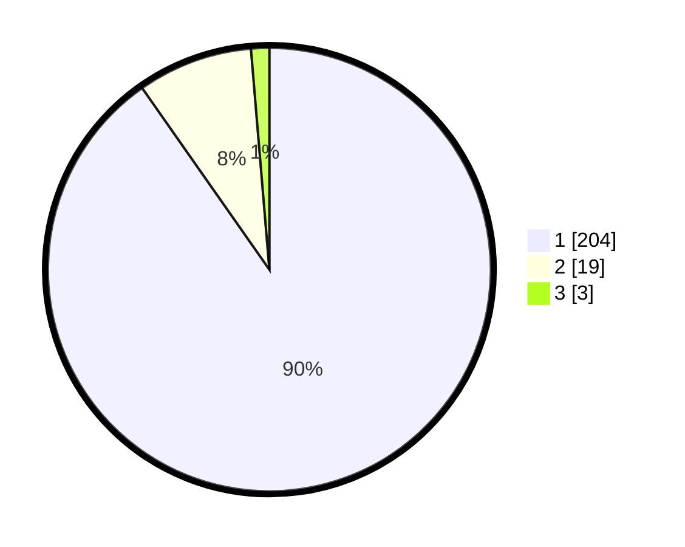

# Hasil

## Grafik

## Tabel

| No. | Nama Paslon    | Suara | Suara (raw) | Persentase |
|:--- |:-------------- | -----:| -----------:| ----------:|
| 1   | ANIES MUHAIMIN | 204   | [204][p-1]  | 90,27      |
| 2   | PRABOWO GIBRAN | 19    | [19][p-2]   | 8,41       |
| 3   | GANJAR MAHFUD  | 3     | [3][p-3]    | 1,33       |

[p-1]: https://github.com/gigit-pemilu/pemilu-2024-11-aceh/blob/main/pilpres/hitung-suara/sub/11-aceh/sub/18-pidie-jaya/sub/06-bandar-baru/sub/2021-mesjid/sub/001-tps/sub/paslon-1.txt
[p-2]: https://github.com/gigit-pemilu/pemilu-2024-11-aceh/blob/main/pilpres/hitung-suara/sub/11-aceh/sub/18-pidie-jaya/sub/06-bandar-baru/sub/2021-mesjid/sub/001-tps/sub/paslon-2.txt
[p-3]: https://github.com/gigit-pemilu/pemilu-2024-11-aceh/blob/main/pilpres/hitung-suara/sub/11-aceh/sub/18-pidie-jaya/sub/06-bandar-baru/sub/2021-mesjid/sub/001-tps/sub/paslon-3.txt

## Foto C Plano

https://sirekap-obj-formc.kpu.go.id/9175/pemilu/ppwp/11/18/06/20/21/1118062021001-20240215-074244--43077dfb-c939-4e07-817e-d5e75107f9ee.jpg

https://sirekap-obj-formc.kpu.go.id/9175/pemilu/ppwp/11/18/06/20/21/1118062021001-20240215-074208--ac5d730c-094f-48d9-8f37-99d8c249fc4a.jpg

https://sirekap-obj-formc.kpu.go.id/9175/pemilu/ppwp/11/18/06/20/21/1118062021001-20240215-074315--0b3f7f2c-b921-475f-881e-783d031be2ba.jpg

## Metadata

| Key        | Value               |
| ---------- | ------------------- |
| Time Stamp | 2024-02-15 22:30:27 |

