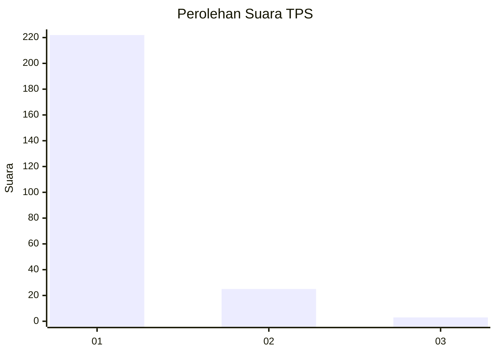
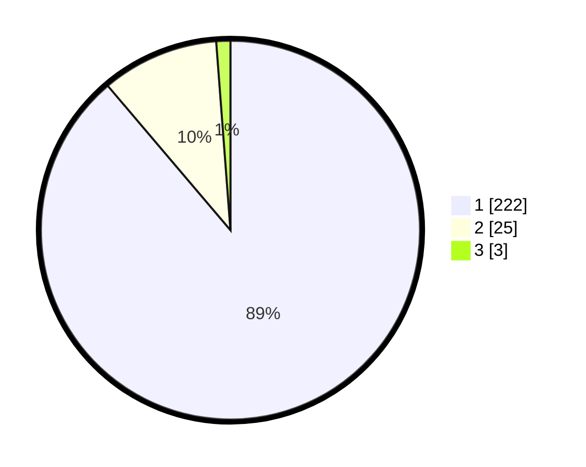

# Hasil

## Grafik

## Tabel

| No. | Nama Paslon    | Suara | Suara (raw) | Persentase |
|:--- |:-------------- | -----:| -----------:| ----------:|
| 1   | ANIES MUHAIMIN | 222   | [222][p-1]  | 88,80      |
| 2   | PRABOWO GIBRAN | 25    | [25][p-2]   | 10,00      |
| 3   | GANJAR MAHFUD  | 3     | [3][p-3]    | 1,20       |

[p-1]: https://github.com/gigit-pemilu/pemilu-2024-11-aceh/blob/main/pilpres/hitung-suara/sub/11-aceh/sub/18-pidie-jaya/sub/06-bandar-baru/sub/2026-sagoe/sub/001-tps/sub/paslon-1.txt
[p-2]: https://github.com/gigit-pemilu/pemilu-2024-11-aceh/blob/main/pilpres/hitung-suara/sub/11-aceh/sub/18-pidie-jaya/sub/06-bandar-baru/sub/2026-sagoe/sub/001-tps/sub/paslon-2.txt
[p-3]: https://github.com/gigit-pemilu/pemilu-2024-11-aceh/blob/main/pilpres/hitung-suara/sub/11-aceh/sub/18-pidie-jaya/sub/06-bandar-baru/sub/2026-sagoe/sub/001-tps/sub/paslon-3.txt

## Foto C Plano

https://sirekap-obj-formc.kpu.go.id/3798/pemilu/ppwp/11/18/06/20/26/1118062026001-20240215-102051--aa758544-0fc6-4197-8f87-79f9e2f66901.jpg

https://sirekap-obj-formc.kpu.go.id/3798/pemilu/ppwp/11/18/06/20/26/1118062026001-20240215-102141--c17c1b69-ade4-4954-a225-8fce6e37294f.jpg

https://sirekap-obj-formc.kpu.go.id/3798/pemilu/ppwp/11/18/06/20/26/1118062026001-20240215-104645--afc6fb84-8fbe-47cc-a960-150792639950.jpg

## Metadata

| Key        | Value               |
| ---------- | ------------------- |
| Time Stamp | 2024-02-15 22:30:27 |

