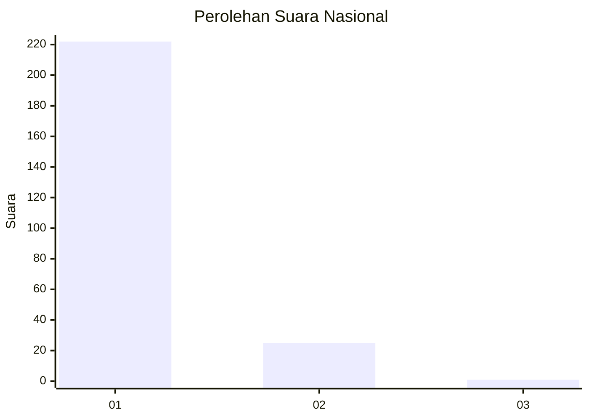
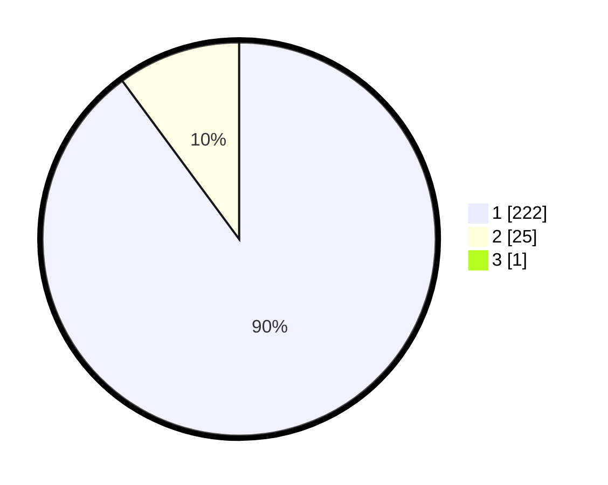

# Hasil

## Grafik

## Tabel

| No. | Nama Paslon    | Suara | Suara (raw) | Persentase |
|:--- |:-------------- | -----:| -----------:| ----------:|
| 1   | ANIES MUHAIMIN | 222   | [222][p-1]  | 89,52      |
| 2   | PRABOWO GIBRAN | 25    | [25][p-2]   | 10,08      |
| 3   | GANJAR MAHFUD  | 1     | [1][p-3]    | 0,40       |

[p-1]: https://github.com/gigit-pemilu/pemilu-2024/blob/main/pilpres/hitung-suara/sub/11-aceh/sub/18-pidie-jaya/sub/06-bandar-baru/sub/2026-sagoe/sub/003-tps/sub/paslon-1.txt
[p-2]: https://github.com/gigit-pemilu/pemilu-2024/blob/main/pilpres/hitung-suara/sub/11-aceh/sub/18-pidie-jaya/sub/06-bandar-baru/sub/2026-sagoe/sub/003-tps/sub/paslon-2.txt
[p-3]: https://github.com/gigit-pemilu/pemilu-2024/blob/main/pilpres/hitung-suara/sub/11-aceh/sub/18-pidie-jaya/sub/06-bandar-baru/sub/2026-sagoe/sub/003-tps/sub/paslon-3.txt

## Foto C Plano

https://sirekap-obj-formc.kpu.go.id/7c0d/pemilu/ppwp/11/18/06/20/26/1118062026003-20240215-112356--1307f176-2e82-45bd-a90b-47367429940f.jpg

https://sirekap-obj-formc.kpu.go.id/7c0d/pemilu/ppwp/11/18/06/20/26/1118062026003-20240215-112050--d8c8cc26-000b-404c-acca-e6abe8c576bf.jpg

https://sirekap-obj-formc.kpu.go.id/7c0d/pemilu/ppwp/11/18/06/20/26/1118062026003-20240215-112324--660ef8b0-18c0-42fe-a1df-19cd28e39f09.jpg

## Metadata

| Key        | Value               |
| ---------- | ------------------- |
| Time Stamp | 2024-02-15 21:30:27 |

