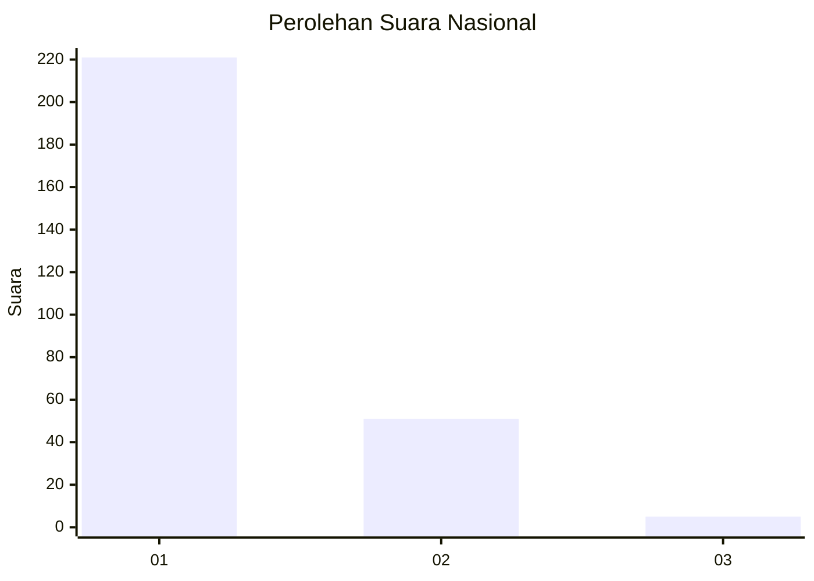
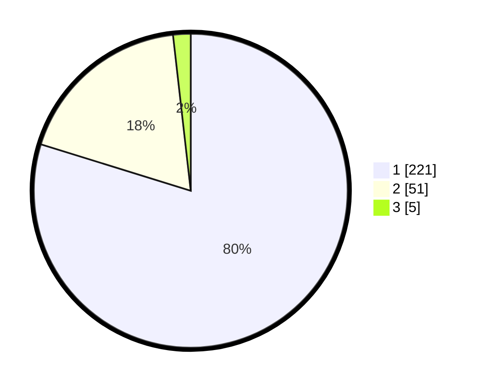

# Hasil

## Grafik

## Tabel

| No. | Nama Paslon    | Suara | Suara (raw) | Persentase |
|:--- |:-------------- | -----:| -----------:| ----------:|
| 1   | ANIES MUHAIMIN | 221   | [221][p-1]  | 79,78      |
| 2   | PRABOWO GIBRAN | 51    | [51][p-2]   | 18,41      |
| 3   | GANJAR MAHFUD  | 5     | [5][p-3]    | 1,81       |

[p-1]: https://github.com/gigit-pemilu/pemilu-2024/blob/main/pilpres/hitung-suara/sub/11-aceh/sub/18-pidie-jaya/sub/06-bandar-baru/sub/2034-paru-keude/sub/007-tps/sub/paslon-1.txt
[p-2]: https://github.com/gigit-pemilu/pemilu-2024/blob/main/pilpres/hitung-suara/sub/11-aceh/sub/18-pidie-jaya/sub/06-bandar-baru/sub/2034-paru-keude/sub/007-tps/sub/paslon-2.txt
[p-3]: https://github.com/gigit-pemilu/pemilu-2024/blob/main/pilpres/hitung-suara/sub/11-aceh/sub/18-pidie-jaya/sub/06-bandar-baru/sub/2034-paru-keude/sub/007-tps/sub/paslon-3.txt

## Foto C Plano

https://sirekap-obj-formc.kpu.go.id/cef3/pemilu/ppwp/11/18/06/20/34/1118062034007-20240217-143201--c4223bfa-ddc3-4f06-b6a1-cbde9fdcdefc.jpg

https://sirekap-obj-formc.kpu.go.id/cef3/pemilu/ppwp/11/18/06/20/34/1118062034007-20240217-144738--7fdec27f-b8d2-4626-8f6e-a3186bda87c4.jpg

## Metadata

| Key        | Value               |
| ---------- | ------------------- |
| Time Stamp | 2024-02-19 06:16:00 |

