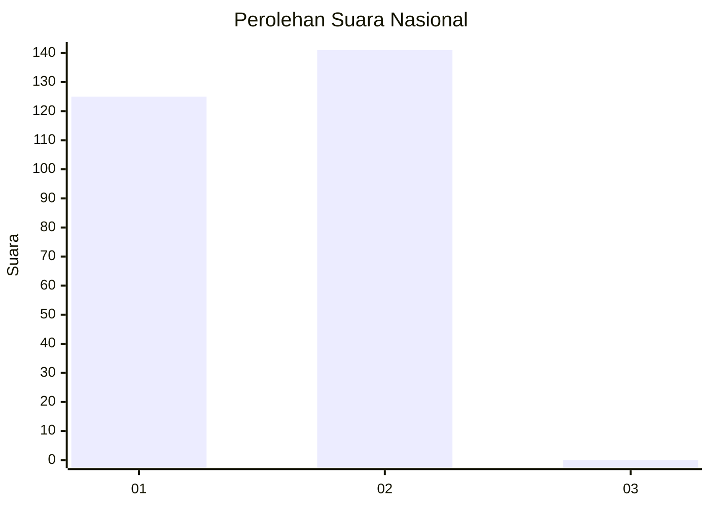
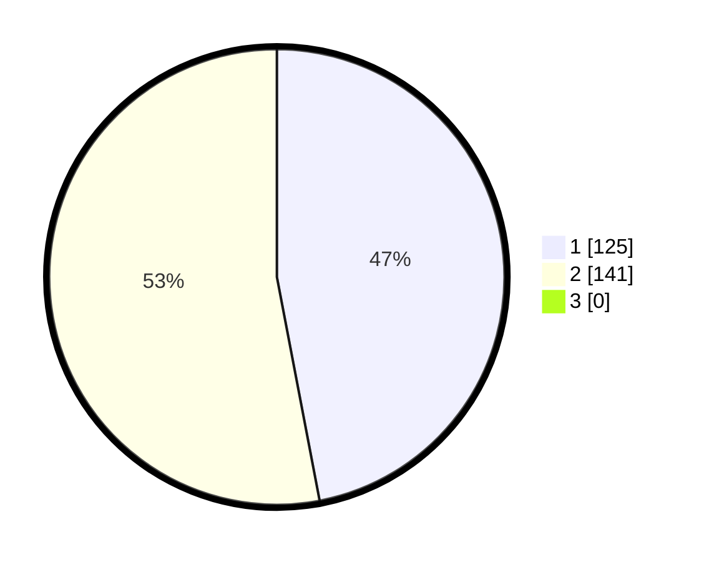

# Hasil

## Grafik

## Tabel

| No. | Nama Paslon    | Suara | Suara (raw) | Persentase |
|:--- |:-------------- | -----:| -----------:| ----------:|
| 1   | ANIES MUHAIMIN | 125   | [125][p-1]  | 46,99      |
| 2   | PRABOWO GIBRAN | 141   | [141][p-2]  | 53,01      |
| 3   | GANJAR MAHFUD  | 0     | [0][p-3]    | 0,00       |

[p-1]: https://github.com/gigit-pemilu/pemilu-2024/blob/main/pilpres/hitung-suara/sub/11-aceh/sub/18-pidie-jaya/sub/06-bandar-baru/sub/2041-alue/sub/001-tps/sub/paslon-1.txt
[p-2]: https://github.com/gigit-pemilu/pemilu-2024/blob/main/pilpres/hitung-suara/sub/11-aceh/sub/18-pidie-jaya/sub/06-bandar-baru/sub/2041-alue/sub/001-tps/sub/paslon-2.txt
[p-3]: https://github.com/gigit-pemilu/pemilu-2024/blob/main/pilpres/hitung-suara/sub/11-aceh/sub/18-pidie-jaya/sub/06-bandar-baru/sub/2041-alue/sub/001-tps/sub/paslon-3.txt

## Foto C Plano

https://sirekap-obj-formc.kpu.go.id/e7e8/pemilu/ppwp/11/18/06/20/41/1118062041001-20240214-214652--db29b43b-affa-41c8-94f2-aa85d445f6d7.jpg

https://sirekap-obj-formc.kpu.go.id/e7e8/pemilu/ppwp/11/18/06/20/41/1118062041001-20240214-214606--d0d7c6e2-f3bf-43dc-a668-6b4db31d47db.jpg

https://sirekap-obj-formc.kpu.go.id/e7e8/pemilu/ppwp/11/18/06/20/41/1118062041001-20240214-214930--5b951290-571b-4faf-8da1-bb20b7f1b23c.jpg

## Metadata

| Key        | Value               |
| ---------- | ------------------- |
| Time Stamp | 2024-02-15 22:30:27 |

