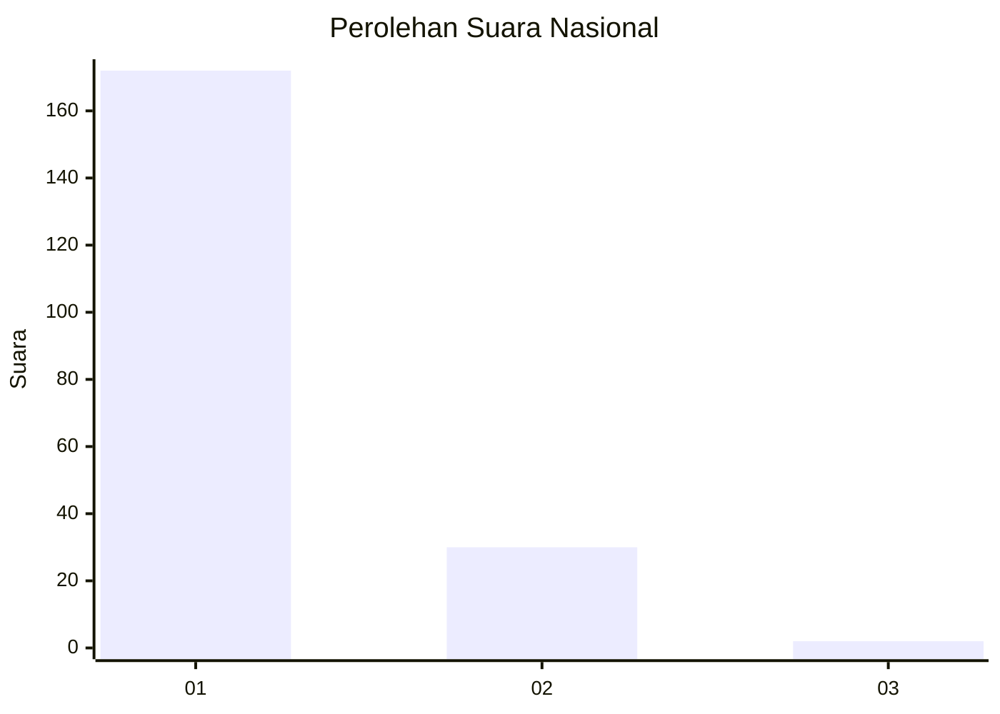
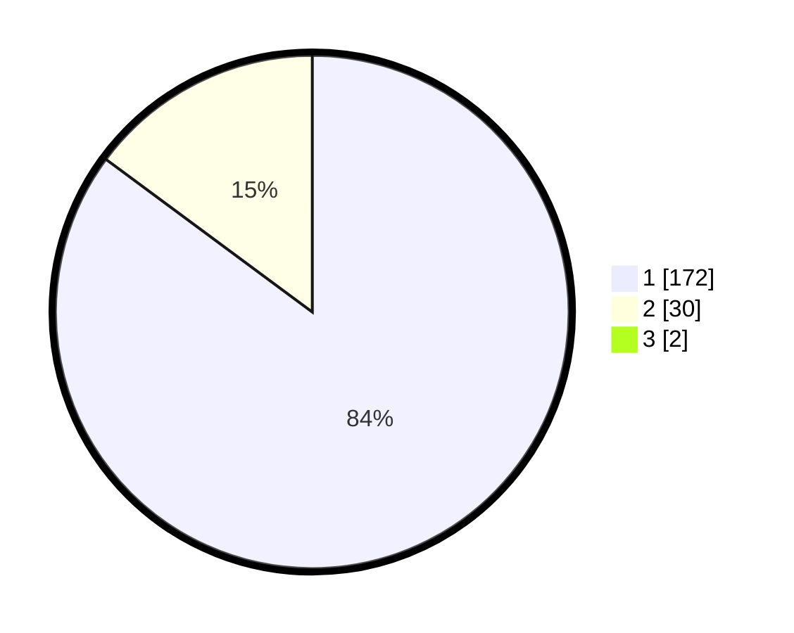

# Hasil

## Grafik

## Tabel

| No. | Nama Paslon    | Suara | Suara (raw) | Persentase |
|:--- |:-------------- | -----:| -----------:| ----------:|
| 1   | ANIES MUHAIMIN | 172   | [172][p-1]  | 84,31      |
| 2   | PRABOWO GIBRAN | 30    | [30][p-2]   | 14,71      |
| 3   | GANJAR MAHFUD  | 2     | [2][p-3]    | 0,98       |

[p-1]: https://github.com/gigit-pemilu/pemilu-2024/blob/main/pilpres/hitung-suara/sub/11-aceh/sub/18-pidie-jaya/sub/07-panteraja/sub/2001-keude-panteraja/sub/001-tps/sub/paslon-1.txt
[p-2]: https://github.com/gigit-pemilu/pemilu-2024/blob/main/pilpres/hitung-suara/sub/11-aceh/sub/18-pidie-jaya/sub/07-panteraja/sub/2001-keude-panteraja/sub/001-tps/sub/paslon-2.txt
[p-3]: https://github.com/gigit-pemilu/pemilu-2024/blob/main/pilpres/hitung-suara/sub/11-aceh/sub/18-pidie-jaya/sub/07-panteraja/sub/2001-keude-panteraja/sub/001-tps/sub/paslon-3.txt

## Foto C Plano

https://sirekap-obj-formc.kpu.go.id/0f15/pemilu/ppwp/11/18/07/20/01/1118072001001-20240215-095601--69d08bcc-02dd-4243-aef0-10c136a3013a.jpg

https://sirekap-obj-formc.kpu.go.id/0f15/pemilu/ppwp/11/18/07/20/01/1118072001001-20240215-095732--cba332cf-fe07-4d18-a2c9-b658def8c961.jpg

https://sirekap-obj-formc.kpu.go.id/0f15/pemilu/ppwp/11/18/07/20/01/1118072001001-20240215-095845--ae85abaa-342e-4ef8-81d5-45c381c1ef79.jpg

## Metadata

| Key        | Value               |
| ---------- | ------------------- |
| Time Stamp | 2024-02-15 22:00:27 |

