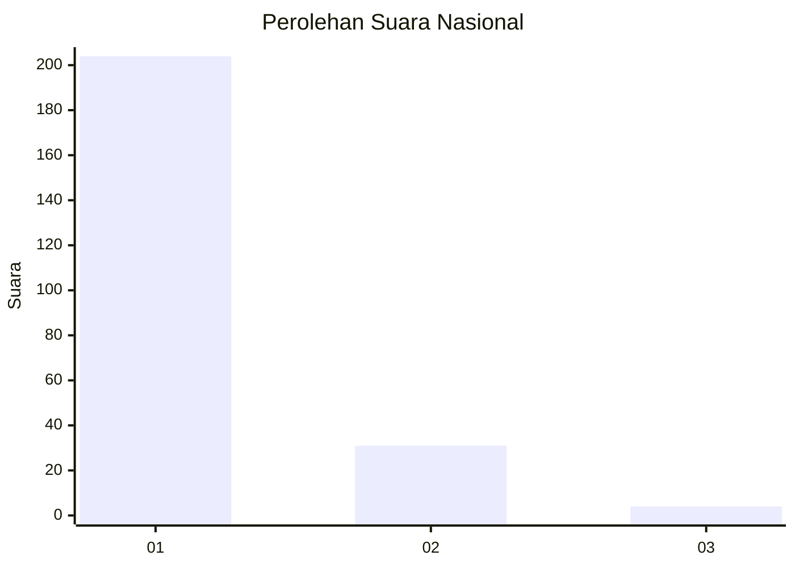
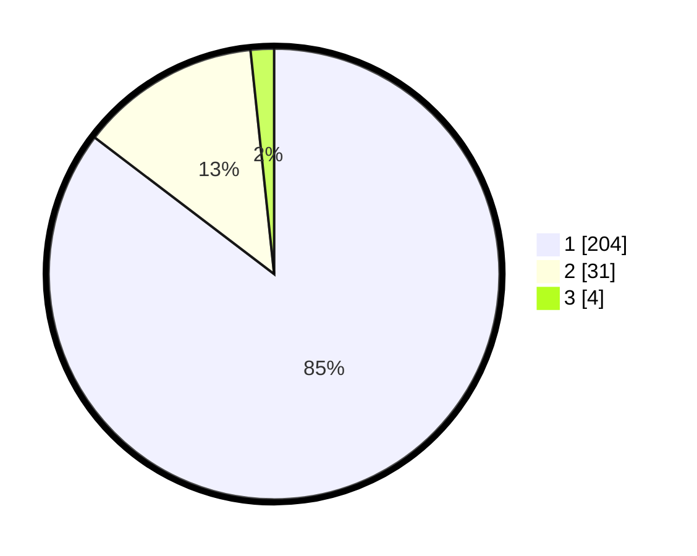

# Hasil

## Grafik

## Tabel

| No. | Nama Paslon    | Suara | Suara (raw) | Persentase |
|:--- |:-------------- | -----:| -----------:| ----------:|
| 1   | ANIES MUHAIMIN | 204   | [204][p-1]  | 85,36      |
| 2   | PRABOWO GIBRAN | 31    | [31][p-2]   | 12,97      |
| 3   | GANJAR MAHFUD  | 4     | [4][p-3]    | 1,67       |

[p-1]: https://github.com/gigit-pemilu/pemilu-2024/blob/main/pilpres/hitung-suara/sub/11-aceh/sub/18-pidie-jaya/sub/08-trienggadeng/sub/2001-sagoe/sub/001-tps/sub/paslon-1.txt
[p-2]: https://github.com/gigit-pemilu/pemilu-2024/blob/main/pilpres/hitung-suara/sub/11-aceh/sub/18-pidie-jaya/sub/08-trienggadeng/sub/2001-sagoe/sub/001-tps/sub/paslon-2.txt
[p-3]: https://github.com/gigit-pemilu/pemilu-2024/blob/main/pilpres/hitung-suara/sub/11-aceh/sub/18-pidie-jaya/sub/08-trienggadeng/sub/2001-sagoe/sub/001-tps/sub/paslon-3.txt

## Foto C Plano

https://sirekap-obj-formc.kpu.go.id/83aa/pemilu/ppwp/11/18/08/20/01/1118082001001-20240215-054923--acc29386-2bc2-48af-9765-03082f00c746.jpg

https://sirekap-obj-formc.kpu.go.id/83aa/pemilu/ppwp/11/18/08/20/01/1118082001001-20240215-055356--61de25b6-0d6a-4e8d-b278-9cd1e6104690.jpg

https://sirekap-obj-formc.kpu.go.id/83aa/pemilu/ppwp/11/18/08/20/01/1118082001001-20240215-055547--81e2cf3b-f16b-4e30-b51f-5a356d570e85.jpg

## Metadata

| Key        | Value               |
| ---------- | ------------------- |
| Time Stamp | 2024-02-15 21:30:27 |

