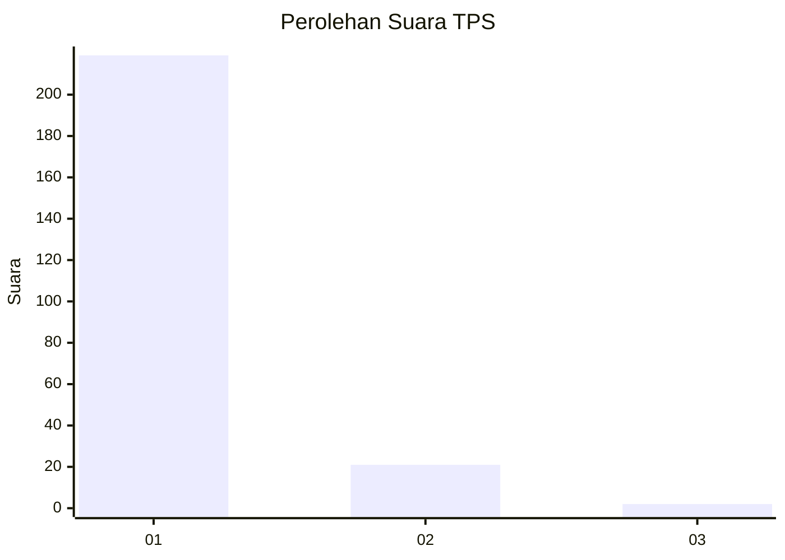
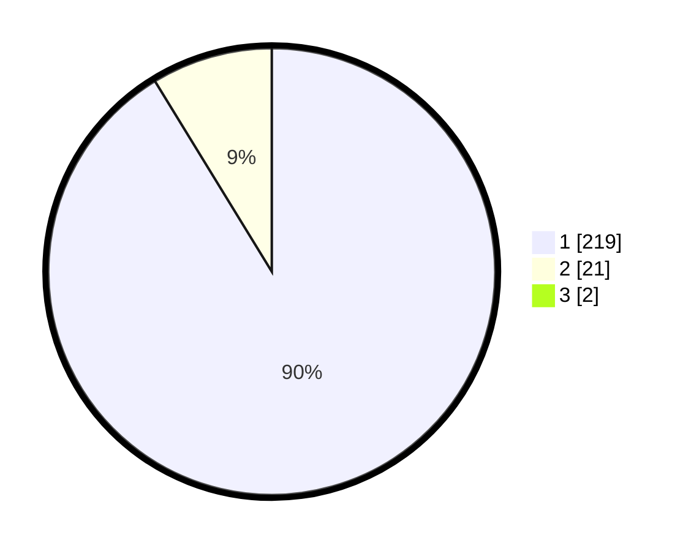

# Hasil

## Grafik

## Tabel

| No. | Nama Paslon    | Suara | Suara (raw) | Persentase |
|:--- |:-------------- | -----:| -----------:| ----------:|
| 1   | ANIES MUHAIMIN | 219   | [219][p-1]  | 90,50      |
| 2   | PRABOWO GIBRAN | 21    | [21][p-2]   | 8,68       |
| 3   | GANJAR MAHFUD  | 2     | [2][p-3]    | 0,83       |

[p-1]: https://github.com/gigit-pemilu/pemilu-2024-11-aceh/blob/main/pilpres/hitung-suara/sub/11-aceh/sub/18-pidie-jaya/sub/08-trienggadeng/sub/2002-mee-peuduek/sub/001-tps/sub/paslon-1.txt
[p-2]: https://github.com/gigit-pemilu/pemilu-2024-11-aceh/blob/main/pilpres/hitung-suara/sub/11-aceh/sub/18-pidie-jaya/sub/08-trienggadeng/sub/2002-mee-peuduek/sub/001-tps/sub/paslon-2.txt
[p-3]: https://github.com/gigit-pemilu/pemilu-2024-11-aceh/blob/main/pilpres/hitung-suara/sub/11-aceh/sub/18-pidie-jaya/sub/08-trienggadeng/sub/2002-mee-peuduek/sub/001-tps/sub/paslon-3.txt

## Foto C Plano

https://sirekap-obj-formc.kpu.go.id/1dbe/pemilu/ppwp/11/18/08/20/02/1118082002001-20240215-113922--2dffc092-437c-4e0a-a700-eeb136e47672.jpg

https://sirekap-obj-formc.kpu.go.id/1dbe/pemilu/ppwp/11/18/08/20/02/1118082002001-20240215-114115--cf640e55-577e-4507-8e17-8212f47c9e9a.jpg

https://sirekap-obj-formc.kpu.go.id/1dbe/pemilu/ppwp/11/18/08/20/02/1118082002001-20240215-114154--541013ea-c949-47b4-97db-692f6970a645.jpg

## Metadata

| Key        | Value               |
| ---------- | ------------------- |
| Time Stamp | 2024-02-15 22:00:27 |

