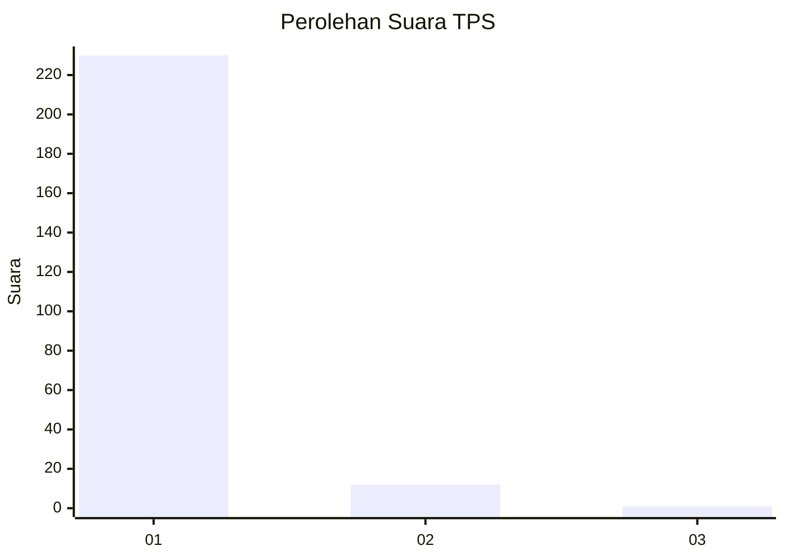
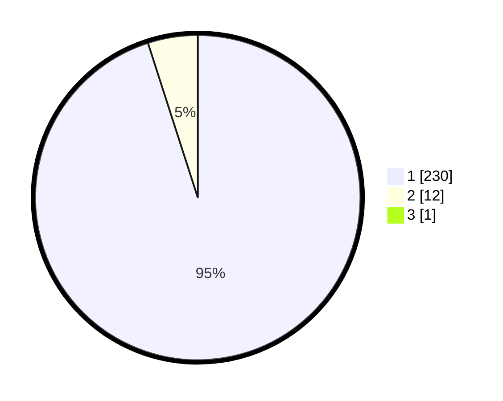

# Hasil

## Grafik

## Tabel

| No. | Nama Paslon    | Suara | Suara (raw) | Persentase |
|:--- |:-------------- | -----:| -----------:| ----------:|
| 1   | ANIES MUHAIMIN | 230   | [230][p-1]  | 94,65      |
| 2   | PRABOWO GIBRAN | 12    | [12][p-2]   | 4,94       |
| 3   | GANJAR MAHFUD  | 1     | [1][p-3]    | 0,41       |

[p-1]: https://github.com/gigit-pemilu/pemilu-2024-11-aceh/blob/main/pilpres/hitung-suara/sub/11-aceh/sub/18-pidie-jaya/sub/08-trienggadeng/sub/2002-mee-peuduek/sub/002-tps/sub/paslon-1.txt
[p-2]: https://github.com/gigit-pemilu/pemilu-2024-11-aceh/blob/main/pilpres/hitung-suara/sub/11-aceh/sub/18-pidie-jaya/sub/08-trienggadeng/sub/2002-mee-peuduek/sub/002-tps/sub/paslon-2.txt
[p-3]: https://github.com/gigit-pemilu/pemilu-2024-11-aceh/blob/main/pilpres/hitung-suara/sub/11-aceh/sub/18-pidie-jaya/sub/08-trienggadeng/sub/2002-mee-peuduek/sub/002-tps/sub/paslon-3.txt

## Foto C Plano

https://sirekap-obj-formc.kpu.go.id/a20d/pemilu/ppwp/11/18/08/20/02/1118082002002-20240215-113304--0382f07e-e179-4134-98bc-34abd3f45425.jpg

https://sirekap-obj-formc.kpu.go.id/a20d/pemilu/ppwp/11/18/08/20/02/1118082002002-20240215-113428--3d83f49a-c099-431f-907d-918cc59940d7.jpg

## Metadata

| Key        | Value               |
| ---------- | ------------------- |
| Time Stamp | 2024-02-24 22:31:28 |

