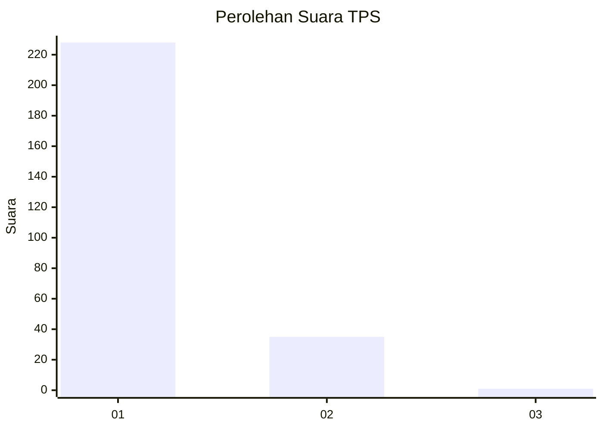
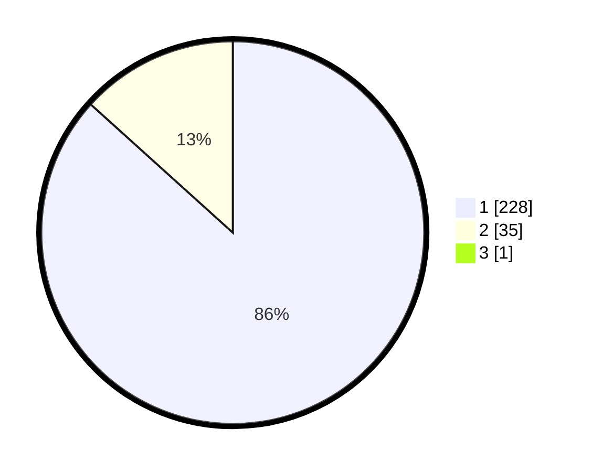

# Hasil

## Grafik

## Tabel

| No. | Nama Paslon    | Suara | Suara (raw) | Persentase |
|:--- |:-------------- | -----:| -----------:| ----------:|
| 1   | ANIES MUHAIMIN | 228   | [228][p-1]  | 86,36      |
| 2   | PRABOWO GIBRAN | 35    | [35][p-2]   | 13,26      |
| 3   | GANJAR MAHFUD  | 1     | [1][p-3]    | 0,38       |

[p-1]: https://github.com/gigit-pemilu/pemilu-2024-11-aceh/blob/main/pilpres/hitung-suara/sub/11-aceh/sub/18-pidie-jaya/sub/08-trienggadeng/sub/2006-dee/sub/001-tps/sub/paslon-1.txt
[p-2]: https://github.com/gigit-pemilu/pemilu-2024-11-aceh/blob/main/pilpres/hitung-suara/sub/11-aceh/sub/18-pidie-jaya/sub/08-trienggadeng/sub/2006-dee/sub/001-tps/sub/paslon-2.txt
[p-3]: https://github.com/gigit-pemilu/pemilu-2024-11-aceh/blob/main/pilpres/hitung-suara/sub/11-aceh/sub/18-pidie-jaya/sub/08-trienggadeng/sub/2006-dee/sub/001-tps/sub/paslon-3.txt

## Foto C Plano

https://sirekap-obj-formc.kpu.go.id/f149/pemilu/ppwp/11/18/08/20/06/1118082006001-20240215-101933--65bb5b5e-f7a9-4ee3-accc-79c2bf9e2c63.jpg

https://sirekap-obj-formc.kpu.go.id/f149/pemilu/ppwp/11/18/08/20/06/1118082006001-20240215-101946--19bc383e-f747-45cd-8ffa-c173c33a956e.jpg

https://sirekap-obj-formc.kpu.go.id/f149/pemilu/ppwp/11/18/08/20/06/1118082006001-20240215-102003--68de9e3d-415a-46c8-8cd0-715780653a3f.jpg

## Metadata

| Key        | Value               |
| ---------- | ------------------- |
| Time Stamp | 2024-02-15 22:00:27 |

