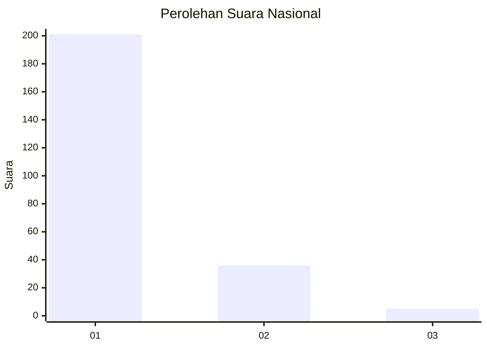
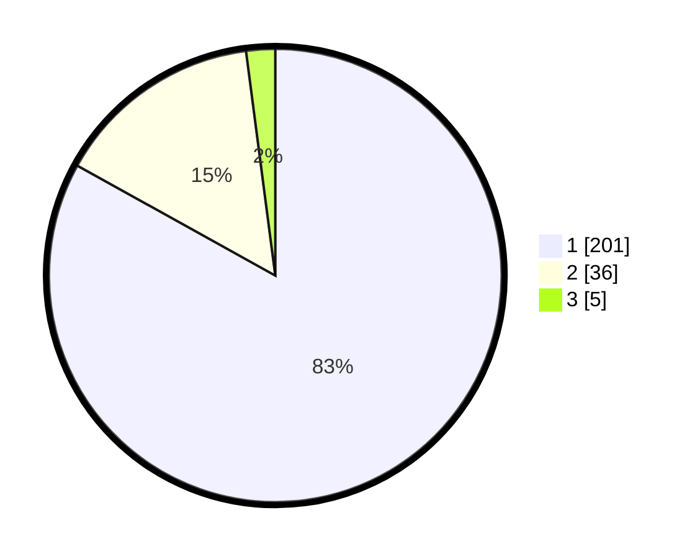

# Hasil

## Grafik

## Tabel

| No. | Nama Paslon    | Suara | Suara (raw) | Persentase |
|:--- |:-------------- | -----:| -----------:| ----------:|
| 1   | ANIES MUHAIMIN | 201   | [201][p-1]  | 83,06      |
| 2   | PRABOWO GIBRAN | 36    | [36][p-2]   | 14,88      |
| 3   | GANJAR MAHFUD  | 5     | [5][p-3]    | 2,07       |

[p-1]: https://github.com/gigit-pemilu/pemilu-2024/blob/main/pilpres/hitung-suara/sub/11-aceh/sub/18-pidie-jaya/sub/08-trienggadeng/sub/2017-deah-ujong-baroh/sub/001-tps/sub/paslon-1.txt
[p-2]: https://github.com/gigit-pemilu/pemilu-2024/blob/main/pilpres/hitung-suara/sub/11-aceh/sub/18-pidie-jaya/sub/08-trienggadeng/sub/2017-deah-ujong-baroh/sub/001-tps/sub/paslon-2.txt
[p-3]: https://github.com/gigit-pemilu/pemilu-2024/blob/main/pilpres/hitung-suara/sub/11-aceh/sub/18-pidie-jaya/sub/08-trienggadeng/sub/2017-deah-ujong-baroh/sub/001-tps/sub/paslon-3.txt

## Foto C Plano

https://sirekap-obj-formc.kpu.go.id/5941/pemilu/ppwp/11/18/08/20/17/1118082017001-20240215-091806--f2e38034-ab3e-4105-8a17-6d8eff1b66e4.jpg

https://sirekap-obj-formc.kpu.go.id/5941/pemilu/ppwp/11/18/08/20/17/1118082017001-20240215-091020--6b6124a4-7e0e-4754-ac8b-2a74ae4b7e68.jpg

https://sirekap-obj-formc.kpu.go.id/5941/pemilu/ppwp/11/18/08/20/17/1118082017001-20240215-030637--c5695024-55f0-4606-9c6e-c5d9eeddea1d.jpg

## Metadata

| Key        | Value               |
| ---------- | ------------------- |
| Time Stamp | 2024-02-15 22:00:27 |

