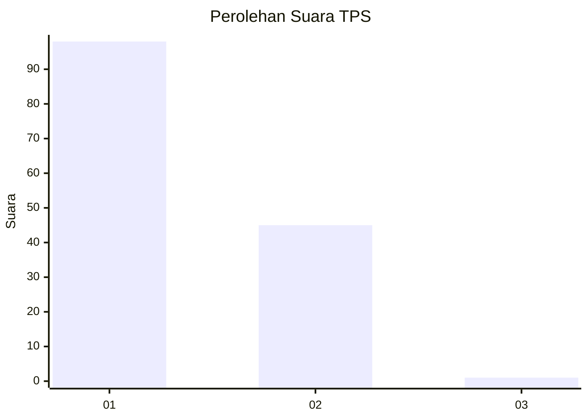
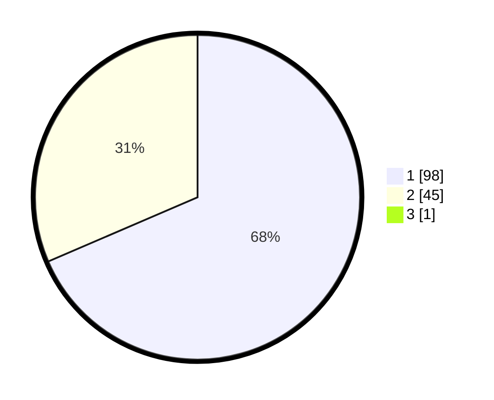

# Hasil

## Grafik

## Tabel

| No. | Nama Paslon    | Suara | Suara (raw) | Persentase |
|:--- |:-------------- | -----:| -----------:| ----------:|
| 1   | ANIES MUHAIMIN | 98    | [98][p-1]   | 68,06      |
| 2   | PRABOWO GIBRAN | 45    | [45][p-2]   | 31,25      |
| 3   | GANJAR MAHFUD  | 1     | [1][p-3]    | 0,69       |

[p-1]: https://github.com/gigit-pemilu/pemilu-2024-11-aceh/blob/main/pilpres/hitung-suara/sub/11-aceh/sub/18-pidie-jaya/sub/08-trienggadeng/sub/2022-cot-makaso/sub/001-tps/sub/paslon-1.txt
[p-2]: https://github.com/gigit-pemilu/pemilu-2024-11-aceh/blob/main/pilpres/hitung-suara/sub/11-aceh/sub/18-pidie-jaya/sub/08-trienggadeng/sub/2022-cot-makaso/sub/001-tps/sub/paslon-2.txt
[p-3]: https://github.com/gigit-pemilu/pemilu-2024-11-aceh/blob/main/pilpres/hitung-suara/sub/11-aceh/sub/18-pidie-jaya/sub/08-trienggadeng/sub/2022-cot-makaso/sub/001-tps/sub/paslon-3.txt

## Foto C Plano

https://sirekap-obj-formc.kpu.go.id/62fd/pemilu/ppwp/11/18/08/20/22/1118082022001-20240215-123303--61060e5e-d6bc-4dd8-8a6f-ece618935b28.jpg

https://sirekap-obj-formc.kpu.go.id/62fd/pemilu/ppwp/11/18/08/20/22/1118082022001-20240215-123516--22db8c94-3428-46c5-a5f3-9234a6f750f0.jpg

https://sirekap-obj-formc.kpu.go.id/62fd/pemilu/ppwp/11/18/08/20/22/1118082022001-20240215-104530--79eefa0e-6f5f-4b63-847d-9652199cb496.jpg

## Metadata

| Key        | Value               |
| ---------- | ------------------- |
| Time Stamp | 2024-02-15 21:30:27 |

