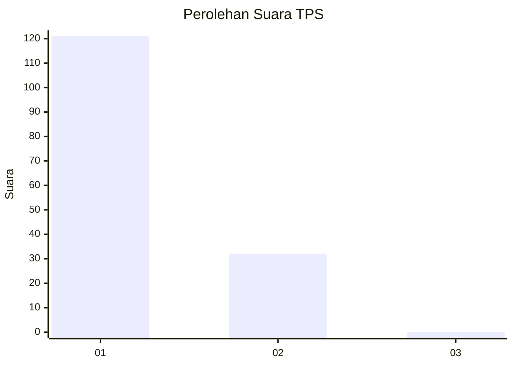
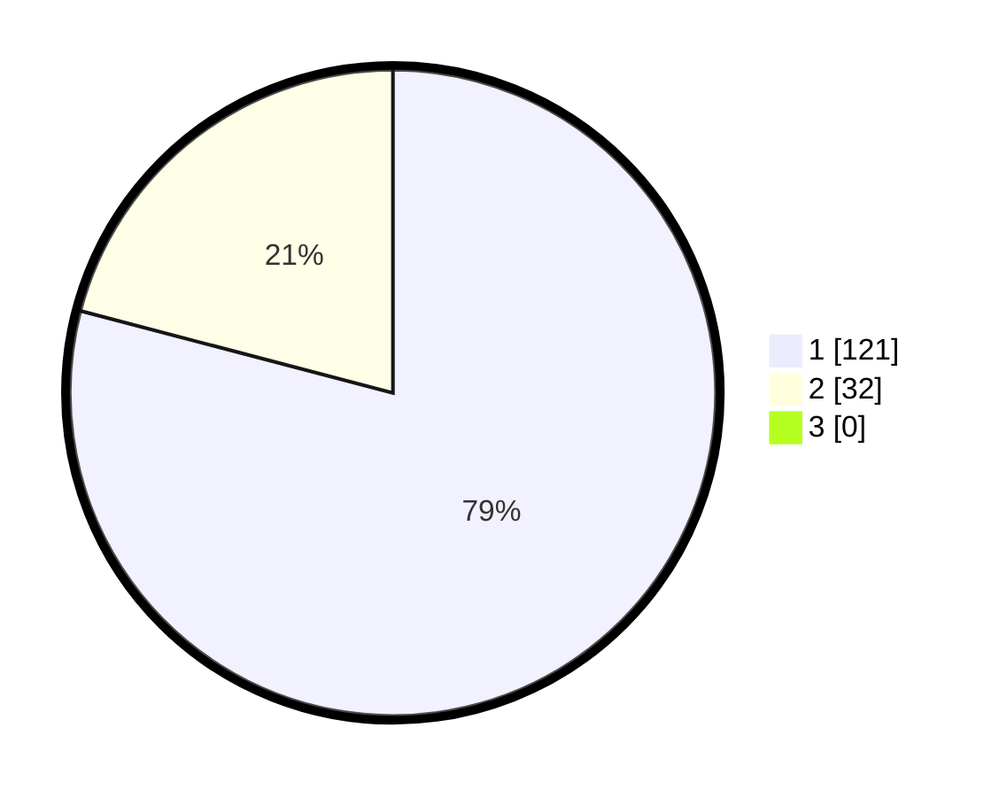

# Hasil

## Grafik

## Tabel

| No. | Nama Paslon    | Suara | Suara (raw) | Persentase |
|:--- |:-------------- | -----:| -----------:| ----------:|
| 1   | ANIES MUHAIMIN | 121   | [121][p-1]  | 79,08      |
| 2   | PRABOWO GIBRAN | 32    | [32][p-2]   | 20,92      |
| 3   | GANJAR MAHFUD  | 0     | [0][p-3]    | 0,00       |

[p-1]: https://github.com/gigit-pemilu/pemilu-2024-11-aceh/blob/main/pilpres/hitung-suara/sub/11-aceh/sub/18-pidie-jaya/sub/08-trienggadeng/sub/2023-buloh/sub/001-tps/sub/paslon-1.txt
[p-2]: https://github.com/gigit-pemilu/pemilu-2024-11-aceh/blob/main/pilpres/hitung-suara/sub/11-aceh/sub/18-pidie-jaya/sub/08-trienggadeng/sub/2023-buloh/sub/001-tps/sub/paslon-2.txt
[p-3]: https://github.com/gigit-pemilu/pemilu-2024-11-aceh/blob/main/pilpres/hitung-suara/sub/11-aceh/sub/18-pidie-jaya/sub/08-trienggadeng/sub/2023-buloh/sub/001-tps/sub/paslon-3.txt

## Foto C Plano

https://sirekap-obj-formc.kpu.go.id/8a2e/pemilu/ppwp/11/18/08/20/23/1118082023001-20240215-053857--edc1146e-345c-4b1f-8c1e-da7feaafefce.jpg

https://sirekap-obj-formc.kpu.go.id/8a2e/pemilu/ppwp/11/18/08/20/23/1118082023001-20240215-054024--12088586-096c-450b-99ab-b10cd1802f48.jpg

https://sirekap-obj-formc.kpu.go.id/8a2e/pemilu/ppwp/11/18/08/20/23/1118082023001-20240215-054128--dd19a388-2351-4761-991d-d8b48eb24e88.jpg

## Metadata

| Key        | Value               |
| ---------- | ------------------- |
| Time Stamp | 2024-02-15 22:00:27 |

