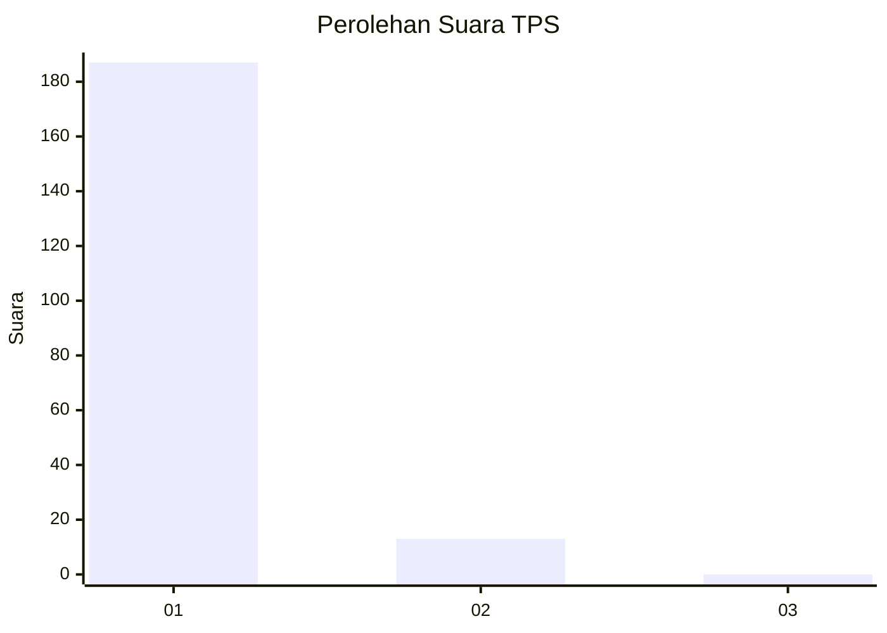
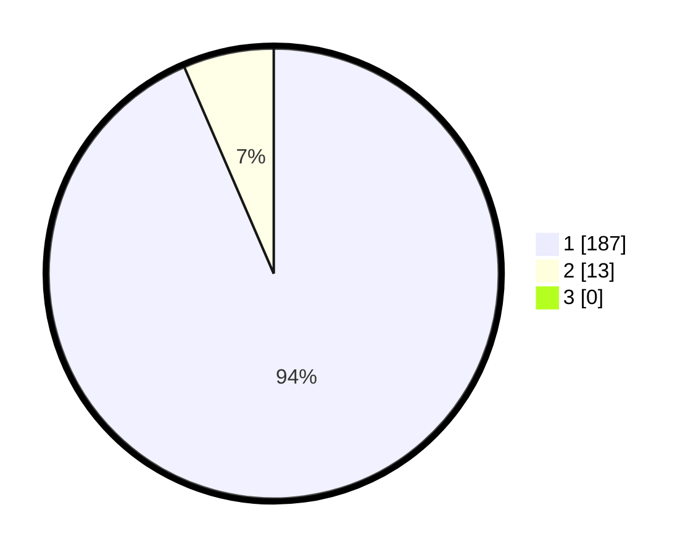

# Hasil

## Grafik

## Tabel

| No. | Nama Paslon    | Suara | Suara (raw) | Persentase |
|:--- |:-------------- | -----:| -----------:| ----------:|
| 1   | ANIES MUHAIMIN | 187   | [187][p-1]  | 93,50      |
| 2   | PRABOWO GIBRAN | 13    | [13][p-2]   | 6,50       |
| 3   | GANJAR MAHFUD  | 0     | [0][p-3]    | 0,00       |

[p-1]: https://github.com/gigit-pemilu/pemilu-2024-11-aceh/blob/main/pilpres/hitung-suara/sub/11-aceh/sub/18-pidie-jaya/sub/08-trienggadeng/sub/2025-kuta-pangwa/sub/001-tps/sub/paslon-1.txt
[p-2]: https://github.com/gigit-pemilu/pemilu-2024-11-aceh/blob/main/pilpres/hitung-suara/sub/11-aceh/sub/18-pidie-jaya/sub/08-trienggadeng/sub/2025-kuta-pangwa/sub/001-tps/sub/paslon-2.txt
[p-3]: https://github.com/gigit-pemilu/pemilu-2024-11-aceh/blob/main/pilpres/hitung-suara/sub/11-aceh/sub/18-pidie-jaya/sub/08-trienggadeng/sub/2025-kuta-pangwa/sub/001-tps/sub/paslon-3.txt

## Foto C Plano

https://sirekap-obj-formc.kpu.go.id/75cc/pemilu/ppwp/11/18/08/20/25/1118082025001-20240215-013610--0a400ae0-5018-4cd5-a161-1564ef0b99cd.jpg

https://sirekap-obj-formc.kpu.go.id/75cc/pemilu/ppwp/11/18/08/20/25/1118082025001-20240215-110357--89ad18ee-0dc7-44de-a613-4a9ab4b01b4b.jpg

https://sirekap-obj-formc.kpu.go.id/75cc/pemilu/ppwp/11/18/08/20/25/1118082025001-20240215-014148--adb8afaf-24ab-4138-bcf8-039c71430689.jpg

## Metadata

| Key        | Value               |
| ---------- | ------------------- |
| Time Stamp | 2024-02-15 21:30:27 |

