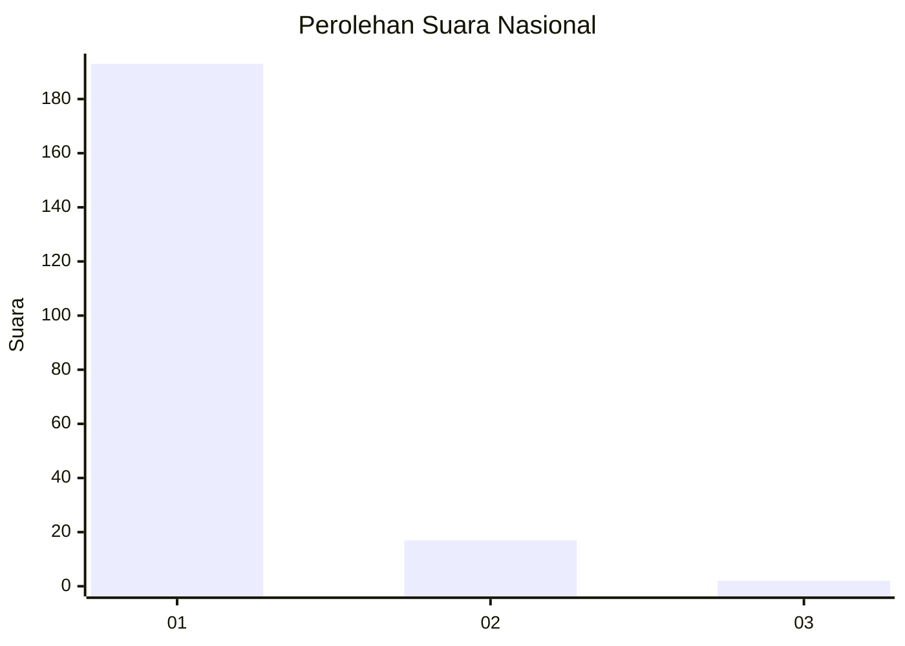
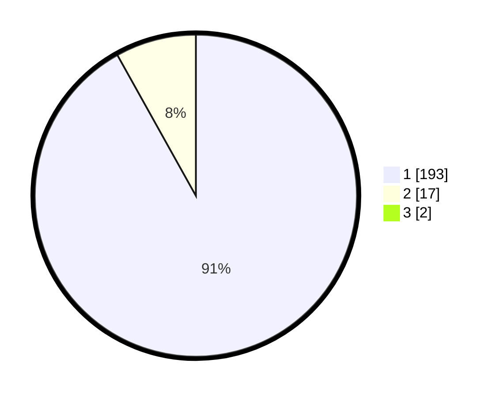

# Hasil

## Grafik

## Tabel

| No. | Nama Paslon    | Suara | Suara (raw) | Persentase |
|:--- |:-------------- | -----:| -----------:| ----------:|
| 1   | ANIES MUHAIMIN | 193   | [193][p-1]  | 91,04      |
| 2   | PRABOWO GIBRAN | 17    | [17][p-2]   | 8,02       |
| 3   | GANJAR MAHFUD  | 2     | [2][p-3]    | 0,94       |

[p-1]: https://github.com/gigit-pemilu/pemilu-2024/blob/main/pilpres/hitung-suara/sub/11-aceh/sub/18-pidie-jaya/sub/08-trienggadeng/sub/2025-kuta-pangwa/sub/002-tps/sub/paslon-1.txt
[p-2]: https://github.com/gigit-pemilu/pemilu-2024/blob/main/pilpres/hitung-suara/sub/11-aceh/sub/18-pidie-jaya/sub/08-trienggadeng/sub/2025-kuta-pangwa/sub/002-tps/sub/paslon-2.txt
[p-3]: https://github.com/gigit-pemilu/pemilu-2024/blob/main/pilpres/hitung-suara/sub/11-aceh/sub/18-pidie-jaya/sub/08-trienggadeng/sub/2025-kuta-pangwa/sub/002-tps/sub/paslon-3.txt

## Foto C Plano

https://sirekap-obj-formc.kpu.go.id/a2d7/pemilu/ppwp/11/18/08/20/25/1118082025002-20240215-114440--775d9a87-8d14-4b25-81e3-a53a1266de79.jpg

https://sirekap-obj-formc.kpu.go.id/a2d7/pemilu/ppwp/11/18/08/20/25/1118082025002-20240215-025436--87911db6-a3b3-4ab5-9196-bd33f369720c.jpg

https://sirekap-obj-formc.kpu.go.id/a2d7/pemilu/ppwp/11/18/08/20/25/1118082025002-20240215-025540--a696e2dd-64c2-4f31-8cb5-c44010a72cf3.jpg

## Metadata

| Key        | Value               |
| ---------- | ------------------- |
| Time Stamp | 2024-02-15 22:00:27 |

