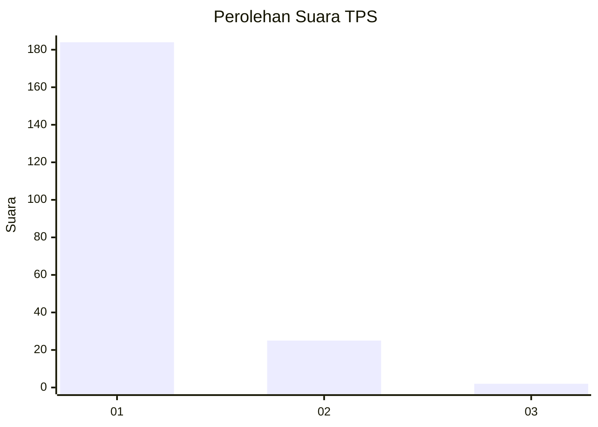
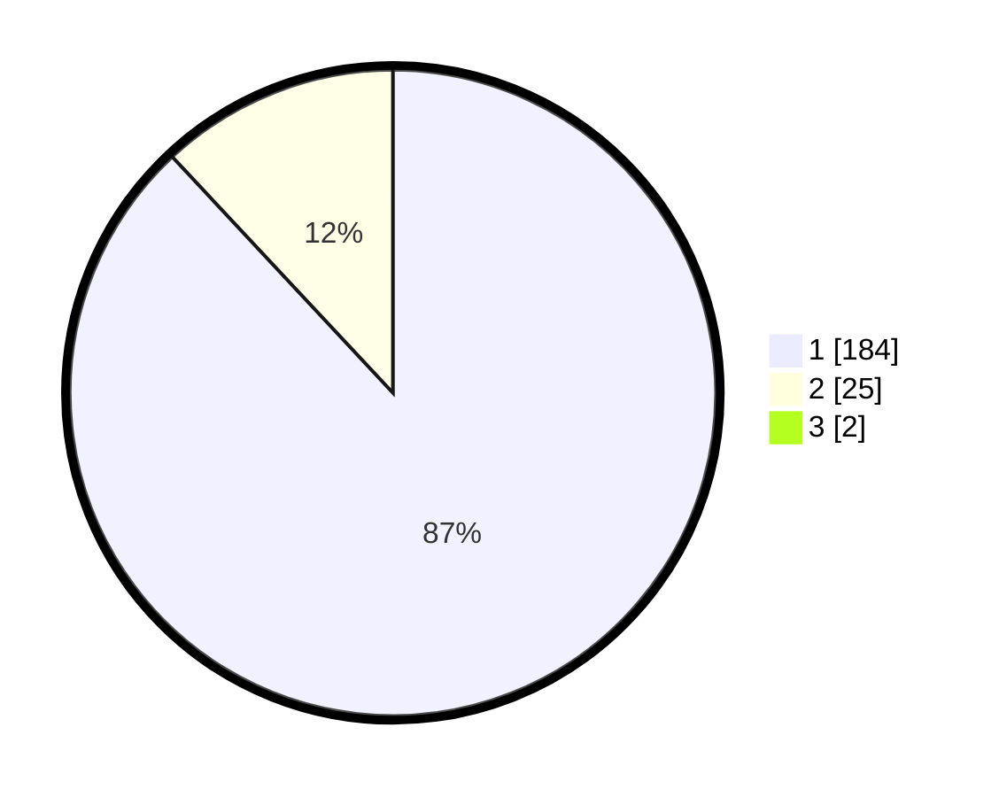

# Hasil

## Grafik

## Tabel

| No. | Nama Paslon    | Suara | Suara (raw) | Persentase |
|:--- |:-------------- | -----:| -----------:| ----------:|
| 1   | ANIES MUHAIMIN | 184   | [184][p-1]  | 87,20      |
| 2   | PRABOWO GIBRAN | 25    | [25][p-2]   | 11,85      |
| 3   | GANJAR MAHFUD  | 2     | [2][p-3]    | 0,95       |

[p-1]: https://github.com/gigit-pemilu/pemilu-2024-11-aceh/blob/main/pilpres/hitung-suara/sub/11-aceh/sub/18-pidie-jaya/sub/08-trienggadeng/sub/2027-rawasari/sub/003-tps/sub/paslon-1.txt
[p-2]: https://github.com/gigit-pemilu/pemilu-2024-11-aceh/blob/main/pilpres/hitung-suara/sub/11-aceh/sub/18-pidie-jaya/sub/08-trienggadeng/sub/2027-rawasari/sub/003-tps/sub/paslon-2.txt
[p-3]: https://github.com/gigit-pemilu/pemilu-2024-11-aceh/blob/main/pilpres/hitung-suara/sub/11-aceh/sub/18-pidie-jaya/sub/08-trienggadeng/sub/2027-rawasari/sub/003-tps/sub/paslon-3.txt

## Foto C Plano

https://sirekap-obj-formc.kpu.go.id/d75c/pemilu/ppwp/11/18/08/20/27/1118082027003-20240214-202625--03dee0da-3118-4f2a-928c-b58380840078.jpg

https://sirekap-obj-formc.kpu.go.id/d75c/pemilu/ppwp/11/18/08/20/27/1118082027003-20240215-162246--c2434e66-d48f-46d5-b982-7160790b925a.jpg

https://sirekap-obj-formc.kpu.go.id/d75c/pemilu/ppwp/11/18/08/20/27/1118082027003-20240214-202733--97a75b15-b317-4acc-9367-9ff6027335d6.jpg

## Metadata

| Key        | Value               |
| ---------- | ------------------- |
| Time Stamp | 2024-02-15 22:00:27 |

