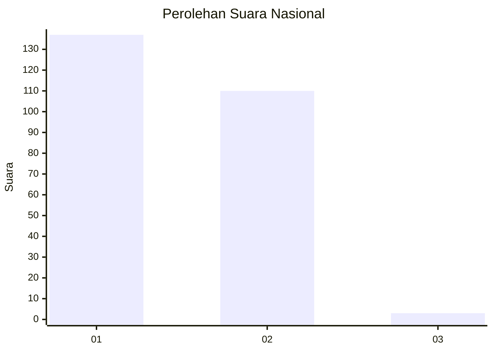
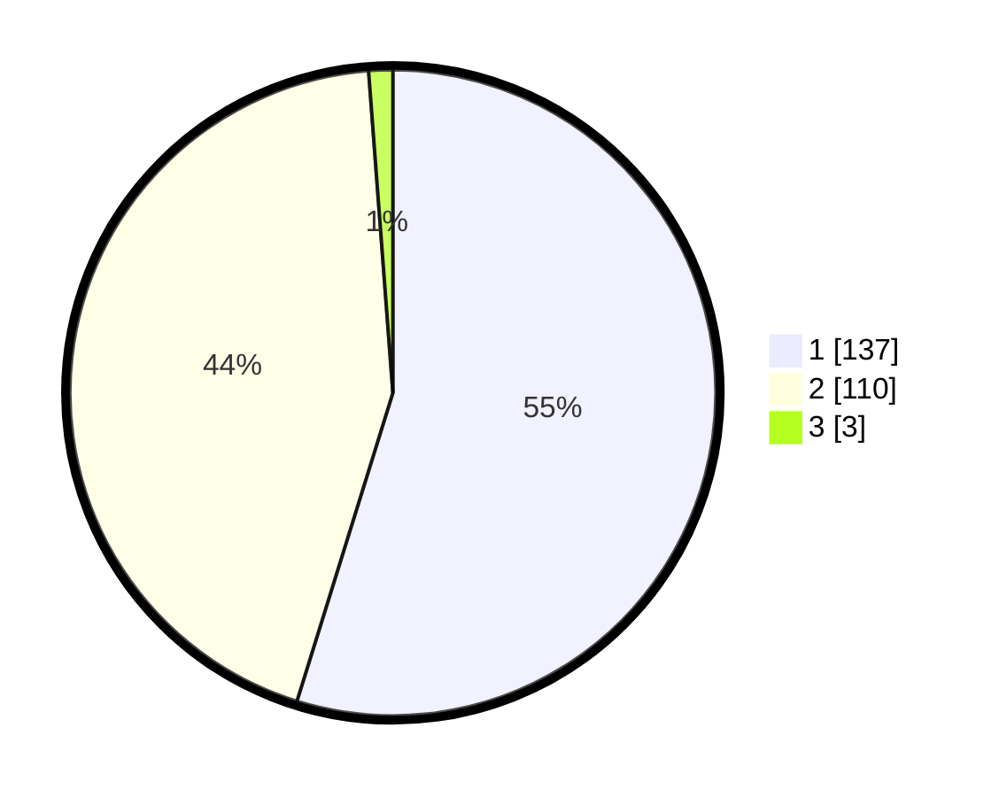

# Hasil

## Grafik

## Tabel

| No. | Nama Paslon    | Suara | Suara (raw) | Persentase |
|:--- |:-------------- | -----:| -----------:| ----------:|
| 1   | ANIES MUHAIMIN | 137   | [137][p-1]  | 54,80      |
| 2   | PRABOWO GIBRAN | 110   | [110][p-2]  | 44,00      |
| 3   | GANJAR MAHFUD  | 3     | [3][p-3]    | 1,20       |

[p-1]: https://github.com/gigit-pemilu/pemilu-2024/blob/main/pilpres/hitung-suara/sub/11-aceh/sub/71-kota-banda-aceh/sub/01-baiturrahman/sub/2001-kampung-baru/sub/001-tps/sub/paslon-1.txt
[p-2]: https://github.com/gigit-pemilu/pemilu-2024/blob/main/pilpres/hitung-suara/sub/11-aceh/sub/71-kota-banda-aceh/sub/01-baiturrahman/sub/2001-kampung-baru/sub/001-tps/sub/paslon-2.txt
[p-3]: https://github.com/gigit-pemilu/pemilu-2024/blob/main/pilpres/hitung-suara/sub/11-aceh/sub/71-kota-banda-aceh/sub/01-baiturrahman/sub/2001-kampung-baru/sub/001-tps/sub/paslon-3.txt

## Foto C Plano

https://sirekap-obj-formc.kpu.go.id/336d/pemilu/ppwp/11/71/01/20/01/1171012001001-20240226-224559--90a21c6f-3f30-4a0d-9773-c76940224239.jpg

https://sirekap-obj-formc.kpu.go.id/336d/pemilu/ppwp/11/71/01/20/01/1171012001001-20240215-070356--4ceb9660-0cfd-409c-837e-9e37b37857b0.jpg

https://sirekap-obj-formc.kpu.go.id/336d/pemilu/ppwp/11/71/01/20/01/1171012001001-20240215-070559--8687da0d-b159-4166-a73a-dd112c226016.jpg

## Metadata

| Key        | Value               |
| ---------- | ------------------- |
| Time Stamp | 2024-02-26 23:00:00 |

