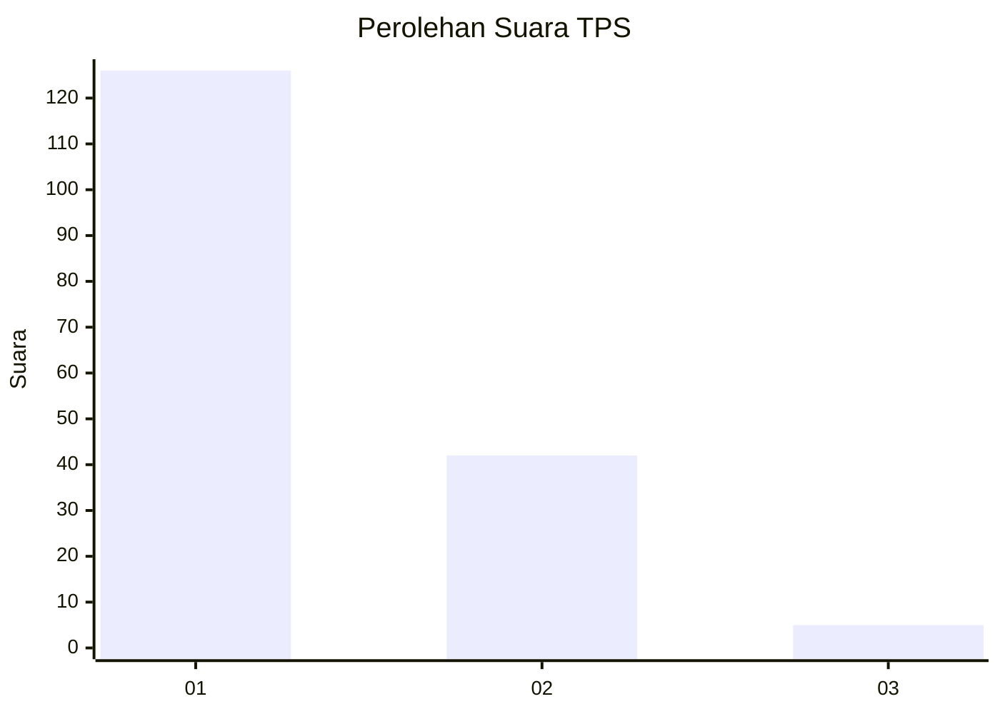
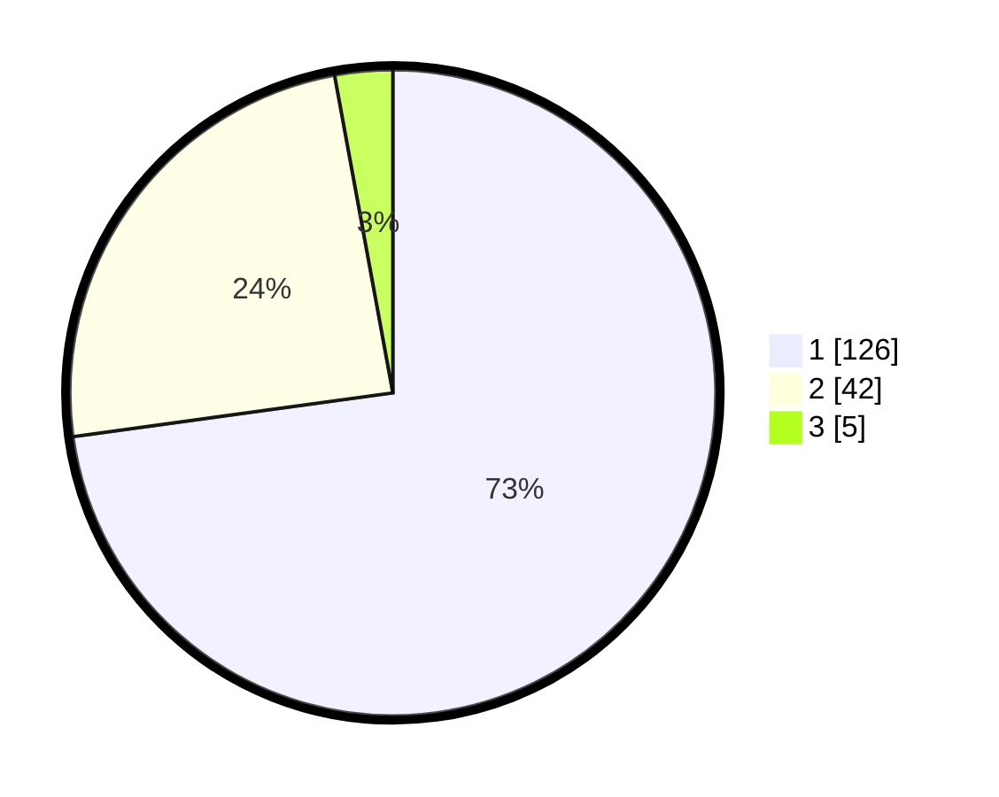

# Hasil

## Grafik

## Tabel

| No. | Nama Paslon    | Suara | Suara (raw) | Persentase |
|:--- |:-------------- | -----:| -----------:| ----------:|
| 1   | ANIES MUHAIMIN | 126   | [126][p-1]  | 72,83      |
| 2   | PRABOWO GIBRAN | 42    | [42][p-2]   | 24,28      |
| 3   | GANJAR MAHFUD  | 5     | [5][p-3]    | 2,89       |

[p-1]: https://github.com/gigit-pemilu/pemilu-2024-11-aceh/blob/main/pilpres/hitung-suara/sub/11-aceh/sub/71-kota-banda-aceh/sub/01-baiturrahman/sub/2001-kampung-baru/sub/002-tps/sub/paslon-1.txt
[p-2]: https://github.com/gigit-pemilu/pemilu-2024-11-aceh/blob/main/pilpres/hitung-suara/sub/11-aceh/sub/71-kota-banda-aceh/sub/01-baiturrahman/sub/2001-kampung-baru/sub/002-tps/sub/paslon-2.txt
[p-3]: https://github.com/gigit-pemilu/pemilu-2024-11-aceh/blob/main/pilpres/hitung-suara/sub/11-aceh/sub/71-kota-banda-aceh/sub/01-baiturrahman/sub/2001-kampung-baru/sub/002-tps/sub/paslon-3.txt

## Foto C Plano

https://sirekap-obj-formc.kpu.go.id/a89f/pemilu/ppwp/11/71/01/20/01/1171012001002-20240227-005718--4c224ff9-1c26-407a-9670-bc1e221e80ee.jpg

https://sirekap-obj-formc.kpu.go.id/a89f/pemilu/ppwp/11/71/01/20/01/1171012001002-20240227-011056--3d130721-2ffc-4716-a3dd-d5d6cdf8b1fd.jpg

https://sirekap-obj-formc.kpu.go.id/a89f/pemilu/ppwp/11/71/01/20/01/1171012001002-20240227-010703--b0aa7705-e56e-47ce-9030-5a75ba0d8551.jpg

## Metadata

| Key        | Value               |
| ---------- | ------------------- |
| Time Stamp | 2024-02-27 02:00:00 |

## DATA PEMILIH TETAP

Jumlah pemilih dalam DPT: **194**.
 * L: **98**.
 * P: **96**.

## DATA PENGGUNA HAK PILIH

Jumlah pengguna hak pilih dalam DPT: **134**.
 * L: **62**.
 * P: **72**.

Jumlah pengguna hak pilih dalam DPTb: **15**.
 * L: **8**.
 * P: **7**.

Jumlah pengguna hak pilih dalam DPK: **25**.
 * L: **9**.
 * P: **16**.

Jumlah pengguna hak pilih: **174**.
 * L: **79**.
 * P: **95**.

## JUMLAH SUARA SAH DAN TIDAK SAH

JUMLAH SELURUH SUARA SAH: **173**.

JUMLAH SUARA TIDAK SAH: **1**.

JUMLAH SELURUH SUARA SAH DAN SUARA TIDAK SAH: **174**.

