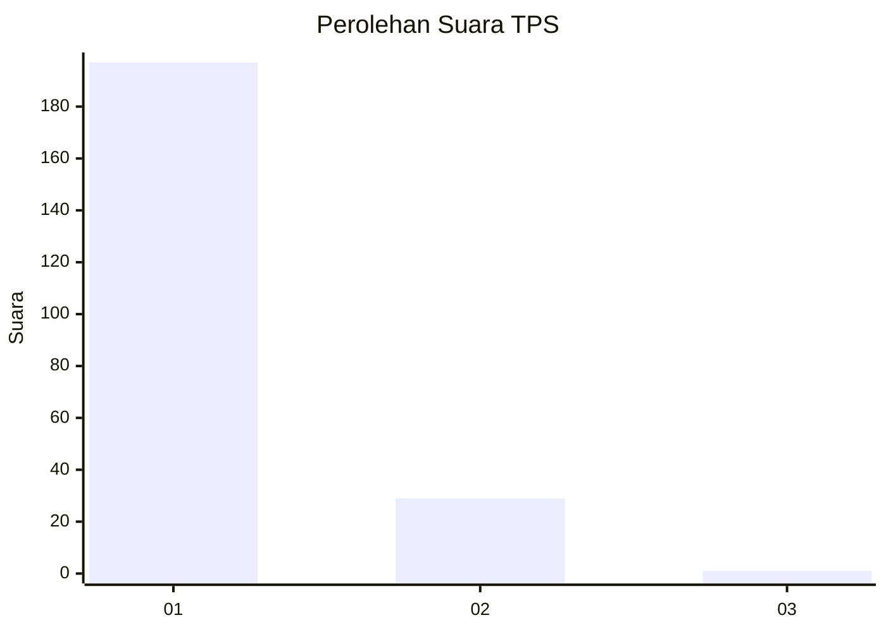
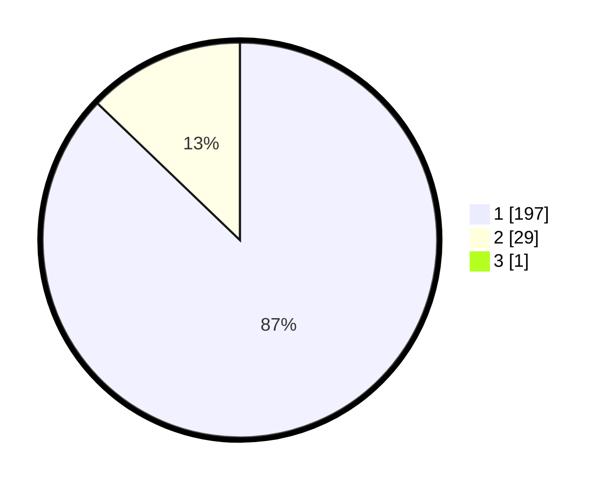

# Hasil

## Grafik

## Tabel

| No. | Nama Paslon    | Suara | Suara (raw) | Persentase |
|:--- |:-------------- | -----:| -----------:| ----------:|
| 1   | ANIES MUHAIMIN | 197   | [197][p-1]  | 86,78      |
| 2   | PRABOWO GIBRAN | 29    | [29][p-2]   | 12,78      |
| 3   | GANJAR MAHFUD  | 1     | [1][p-3]    | 0,44       |

[p-1]: https://github.com/gigit-pemilu/pemilu-2024-11-aceh/blob/main/pilpres/hitung-suara/sub/11-aceh/sub/71-kota-banda-aceh/sub/01-baiturrahman/sub/2001-kampung-baru/sub/003-tps/sub/paslon-1.txt
[p-2]: https://github.com/gigit-pemilu/pemilu-2024-11-aceh/blob/main/pilpres/hitung-suara/sub/11-aceh/sub/71-kota-banda-aceh/sub/01-baiturrahman/sub/2001-kampung-baru/sub/003-tps/sub/paslon-2.txt
[p-3]: https://github.com/gigit-pemilu/pemilu-2024-11-aceh/blob/main/pilpres/hitung-suara/sub/11-aceh/sub/71-kota-banda-aceh/sub/01-baiturrahman/sub/2001-kampung-baru/sub/003-tps/sub/paslon-3.txt

## Foto C Plano

https://sirekap-obj-formc.kpu.go.id/b2d3/pemilu/ppwp/11/71/01/20/01/1171012001003-20240217-185503--1c3ccfc0-1189-4f2c-a689-703adcac1801.jpg

https://sirekap-obj-formc.kpu.go.id/b2d3/pemilu/ppwp/11/71/01/20/01/1171012001003-20240217-185639--9588e0af-a4dc-4d34-a9da-5b174ad64a5c.jpg

https://sirekap-obj-formc.kpu.go.id/b2d3/pemilu/ppwp/11/71/01/20/01/1171012001003-20240217-185846--ee9586d7-ade9-41f6-b033-03c3d719d21d.jpg

## Metadata

| Key        | Value               |
| ---------- | ------------------- |
| Time Stamp | 2024-02-19 06:16:00 |

## DATA PEMILIH TETAP

Jumlah pemilih dalam DPT: **268**.
 * L: **127**.
 * P: **141**.

## DATA PENGGUNA HAK PILIH

Jumlah pengguna hak pilih dalam DPT: **218**.
 * L: **97**.
 * P: **121**.

Jumlah pengguna hak pilih dalam DPTb: **4**.
 * L: **3**.
 * P: **1**.

Jumlah pengguna hak pilih dalam DPK: **6**.
 * L: **3**.
 * P: **3**.

Jumlah pengguna hak pilih: **228**.
 * L: **103**.
 * P: **125**.

## JUMLAH SUARA SAH DAN TIDAK SAH

JUMLAH SELURUH SUARA SAH: **227**.

JUMLAH SUARA TIDAK SAH: **1**.

JUMLAH SELURUH SUARA SAH DAN SUARA TIDAK SAH: **228**.

