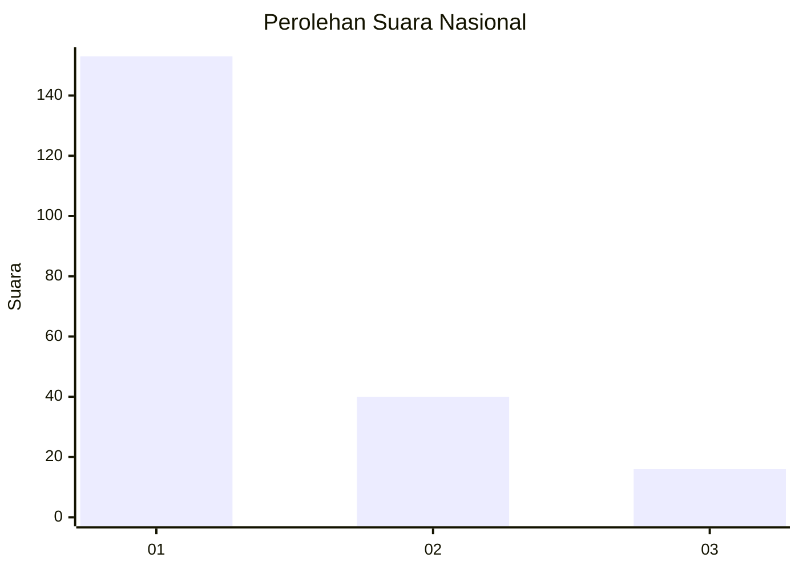
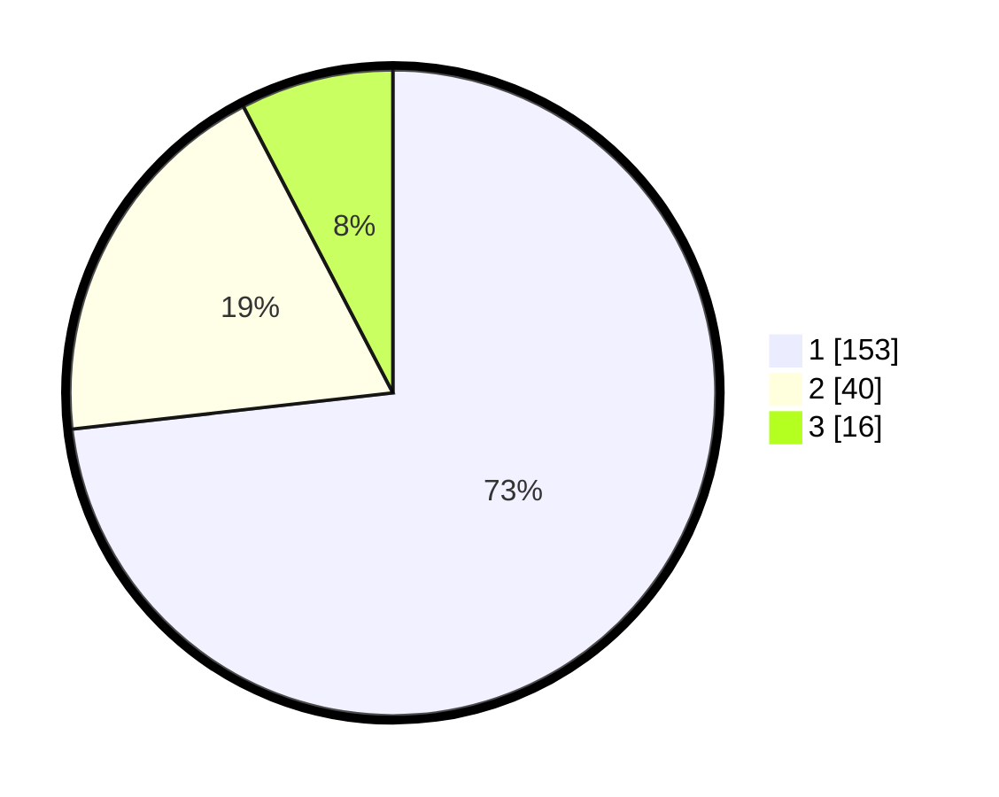

# Hasil

## Grafik

## Tabel

| No. | Nama Paslon    | Suara | Suara (raw) | Persentase |
|:--- |:-------------- | -----:| -----------:| ----------:|
| 1   | ANIES MUHAIMIN | 153   | [153][p-1]  | 73,21      |
| 2   | PRABOWO GIBRAN | 40    | [40][p-2]   | 19,14      |
| 3   | GANJAR MAHFUD  | 16    | [16][p-3]   | 7,66       |

[p-1]: https://github.com/gigit-pemilu/pemilu-2024/blob/main/pilpres/hitung-suara/sub/11-aceh/sub/71-kota-banda-aceh/sub/01-baiturrahman/sub/2001-kampung-baru/sub/004-tps/sub/paslon-1.txt
[p-2]: https://github.com/gigit-pemilu/pemilu-2024/blob/main/pilpres/hitung-suara/sub/11-aceh/sub/71-kota-banda-aceh/sub/01-baiturrahman/sub/2001-kampung-baru/sub/004-tps/sub/paslon-2.txt
[p-3]: https://github.com/gigit-pemilu/pemilu-2024/blob/main/pilpres/hitung-suara/sub/11-aceh/sub/71-kota-banda-aceh/sub/01-baiturrahman/sub/2001-kampung-baru/sub/004-tps/sub/paslon-3.txt

## Foto C Plano

https://sirekap-obj-formc.kpu.go.id/3625/pemilu/ppwp/11/71/01/20/01/1171012001004-20240226-171036--0a98870c-2150-4aee-b830-49c2ac4d179e.jpg

https://sirekap-obj-formc.kpu.go.id/3625/pemilu/ppwp/11/71/01/20/01/1171012001004-20240226-172847--25d36678-dc4f-4866-8fd8-e8b81b08d1f0.jpg

https://sirekap-obj-formc.kpu.go.id/3625/pemilu/ppwp/11/71/01/20/01/1171012001004-20240226-172548--e9f3c1e4-3bca-49bf-b2d7-18262bb9ab0b.jpg

## Metadata

| Key        | Value               |
| ---------- | ------------------- |
| Time Stamp | 2024-02-26 18:00:00 |

## DATA PEMILIH TETAP

Jumlah pemilih dalam DPT: **262**.
 * L: **140**.
 * P: **122**.

## DATA PENGGUNA HAK PILIH

Jumlah pengguna hak pilih dalam DPT: **192**.
 * L: **99**.
 * P: **93**.

Jumlah pengguna hak pilih dalam DPTb: **9**.
 * L: **1**.
 * P: **8**.

Jumlah pengguna hak pilih dalam DPK: **12**.
 * L: **7**.
 * P: **5**.

Jumlah pengguna hak pilih: **213**.
 * L: **107**.
 * P: **106**.

## JUMLAH SUARA SAH DAN TIDAK SAH

JUMLAH SELURUH SUARA SAH: **209**.

JUMLAH SUARA TIDAK SAH: **4**.

JUMLAH SELURUH SUARA SAH DAN SUARA TIDAK SAH: **213**.

