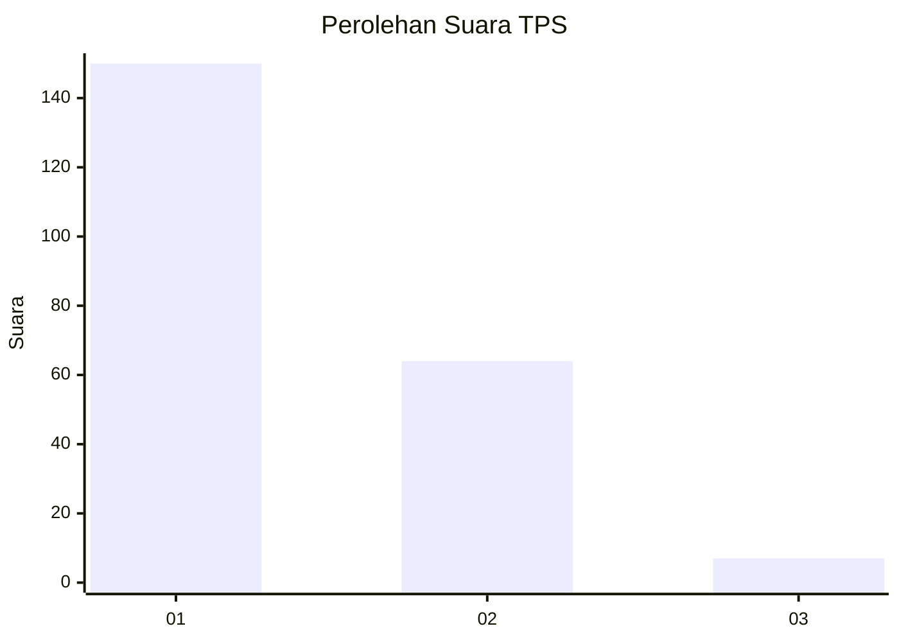
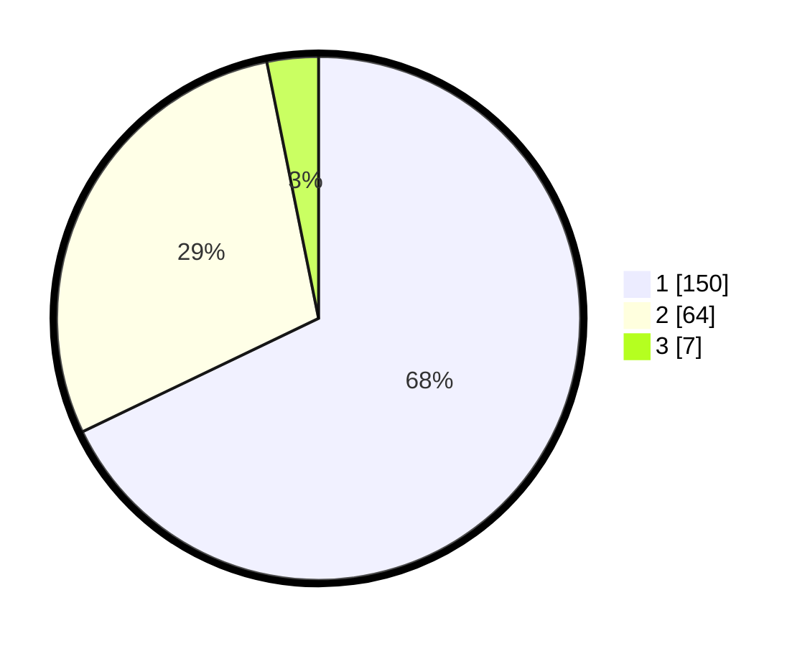

# Hasil

## Grafik

## Tabel

| No. | Nama Paslon    | Suara | Suara (raw) | Persentase |
|:--- |:-------------- | -----:| -----------:| ----------:|
| 1   | ANIES MUHAIMIN | 150   | [150][p-1]  | 67,87      |
| 2   | PRABOWO GIBRAN | 64    | [64][p-2]   | 28,96      |
| 3   | GANJAR MAHFUD  | 7     | [7][p-3]    | 3,17       |

[p-1]: https://github.com/gigit-pemilu/pemilu-2024-11-aceh/blob/main/pilpres/hitung-suara/sub/11-aceh/sub/71-kota-banda-aceh/sub/01-baiturrahman/sub/2002-neusu-jaya/sub/001-tps/sub/paslon-1.txt
[p-2]: https://github.com/gigit-pemilu/pemilu-2024-11-aceh/blob/main/pilpres/hitung-suara/sub/11-aceh/sub/71-kota-banda-aceh/sub/01-baiturrahman/sub/2002-neusu-jaya/sub/001-tps/sub/paslon-2.txt
[p-3]: https://github.com/gigit-pemilu/pemilu-2024-11-aceh/blob/main/pilpres/hitung-suara/sub/11-aceh/sub/71-kota-banda-aceh/sub/01-baiturrahman/sub/2002-neusu-jaya/sub/001-tps/sub/paslon-3.txt

## Foto C Plano

https://sirekap-obj-formc.kpu.go.id/571c/pemilu/ppwp/11/71/01/20/02/1171012002001-20240224-102846--d05ac2fe-0e38-4273-ab27-4cde4ad8bb56.jpg

https://sirekap-obj-formc.kpu.go.id/571c/pemilu/ppwp/11/71/01/20/02/1171012002001-20240224-103051--4b19f7a8-e2ad-4359-8a0b-b4cd1bf4a617.jpg

https://sirekap-obj-formc.kpu.go.id/571c/pemilu/ppwp/11/71/01/20/02/1171012002001-20240224-103147--8b23a195-047e-4b37-a070-bc73678d5e9b.jpg

## Metadata

| Key        | Value               |
| ---------- | ------------------- |
| Time Stamp | 2024-02-24 22:31:28 |

## DATA PEMILIH TETAP

Jumlah pemilih dalam DPT: **271**.
 * L: **121**.
 * P: **150**.

## DATA PENGGUNA HAK PILIH

Jumlah pengguna hak pilih dalam DPT: **212**.
 * L: **87**.
 * P: **125**.

Jumlah pengguna hak pilih dalam DPTb: **6**.
 * L: **3**.
 * P: **3**.

Jumlah pengguna hak pilih dalam DPK: **3**.
 * L: **2**.
 * P: **1**.

Jumlah pengguna hak pilih: **221**.
 * L: **92**.
 * P: **129**.

## JUMLAH SUARA SAH DAN TIDAK SAH

JUMLAH SELURUH SUARA SAH: **221**.

JUMLAH SUARA TIDAK SAH: **0**.

JUMLAH SELURUH SUARA SAH DAN SUARA TIDAK SAH: **221**.

