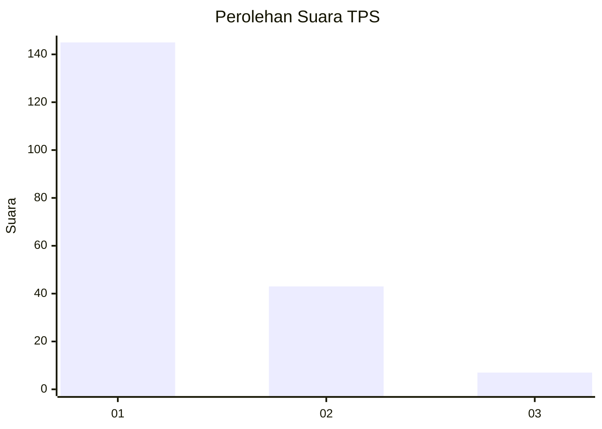
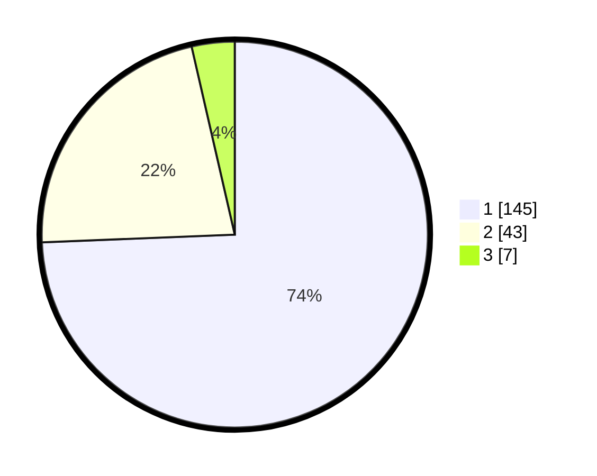

# Hasil

## Grafik

## Tabel

| No. | Nama Paslon    | Suara | Suara (raw) | Persentase |
|:--- |:-------------- | -----:| -----------:| ----------:|
| 1   | ANIES MUHAIMIN | 145   | [145][p-1]  | 74,36      |
| 2   | PRABOWO GIBRAN | 43    | [43][p-2]   | 22,05      |
| 3   | GANJAR MAHFUD  | 7     | [7][p-3]    | 3,59       |

[p-1]: https://github.com/gigit-pemilu/pemilu-2024-11-aceh/blob/main/pilpres/hitung-suara/sub/11-aceh/sub/71-kota-banda-aceh/sub/01-baiturrahman/sub/2003-sukaramai/sub/004-tps/sub/paslon-1.txt
[p-2]: https://github.com/gigit-pemilu/pemilu-2024-11-aceh/blob/main/pilpres/hitung-suara/sub/11-aceh/sub/71-kota-banda-aceh/sub/01-baiturrahman/sub/2003-sukaramai/sub/004-tps/sub/paslon-2.txt
[p-3]: https://github.com/gigit-pemilu/pemilu-2024-11-aceh/blob/main/pilpres/hitung-suara/sub/11-aceh/sub/71-kota-banda-aceh/sub/01-baiturrahman/sub/2003-sukaramai/sub/004-tps/sub/paslon-3.txt

## Foto C Plano

https://sirekap-obj-formc.kpu.go.id/a464/pemilu/ppwp/11/71/01/20/03/1171012003004-20240222-114302--3cf6a932-3271-4346-9255-2a132d4148cc.jpg

https://sirekap-obj-formc.kpu.go.id/a464/pemilu/ppwp/11/71/01/20/03/1171012003004-20240222-114642--16f4fccf-903b-43e0-bc19-bb5ff1c6442f.jpg

https://sirekap-obj-formc.kpu.go.id/a464/pemilu/ppwp/11/71/01/20/03/1171012003004-20240222-130516--ef174b8d-6354-40be-a3fb-c0eecfc1f8ee.jpg

## Metadata

| Key        | Value               |
| ---------- | ------------------- |
| Time Stamp | 2024-02-22 14:00:00 |

## DATA PEMILIH TETAP

Jumlah pemilih dalam DPT: **252**.
 * L: **108**.
 * P: **144**.

## DATA PENGGUNA HAK PILIH

Jumlah pengguna hak pilih dalam DPT: **183**.
 * L: **78**.
 * P: **105**.

Jumlah pengguna hak pilih dalam DPTb: **1**.
 * L: **0**.
 * P: **1**.

Jumlah pengguna hak pilih dalam DPK: **13**.
 * L: **8**.
 * P: **5**.

Jumlah pengguna hak pilih: **197**.
 * L: **86**.
 * P: **111**.

## JUMLAH SUARA SAH DAN TIDAK SAH

JUMLAH SELURUH SUARA SAH: **195**.

JUMLAH SUARA TIDAK SAH: **2**.

JUMLAH SELURUH SUARA SAH DAN SUARA TIDAK SAH: **197**.

