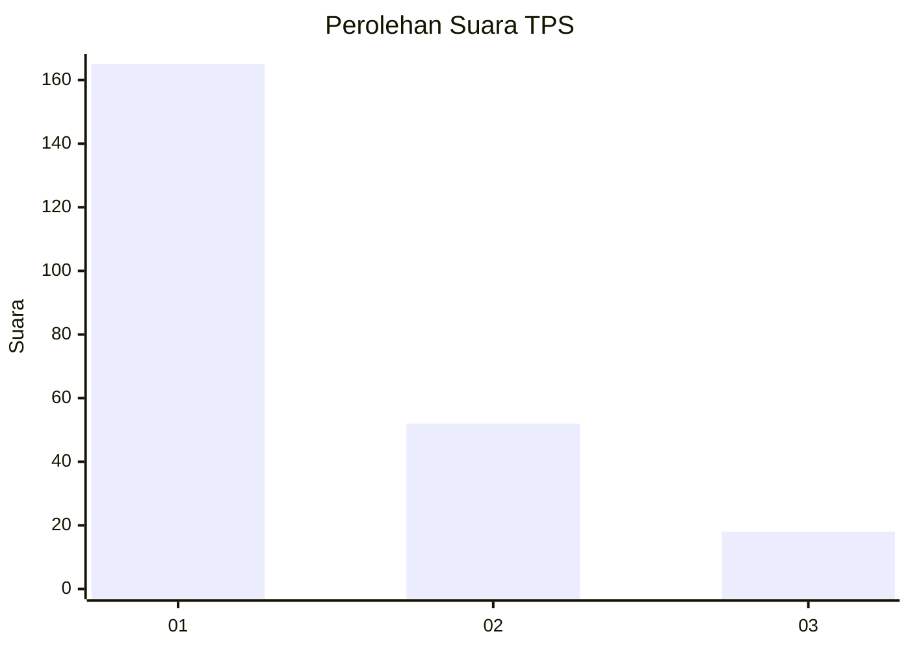
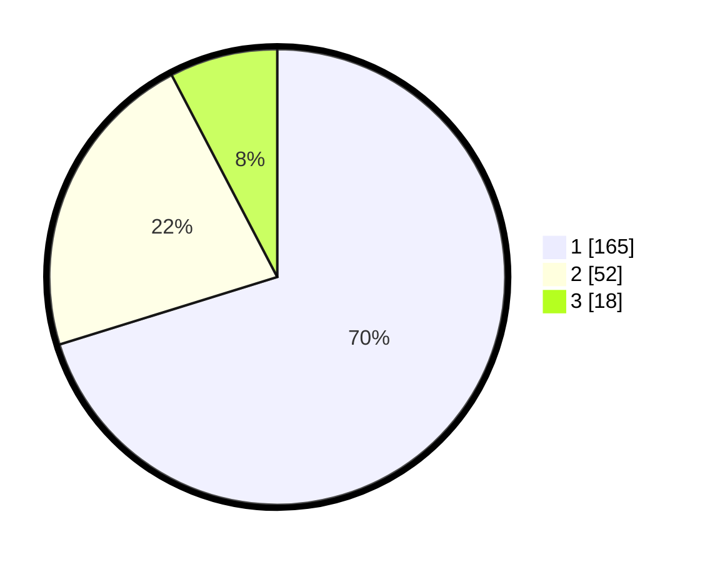

# Hasil

## Grafik

## Tabel

| No. | Nama Paslon    | Suara | Suara (raw) | Persentase |
|:--- |:-------------- | -----:| -----------:| ----------:|
| 1   | ANIES MUHAIMIN | 165   | [165][p-1]  | 70,21      |
| 2   | PRABOWO GIBRAN | 52    | [52][p-2]   | 22,13      |
| 3   | GANJAR MAHFUD  | 18    | [18][p-3]   | 7,66       |

[p-1]: https://github.com/gigit-pemilu/pemilu-2024-11-aceh/blob/main/pilpres/hitung-suara/sub/11-aceh/sub/71-kota-banda-aceh/sub/02-kuta-alam/sub/2001-mulia/sub/001-tps/sub/paslon-1.txt
[p-2]: https://github.com/gigit-pemilu/pemilu-2024-11-aceh/blob/main/pilpres/hitung-suara/sub/11-aceh/sub/71-kota-banda-aceh/sub/02-kuta-alam/sub/2001-mulia/sub/001-tps/sub/paslon-2.txt
[p-3]: https://github.com/gigit-pemilu/pemilu-2024-11-aceh/blob/main/pilpres/hitung-suara/sub/11-aceh/sub/71-kota-banda-aceh/sub/02-kuta-alam/sub/2001-mulia/sub/001-tps/sub/paslon-3.txt

## Foto C Plano

https://sirekap-obj-formc.kpu.go.id/3661/pemilu/ppwp/11/71/02/20/01/1171022001001-20240214-220340--e80f58a6-375c-4ac7-a5a2-d7e21a053ac0.jpg

https://sirekap-obj-formc.kpu.go.id/3661/pemilu/ppwp/11/71/02/20/01/1171022001001-20240214-220442--88d3378d-7bc6-4399-a3c2-3dc1cac24bf3.jpg

https://sirekap-obj-formc.kpu.go.id/3661/pemilu/ppwp/11/71/02/20/01/1171022001001-20240214-220517--fd61e4e3-3b2f-45c7-97c8-21582eb93a48.jpg

## Metadata

| Key        | Value               |
| ---------- | ------------------- |
| Time Stamp | 2024-02-15 12:00:28 |

