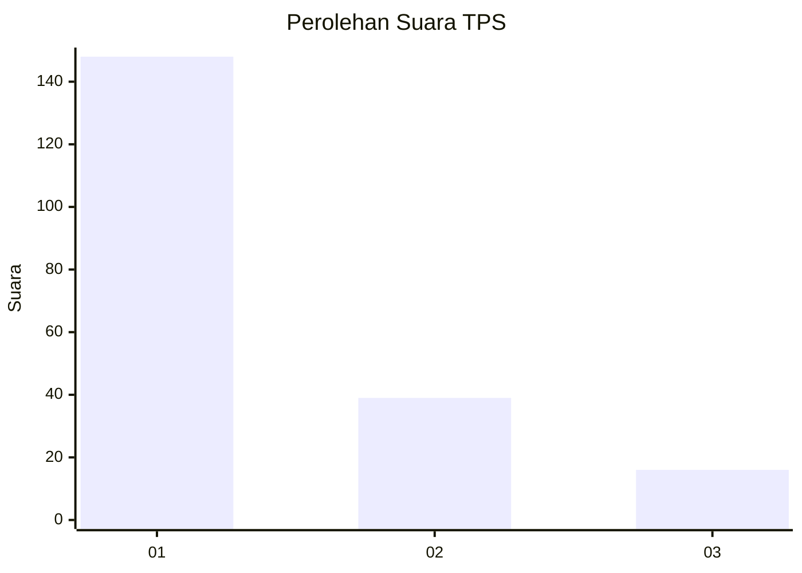
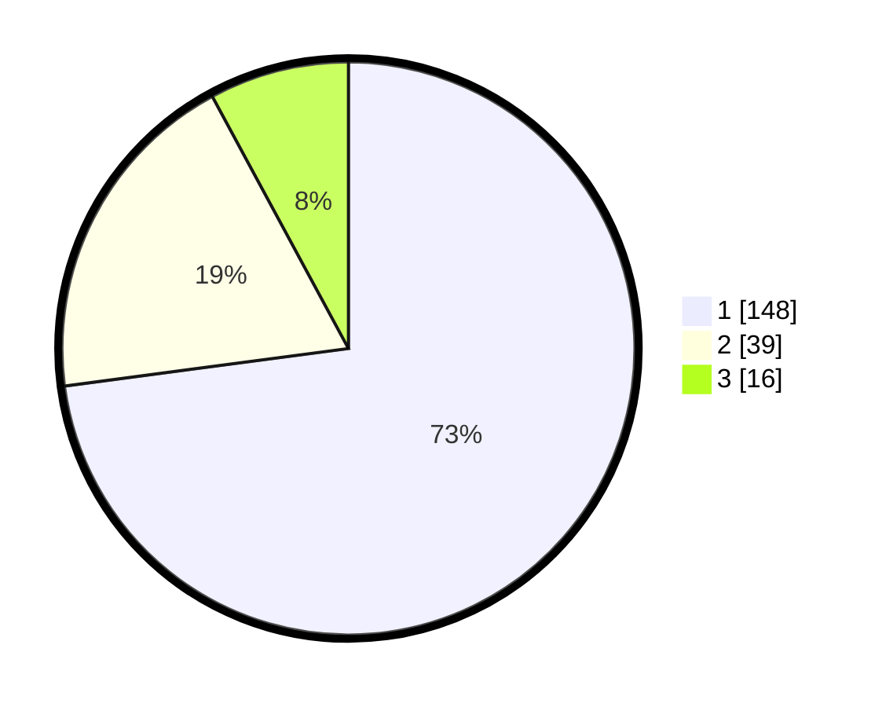

# Hasil

## Grafik

## Tabel

| No. | Nama Paslon    | Suara | Suara (raw) | Persentase |
|:--- |:-------------- | -----:| -----------:| ----------:|
| 1   | ANIES MUHAIMIN | 148   | [148][p-1]  | 72,91      |
| 2   | PRABOWO GIBRAN | 39    | [39][p-2]   | 19,21      |
| 3   | GANJAR MAHFUD  | 16    | [16][p-3]   | 7,88       |

[p-1]: https://github.com/gigit-pemilu/pemilu-2024-11-aceh/blob/main/pilpres/hitung-suara/sub/11-aceh/sub/71-kota-banda-aceh/sub/02-kuta-alam/sub/2001-mulia/sub/002-tps/sub/paslon-1.txt
[p-2]: https://github.com/gigit-pemilu/pemilu-2024-11-aceh/blob/main/pilpres/hitung-suara/sub/11-aceh/sub/71-kota-banda-aceh/sub/02-kuta-alam/sub/2001-mulia/sub/002-tps/sub/paslon-2.txt
[p-3]: https://github.com/gigit-pemilu/pemilu-2024-11-aceh/blob/main/pilpres/hitung-suara/sub/11-aceh/sub/71-kota-banda-aceh/sub/02-kuta-alam/sub/2001-mulia/sub/002-tps/sub/paslon-3.txt

## Foto C Plano

https://sirekap-obj-formc.kpu.go.id/078a/pemilu/ppwp/11/71/02/20/01/1171022001002-20240214-213832--ca14b41b-d13f-47c3-98fc-ece8c3d92c31.jpg

https://sirekap-obj-formc.kpu.go.id/078a/pemilu/ppwp/11/71/02/20/01/1171022001002-20240214-195257--3ed62822-9042-4b0b-897a-bf7ec2599685.jpg

https://sirekap-obj-formc.kpu.go.id/078a/pemilu/ppwp/11/71/02/20/01/1171022001002-20240214-195527--944d1352-2cf0-44a7-b2da-eacb47f52502.jpg

## Metadata

| Key        | Value               |
| ---------- | ------------------- |
| Time Stamp | 2024-02-15 12:00:28 |

