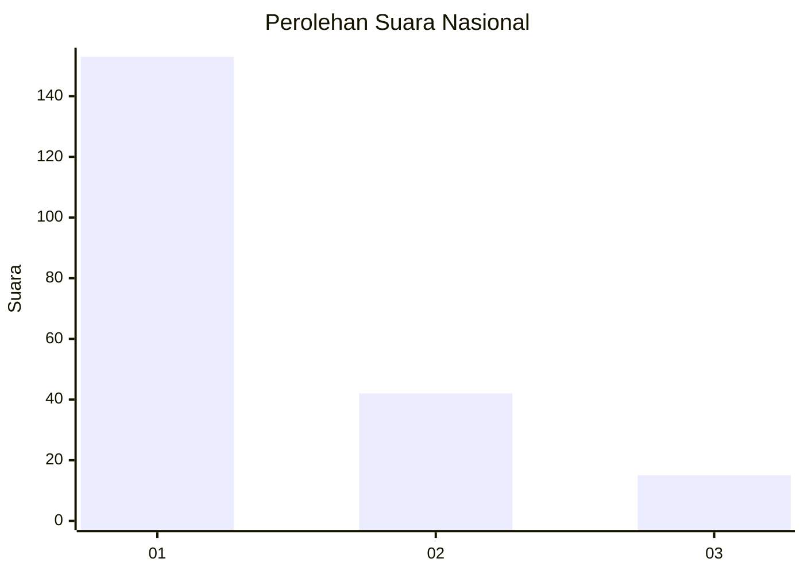
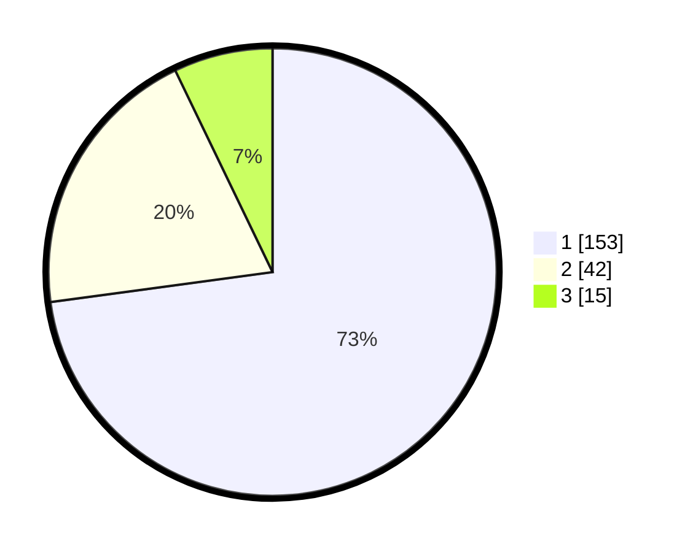

# Hasil

## Grafik

## Tabel

| No. | Nama Paslon    | Suara | Suara (raw) | Persentase |
|:--- |:-------------- | -----:| -----------:| ----------:|
| 1   | ANIES MUHAIMIN | 153   | [153][p-1]  | 72,86      |
| 2   | PRABOWO GIBRAN | 42    | [42][p-2]   | 20,00      |
| 3   | GANJAR MAHFUD  | 15    | [15][p-3]   | 7,14       |

[p-1]: https://github.com/gigit-pemilu/pemilu-2024/blob/main/pilpres/hitung-suara/sub/11-aceh/sub/71-kota-banda-aceh/sub/02-kuta-alam/sub/2001-mulia/sub/010-tps/sub/paslon-1.txt
[p-2]: https://github.com/gigit-pemilu/pemilu-2024/blob/main/pilpres/hitung-suara/sub/11-aceh/sub/71-kota-banda-aceh/sub/02-kuta-alam/sub/2001-mulia/sub/010-tps/sub/paslon-2.txt
[p-3]: https://github.com/gigit-pemilu/pemilu-2024/blob/main/pilpres/hitung-suara/sub/11-aceh/sub/71-kota-banda-aceh/sub/02-kuta-alam/sub/2001-mulia/sub/010-tps/sub/paslon-3.txt

## Foto C Plano

https://sirekap-obj-formc.kpu.go.id/fb4c/pemilu/ppwp/11/71/02/20/01/1171022001010-20240214-193904--df92e60f-d2d0-4be8-b545-e06730470c50.jpg

https://sirekap-obj-formc.kpu.go.id/fb4c/pemilu/ppwp/11/71/02/20/01/1171022001010-20240214-193950--01e02171-22ab-40f6-8eee-e54eece3c153.jpg

https://sirekap-obj-formc.kpu.go.id/fb4c/pemilu/ppwp/11/71/02/20/01/1171022001010-20240214-194050--95fc950b-0fff-4dd5-af2a-20ab1dbb30e1.jpg

## Metadata

| Key        | Value               |
| ---------- | ------------------- |
| Time Stamp | 2024-02-15 12:00:28 |

