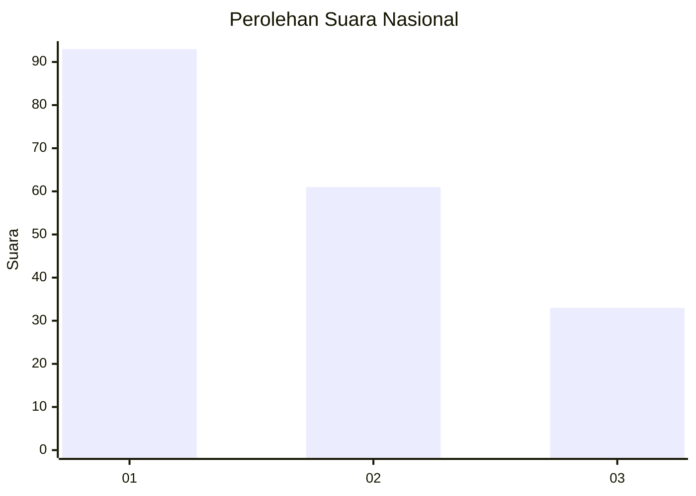
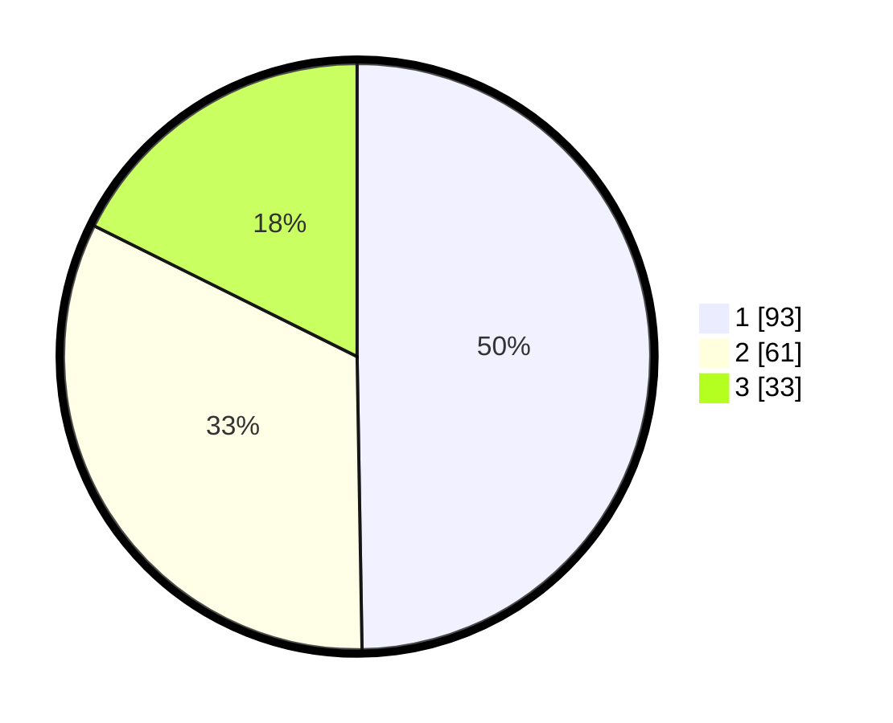

# Hasil

## Grafik

## Tabel

| No. | Nama Paslon    | Suara | Suara (raw) | Persentase |
|:--- |:-------------- | -----:| -----------:| ----------:|
| 1   | ANIES MUHAIMIN | 93    | [93][p-1]   | 49,73      |
| 2   | PRABOWO GIBRAN | 61    | [61][p-2]   | 32,62      |
| 3   | GANJAR MAHFUD  | 33    | [33][p-3]   | 17,65      |

[p-1]: https://github.com/gigit-pemilu/pemilu-2024/blob/main/pilpres/hitung-suara/sub/11-aceh/sub/71-kota-banda-aceh/sub/02-kuta-alam/sub/2002-peunayong/sub/001-tps/sub/paslon-1.txt
[p-2]: https://github.com/gigit-pemilu/pemilu-2024/blob/main/pilpres/hitung-suara/sub/11-aceh/sub/71-kota-banda-aceh/sub/02-kuta-alam/sub/2002-peunayong/sub/001-tps/sub/paslon-2.txt
[p-3]: https://github.com/gigit-pemilu/pemilu-2024/blob/main/pilpres/hitung-suara/sub/11-aceh/sub/71-kota-banda-aceh/sub/02-kuta-alam/sub/2002-peunayong/sub/001-tps/sub/paslon-3.txt

## Foto C Plano

https://sirekap-obj-formc.kpu.go.id/fb67/pemilu/ppwp/11/71/02/20/02/1171022002001-20240223-152851--7d2e9e2d-0e8a-432b-98b5-3bd16a0c27bd.jpg

https://sirekap-obj-formc.kpu.go.id/fb67/pemilu/ppwp/11/71/02/20/02/1171022002001-20240223-152447--d304e540-afde-4f3b-bf06-7dc998ecc1c4.jpg

https://sirekap-obj-formc.kpu.go.id/fb67/pemilu/ppwp/11/71/02/20/02/1171022002001-20240223-152637--de8b54d1-9547-4b9a-afc3-ce352a84e147.jpg

## Metadata

| Key        | Value               |
| ---------- | ------------------- |
| Time Stamp | 2024-02-24 22:31:28 |

## DATA PEMILIH TETAP

Jumlah pemilih dalam DPT: **265**.
 * L: **137**.
 * P: **128**.

## DATA PENGGUNA HAK PILIH

Jumlah pengguna hak pilih dalam DPT: **175**.
 * L: **91**.
 * P: **84**.

Jumlah pengguna hak pilih dalam DPTb: **8**.
 * L: **6**.
 * P: **2**.

Jumlah pengguna hak pilih dalam DPK: **4**.
 * L: **1**.
 * P: **3**.

Jumlah pengguna hak pilih: **187**.
 * L: **98**.
 * P: **89**.

## JUMLAH SUARA SAH DAN TIDAK SAH

JUMLAH SELURUH SUARA SAH: **187**.

JUMLAH SUARA TIDAK SAH: **0**.

JUMLAH SELURUH SUARA SAH DAN SUARA TIDAK SAH: **187**.

