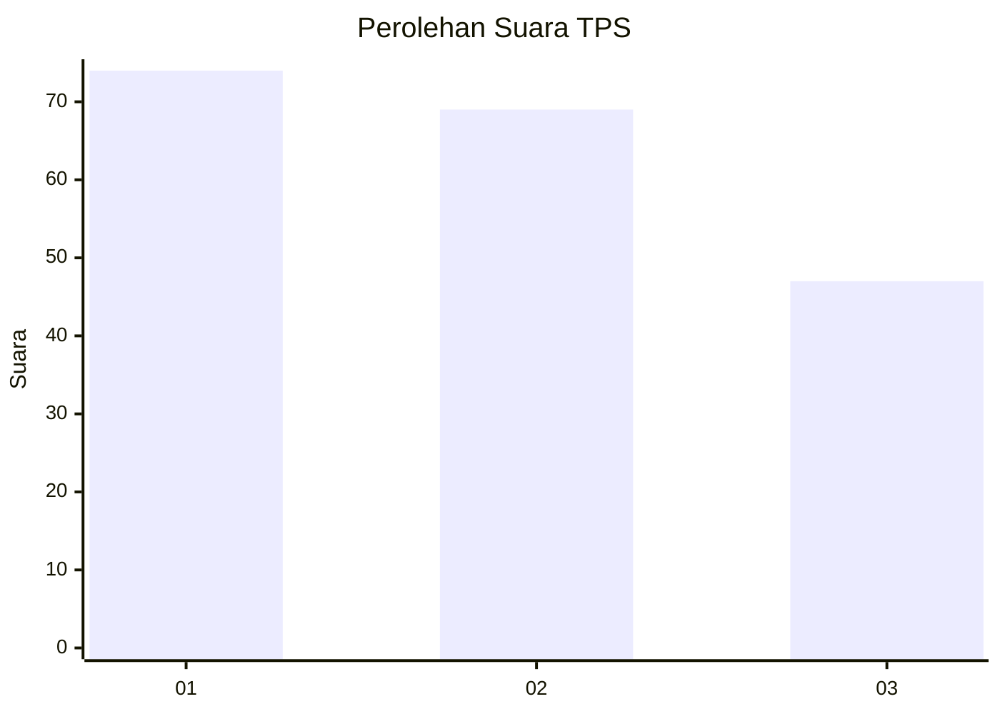
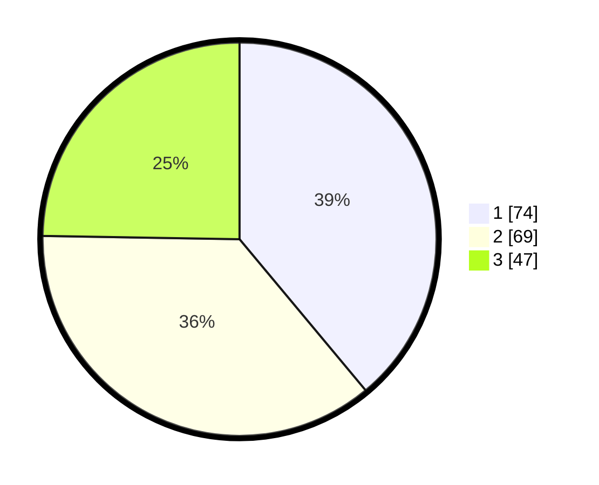

# Hasil

## Grafik

## Tabel

| No. | Nama Paslon    | Suara | Suara (raw) | Persentase |
|:--- |:-------------- | -----:| -----------:| ----------:|
| 1   | ANIES MUHAIMIN | 74    | [74][p-1]   | 38,95      |
| 2   | PRABOWO GIBRAN | 69    | [69][p-2]   | 36,32      |
| 3   | GANJAR MAHFUD  | 47    | [47][p-3]   | 24,74      |

[p-1]: https://github.com/gigit-pemilu/pemilu-2024-11-aceh/blob/main/pilpres/hitung-suara/sub/11-aceh/sub/71-kota-banda-aceh/sub/02-kuta-alam/sub/2002-peunayong/sub/002-tps/sub/paslon-1.txt
[p-2]: https://github.com/gigit-pemilu/pemilu-2024-11-aceh/blob/main/pilpres/hitung-suara/sub/11-aceh/sub/71-kota-banda-aceh/sub/02-kuta-alam/sub/2002-peunayong/sub/002-tps/sub/paslon-2.txt
[p-3]: https://github.com/gigit-pemilu/pemilu-2024-11-aceh/blob/main/pilpres/hitung-suara/sub/11-aceh/sub/71-kota-banda-aceh/sub/02-kuta-alam/sub/2002-peunayong/sub/002-tps/sub/paslon-3.txt

## Foto C Plano

https://sirekap-obj-formc.kpu.go.id/06ba/pemilu/ppwp/11/71/02/20/02/1171022002002-20240223-154540--592f16f8-be8c-4f5a-8be8-ae36e27870ba.jpg

https://sirekap-obj-formc.kpu.go.id/06ba/pemilu/ppwp/11/71/02/20/02/1171022002002-20240223-154834--5295cf12-ee36-409c-9800-b8ff2a1d1f21.jpg

https://sirekap-obj-formc.kpu.go.id/06ba/pemilu/ppwp/11/71/02/20/02/1171022002002-20240223-155040--fd65b39f-6f91-4d15-b8ff-6f5b2298fe7e.jpg

## Metadata

| Key        | Value               |
| ---------- | ------------------- |
| Time Stamp | 2024-02-24 22:31:28 |

## DATA PEMILIH TETAP

Jumlah pemilih dalam DPT: **276**.
 * L: **128**.
 * P: **148**.

## DATA PENGGUNA HAK PILIH

Jumlah pengguna hak pilih dalam DPT: **186**.
 * L: **84**.
 * P: **102**.

Jumlah pengguna hak pilih dalam DPTb: **5**.
 * L: **3**.
 * P: **2**.

Jumlah pengguna hak pilih dalam DPK: **2**.
 * L: **2**.
 * P: **0**.

Jumlah pengguna hak pilih: **193**.
 * L: **89**.
 * P: **104**.

## JUMLAH SUARA SAH DAN TIDAK SAH

JUMLAH SELURUH SUARA SAH: **190**.

JUMLAH SUARA TIDAK SAH: **3**.

JUMLAH SELURUH SUARA SAH DAN SUARA TIDAK SAH: **193**.

