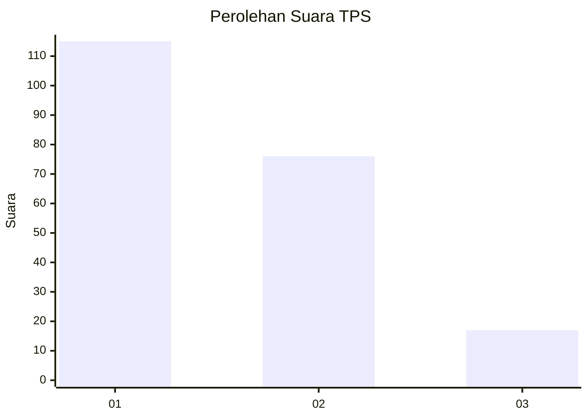
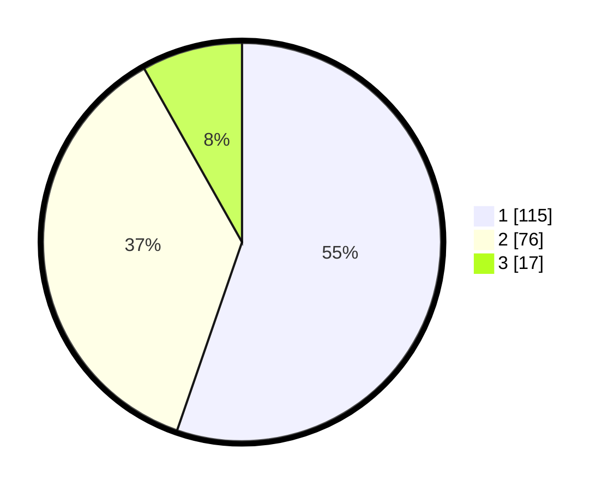

# Hasil

## Grafik

## Tabel

| No. | Nama Paslon    | Suara | Suara (raw) | Persentase |
|:--- |:-------------- | -----:| -----------:| ----------:|
| 1   | ANIES MUHAIMIN | 115   | [115][p-1]  | 55,29      |
| 2   | PRABOWO GIBRAN | 76    | [76][p-2]   | 36,54      |
| 3   | GANJAR MAHFUD  | 17    | [17][p-3]   | 8,17       |

[p-1]: https://github.com/gigit-pemilu/pemilu-2024-11-aceh/blob/main/pilpres/hitung-suara/sub/11-aceh/sub/71-kota-banda-aceh/sub/02-kuta-alam/sub/2003-laksana/sub/004-tps/sub/paslon-1.txt
[p-2]: https://github.com/gigit-pemilu/pemilu-2024-11-aceh/blob/main/pilpres/hitung-suara/sub/11-aceh/sub/71-kota-banda-aceh/sub/02-kuta-alam/sub/2003-laksana/sub/004-tps/sub/paslon-2.txt
[p-3]: https://github.com/gigit-pemilu/pemilu-2024-11-aceh/blob/main/pilpres/hitung-suara/sub/11-aceh/sub/71-kota-banda-aceh/sub/02-kuta-alam/sub/2003-laksana/sub/004-tps/sub/paslon-3.txt

## Foto C Plano

https://sirekap-obj-formc.kpu.go.id/679a/pemilu/ppwp/11/71/02/20/03/1171022003004-20240214-230318--21615f14-9516-4382-b5b3-18f260a4cb93.jpg

https://sirekap-obj-formc.kpu.go.id/679a/pemilu/ppwp/11/71/02/20/03/1171022003004-20240214-230404--8d72880f-ee61-4c93-916f-2f5e046f1e52.jpg

https://sirekap-obj-formc.kpu.go.id/679a/pemilu/ppwp/11/71/02/20/03/1171022003004-20240214-230516--df7e5e43-3885-4a6f-b183-967d3de3db05.jpg

## Metadata

| Key        | Value               |
| ---------- | ------------------- |
| Time Stamp | 2024-02-15 21:30:27 |

