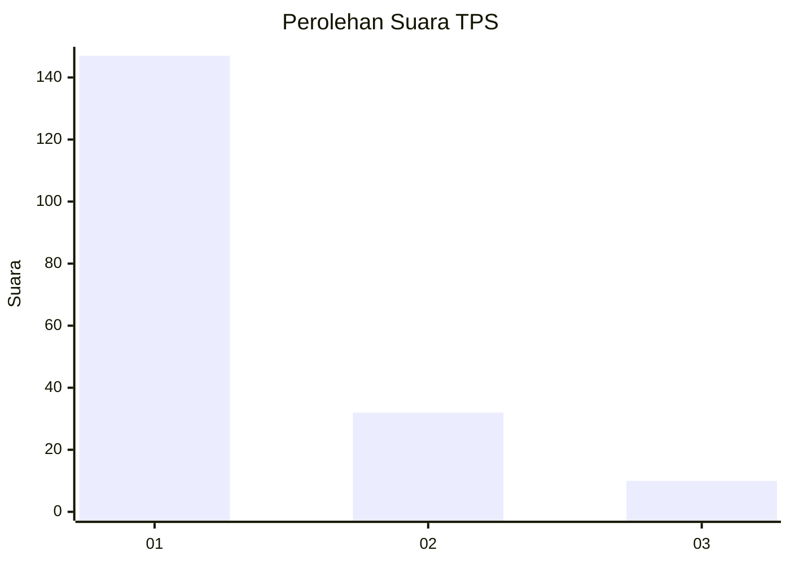
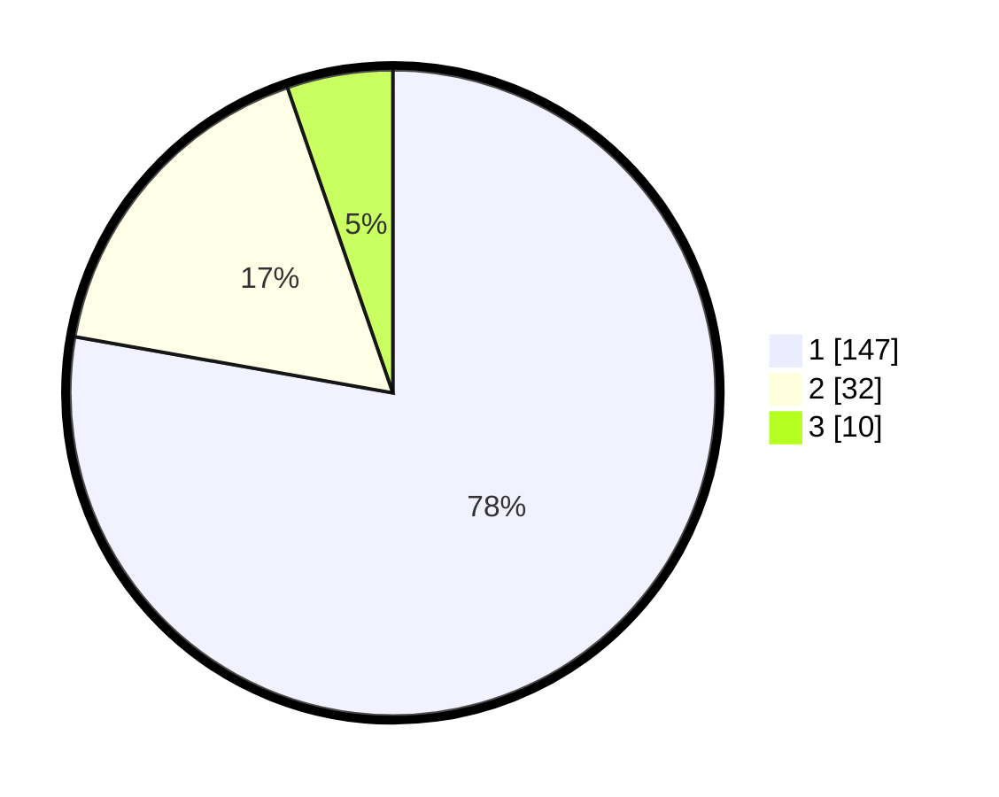

# Hasil

## Grafik

## Tabel

| No. | Nama Paslon    | Suara | Suara (raw) | Persentase |
|:--- |:-------------- | -----:| -----------:| ----------:|
| 1   | ANIES MUHAIMIN | 147   | [147][p-1]  | 77,78      |
| 2   | PRABOWO GIBRAN | 32    | [32][p-2]   | 16,93      |
| 3   | GANJAR MAHFUD  | 10    | [10][p-3]   | 5,29       |

[p-1]: https://github.com/gigit-pemilu/pemilu-2024-11-aceh/blob/main/pilpres/hitung-suara/sub/11-aceh/sub/71-kota-banda-aceh/sub/02-kuta-alam/sub/2004-keuramat/sub/003-tps/sub/paslon-1.txt
[p-2]: https://github.com/gigit-pemilu/pemilu-2024-11-aceh/blob/main/pilpres/hitung-suara/sub/11-aceh/sub/71-kota-banda-aceh/sub/02-kuta-alam/sub/2004-keuramat/sub/003-tps/sub/paslon-2.txt
[p-3]: https://github.com/gigit-pemilu/pemilu-2024-11-aceh/blob/main/pilpres/hitung-suara/sub/11-aceh/sub/71-kota-banda-aceh/sub/02-kuta-alam/sub/2004-keuramat/sub/003-tps/sub/paslon-3.txt

## Foto C Plano

https://sirekap-obj-formc.kpu.go.id/3274/pemilu/ppwp/11/71/02/20/04/1171022004003-20240214-224707--75a5587b-5f87-48c4-96c1-29f06f8467d0.jpg

https://sirekap-obj-formc.kpu.go.id/3274/pemilu/ppwp/11/71/02/20/04/1171022004003-20240214-224844--7f9edbcc-e133-450d-8465-1d3fcb301dc1.jpg

https://sirekap-obj-formc.kpu.go.id/3274/pemilu/ppwp/11/71/02/20/04/1171022004003-20240215-053042--a097e3db-7c68-4dcf-86c7-4675ec2178de.jpg

## Metadata

| Key        | Value               |
| ---------- | ------------------- |
| Time Stamp | 2024-02-15 15:00:29 |

