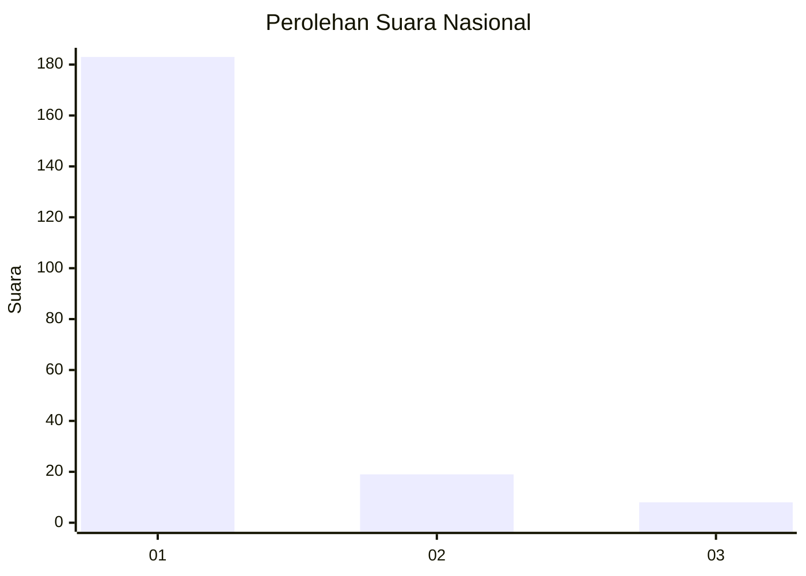
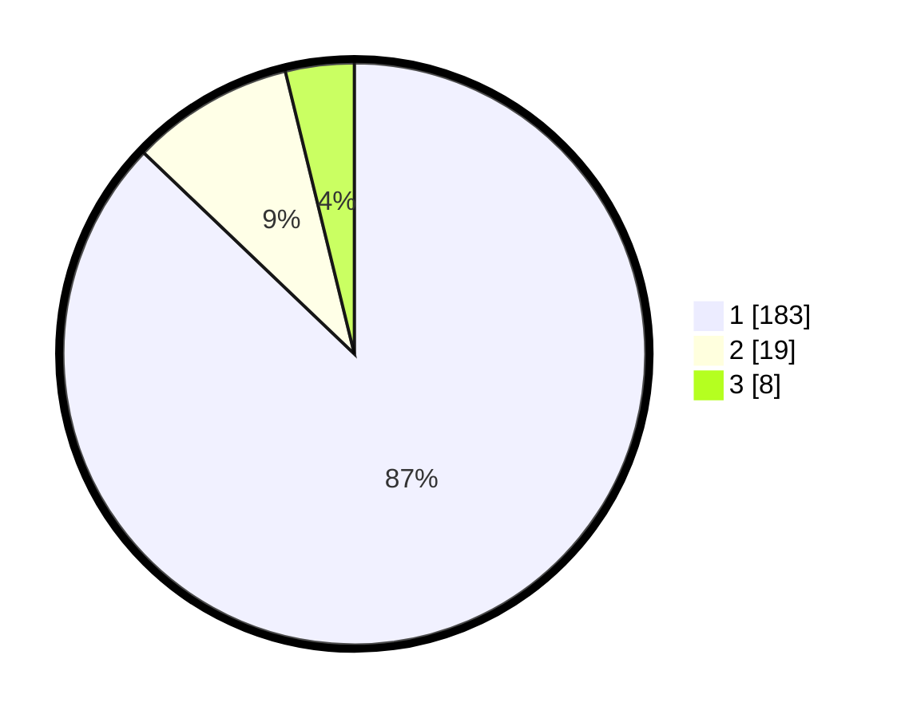

# Hasil

## Grafik

## Tabel

| No. | Nama Paslon    | Suara | Suara (raw) | Persentase |
|:--- |:-------------- | -----:| -----------:| ----------:|
| 1   | ANIES MUHAIMIN | 183   | [183][p-1]  | 87,14      |
| 2   | PRABOWO GIBRAN | 19    | [19][p-2]   | 9,05       |
| 3   | GANJAR MAHFUD  | 8     | [8][p-3]    | 3,81       |

[p-1]: https://github.com/gigit-pemilu/pemilu-2024/blob/main/pilpres/hitung-suara/sub/11-aceh/sub/71-kota-banda-aceh/sub/02-kuta-alam/sub/2004-keuramat/sub/005-tps/sub/paslon-1.txt
[p-2]: https://github.com/gigit-pemilu/pemilu-2024/blob/main/pilpres/hitung-suara/sub/11-aceh/sub/71-kota-banda-aceh/sub/02-kuta-alam/sub/2004-keuramat/sub/005-tps/sub/paslon-2.txt
[p-3]: https://github.com/gigit-pemilu/pemilu-2024/blob/main/pilpres/hitung-suara/sub/11-aceh/sub/71-kota-banda-aceh/sub/02-kuta-alam/sub/2004-keuramat/sub/005-tps/sub/paslon-3.txt

## Foto C Plano

https://sirekap-obj-formc.kpu.go.id/1fd6/pemilu/ppwp/11/71/02/20/04/1171022004005-20240215-031824--6292ced5-8ba4-4526-a77b-35275cf61dc8.jpg

https://sirekap-obj-formc.kpu.go.id/1fd6/pemilu/ppwp/11/71/02/20/04/1171022004005-20240215-031916--639de472-004d-47ee-84ed-4ffd257f2fb9.jpg

https://sirekap-obj-formc.kpu.go.id/1fd6/pemilu/ppwp/11/71/02/20/04/1171022004005-20240215-032013--b38c23b6-5032-4a1d-b4fd-bdb3ac2103c6.jpg

## Metadata

| Key        | Value               |
| ---------- | ------------------- |
| Time Stamp | 2024-02-15 12:00:28 |

