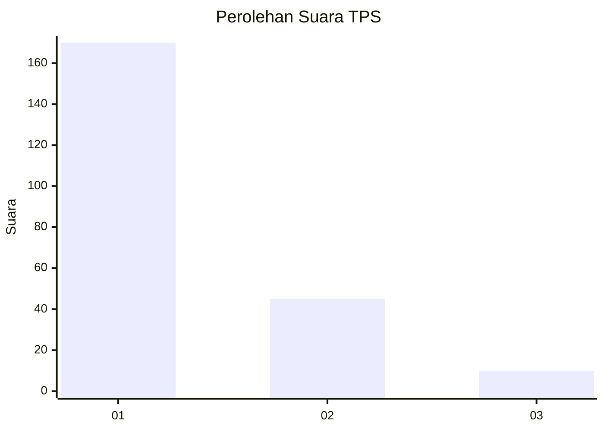
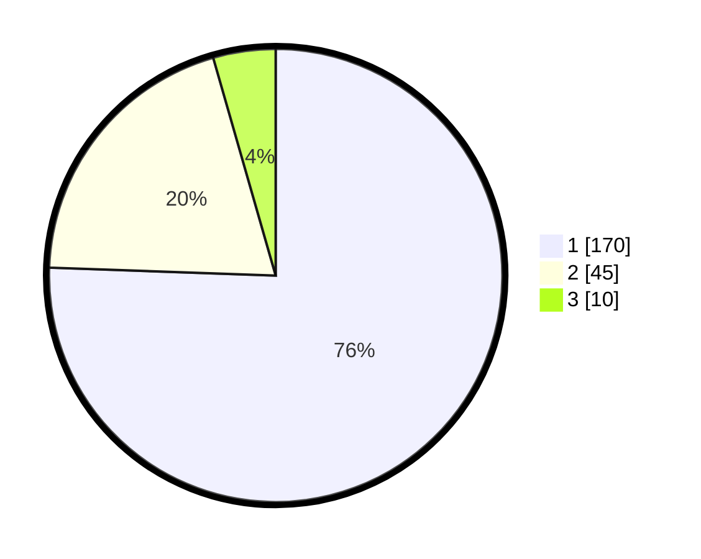

# Hasil

## Grafik

## Tabel

| No. | Nama Paslon    | Suara | Suara (raw) | Persentase |
|:--- |:-------------- | -----:| -----------:| ----------:|
| 1   | ANIES MUHAIMIN | 170   | [170][p-1]  | 75,56      |
| 2   | PRABOWO GIBRAN | 45    | [45][p-2]   | 20,00      |
| 3   | GANJAR MAHFUD  | 10    | [10][p-3]   | 4,44       |

[p-1]: https://github.com/gigit-pemilu/pemilu-2024-11-aceh/blob/main/pilpres/hitung-suara/sub/11-aceh/sub/71-kota-banda-aceh/sub/02-kuta-alam/sub/2004-keuramat/sub/006-tps/sub/paslon-1.txt
[p-2]: https://github.com/gigit-pemilu/pemilu-2024-11-aceh/blob/main/pilpres/hitung-suara/sub/11-aceh/sub/71-kota-banda-aceh/sub/02-kuta-alam/sub/2004-keuramat/sub/006-tps/sub/paslon-2.txt
[p-3]: https://github.com/gigit-pemilu/pemilu-2024-11-aceh/blob/main/pilpres/hitung-suara/sub/11-aceh/sub/71-kota-banda-aceh/sub/02-kuta-alam/sub/2004-keuramat/sub/006-tps/sub/paslon-3.txt

## Foto C Plano

https://sirekap-obj-formc.kpu.go.id/8198/pemilu/ppwp/11/71/02/20/04/1171022004006-20240214-221838--1055f62c-7b10-4406-b692-ab66638ae286.jpg

https://sirekap-obj-formc.kpu.go.id/8198/pemilu/ppwp/11/71/02/20/04/1171022004006-20240214-221736--0971822f-9773-43c2-bf36-c5521f1eb5ae.jpg

https://sirekap-obj-formc.kpu.go.id/8198/pemilu/ppwp/11/71/02/20/04/1171022004006-20240214-221918--e151c0da-bcae-482d-ba6d-9e5b13d0f704.jpg

## Metadata

| Key        | Value               |
| ---------- | ------------------- |
| Time Stamp | 2024-02-15 20:30:46 |

