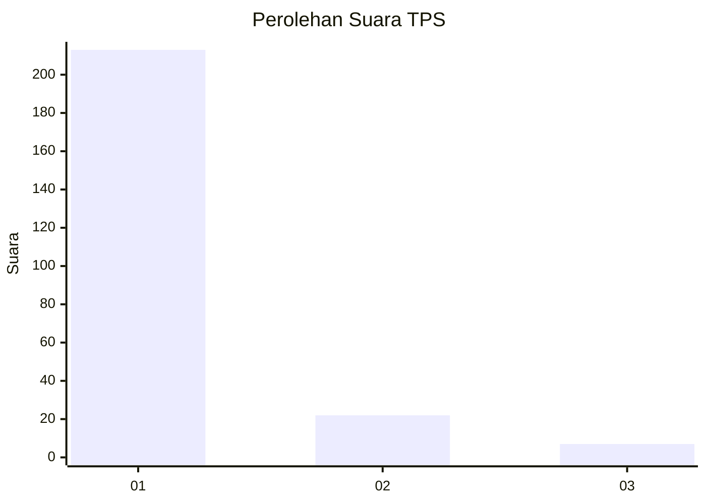
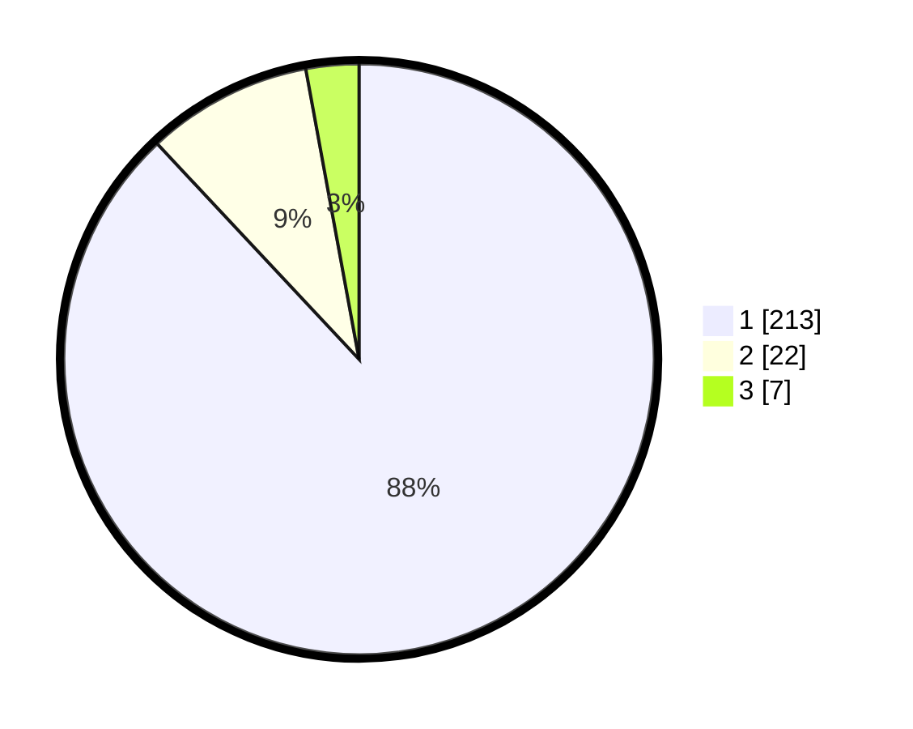

# Hasil

## Grafik

## Tabel

| No. | Nama Paslon    | Suara | Suara (raw) | Persentase |
|:--- |:-------------- | -----:| -----------:| ----------:|
| 1   | ANIES MUHAIMIN | 213   | [213][p-1]  | 88,02      |
| 2   | PRABOWO GIBRAN | 22    | [22][p-2]   | 9,09       |
| 3   | GANJAR MAHFUD  | 7     | [7][p-3]    | 2,89       |

[p-1]: https://github.com/gigit-pemilu/pemilu-2024-11-aceh/blob/main/pilpres/hitung-suara/sub/11-aceh/sub/71-kota-banda-aceh/sub/02-kuta-alam/sub/2006-beurawe/sub/002-tps/sub/paslon-1.txt
[p-2]: https://github.com/gigit-pemilu/pemilu-2024-11-aceh/blob/main/pilpres/hitung-suara/sub/11-aceh/sub/71-kota-banda-aceh/sub/02-kuta-alam/sub/2006-beurawe/sub/002-tps/sub/paslon-2.txt
[p-3]: https://github.com/gigit-pemilu/pemilu-2024-11-aceh/blob/main/pilpres/hitung-suara/sub/11-aceh/sub/71-kota-banda-aceh/sub/02-kuta-alam/sub/2006-beurawe/sub/002-tps/sub/paslon-3.txt

## Foto C Plano

https://sirekap-obj-formc.kpu.go.id/c3ca/pemilu/ppwp/11/71/02/20/06/1171022006002-20240215-010744--f664e3c8-901d-42fd-b705-20f46ff49abf.jpg

https://sirekap-obj-formc.kpu.go.id/c3ca/pemilu/ppwp/11/71/02/20/06/1171022006002-20240214-233218--b246fd3a-f677-464d-b272-17fbd7fb7bb8.jpg

https://sirekap-obj-formc.kpu.go.id/c3ca/pemilu/ppwp/11/71/02/20/06/1171022006002-20240214-233924--abaf4bca-9cf0-4d70-861a-8f1b338c8fd4.jpg

## Metadata

| Key        | Value               |
| ---------- | ------------------- |
| Time Stamp | 2024-02-15 06:00:23 |

## DATA PEMILIH TETAP

Jumlah pemilih dalam DPT: **286**.
 * L: **133**.
 * P: **153**.

## DATA PENGGUNA HAK PILIH

Jumlah pengguna hak pilih dalam DPT: **220**.
 * L: **100**.
 * P: **120**.

Jumlah pengguna hak pilih dalam DPTb: **10**.
 * L: **5**.
 * P: **5**.

Jumlah pengguna hak pilih dalam DPK: **12**.
 * L: **4**.
 * P: **8**.

Jumlah pengguna hak pilih: **242**.
 * L: **109**.
 * P: **133**.

## JUMLAH SUARA SAH DAN TIDAK SAH

JUMLAH SELURUH SUARA SAH: **242**.

JUMLAH SUARA TIDAK SAH: **0**.

JUMLAH SELURUH SUARA SAH DAN SUARA TIDAK SAH: **242**.

