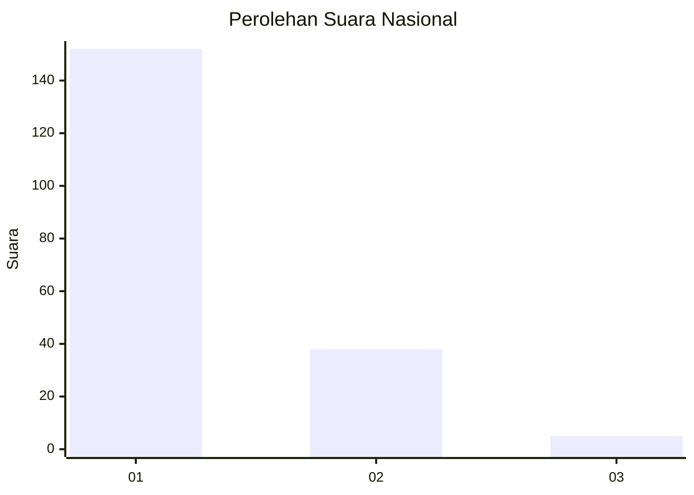
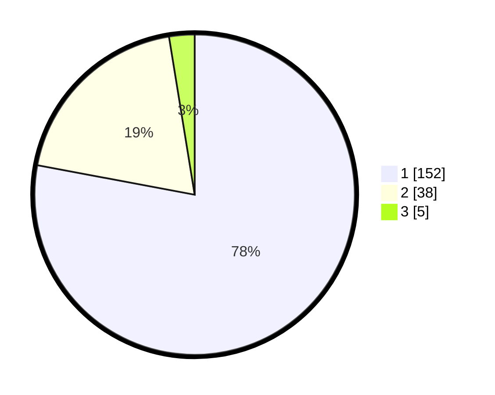

# Hasil

## Grafik

## Tabel

| No. | Nama Paslon    | Suara | Suara (raw) | Persentase |
|:--- |:-------------- | -----:| -----------:| ----------:|
| 1   | ANIES MUHAIMIN | 152   | [152][p-1]  | 77,95      |
| 2   | PRABOWO GIBRAN | 38    | [38][p-2]   | 19,49      |
| 3   | GANJAR MAHFUD  | 5     | [5][p-3]    | 2,56       |

[p-1]: https://github.com/gigit-pemilu/pemilu-2024/blob/main/pilpres/hitung-suara/sub/11-aceh/sub/71-kota-banda-aceh/sub/02-kuta-alam/sub/2008-bandar-baru/sub/004-tps/sub/paslon-1.txt
[p-2]: https://github.com/gigit-pemilu/pemilu-2024/blob/main/pilpres/hitung-suara/sub/11-aceh/sub/71-kota-banda-aceh/sub/02-kuta-alam/sub/2008-bandar-baru/sub/004-tps/sub/paslon-2.txt
[p-3]: https://github.com/gigit-pemilu/pemilu-2024/blob/main/pilpres/hitung-suara/sub/11-aceh/sub/71-kota-banda-aceh/sub/02-kuta-alam/sub/2008-bandar-baru/sub/004-tps/sub/paslon-3.txt

## Foto C Plano

https://sirekap-obj-formc.kpu.go.id/616f/pemilu/ppwp/11/71/02/20/08/1171022008004-20240214-214811--08d1caf2-4ed5-4ab2-8fe3-6203420e2e62.jpg

https://sirekap-obj-formc.kpu.go.id/616f/pemilu/ppwp/11/71/02/20/08/1171022008004-20240214-215430--c368fbbd-4c20-41ea-9ce8-795bd15b2ff5.jpg

https://sirekap-obj-formc.kpu.go.id/616f/pemilu/ppwp/11/71/02/20/08/1171022008004-20240214-215814--1993981a-3424-4079-8e95-8a96219026e0.jpg

## Metadata

| Key        | Value               |
| ---------- | ------------------- |
| Time Stamp | 2024-02-15 15:00:29 |

