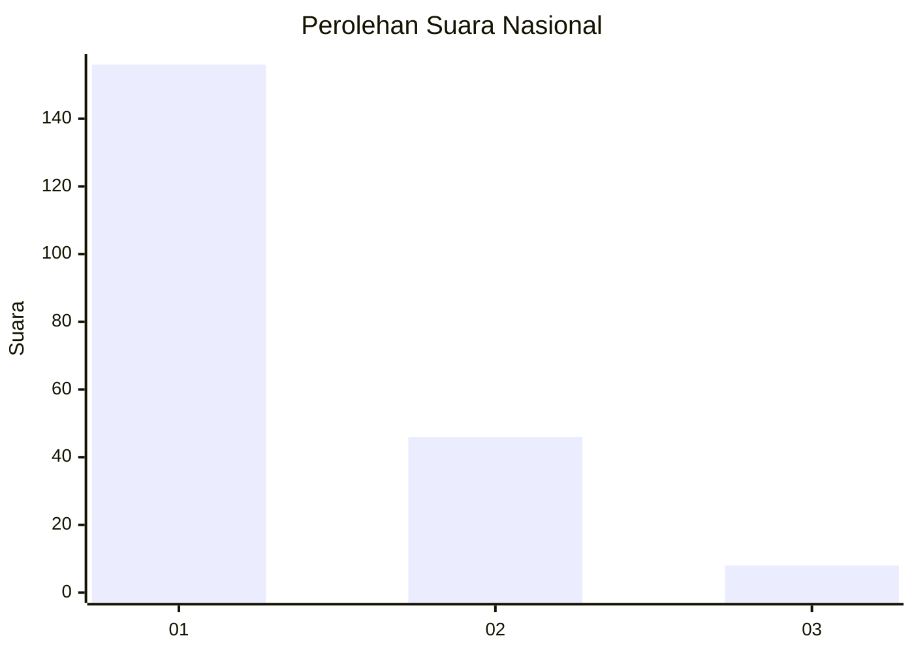
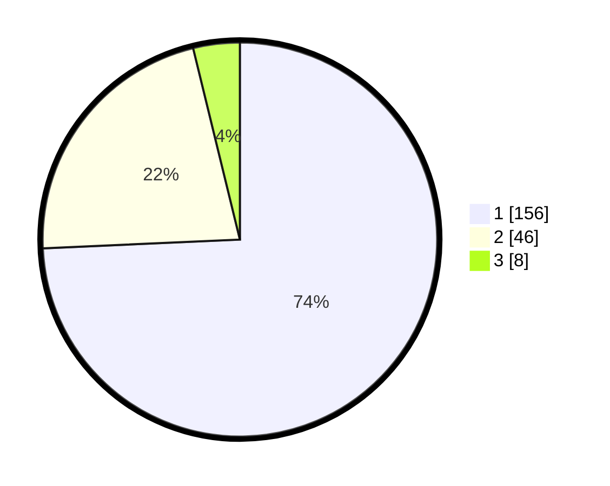

# Hasil

## Grafik

## Tabel

| No. | Nama Paslon    | Suara | Suara (raw) | Persentase |
|:--- |:-------------- | -----:| -----------:| ----------:|
| 1   | ANIES MUHAIMIN | 156   | [156][p-1]  | 74,29      |
| 2   | PRABOWO GIBRAN | 46    | [46][p-2]   | 21,90      |
| 3   | GANJAR MAHFUD  | 8     | [8][p-3]    | 3,81       |

[p-1]: https://github.com/gigit-pemilu/pemilu-2024/blob/main/pilpres/hitung-suara/sub/11-aceh/sub/71-kota-banda-aceh/sub/02-kuta-alam/sub/2008-bandar-baru/sub/006-tps/sub/paslon-1.txt
[p-2]: https://github.com/gigit-pemilu/pemilu-2024/blob/main/pilpres/hitung-suara/sub/11-aceh/sub/71-kota-banda-aceh/sub/02-kuta-alam/sub/2008-bandar-baru/sub/006-tps/sub/paslon-2.txt
[p-3]: https://github.com/gigit-pemilu/pemilu-2024/blob/main/pilpres/hitung-suara/sub/11-aceh/sub/71-kota-banda-aceh/sub/02-kuta-alam/sub/2008-bandar-baru/sub/006-tps/sub/paslon-3.txt

## Foto C Plano

https://sirekap-obj-formc.kpu.go.id/c1c5/pemilu/ppwp/11/71/02/20/08/1171022008006-20240214-215225--33c13cfd-12e6-45df-beba-e06838ba7359.jpg

https://sirekap-obj-formc.kpu.go.id/c1c5/pemilu/ppwp/11/71/02/20/08/1171022008006-20240214-215427--3da5bca0-21ef-4e36-9c58-9b08223b7305.jpg

https://sirekap-obj-formc.kpu.go.id/c1c5/pemilu/ppwp/11/71/02/20/08/1171022008006-20240214-220144--be592a18-08dd-474e-8d00-e61a3032922e.jpg

## Metadata

| Key        | Value               |
| ---------- | ------------------- |
| Time Stamp | 2024-02-15 15:00:29 |

