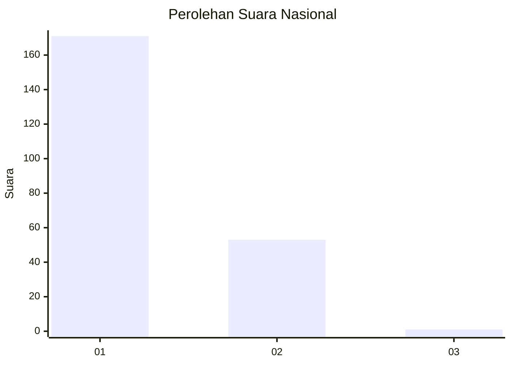
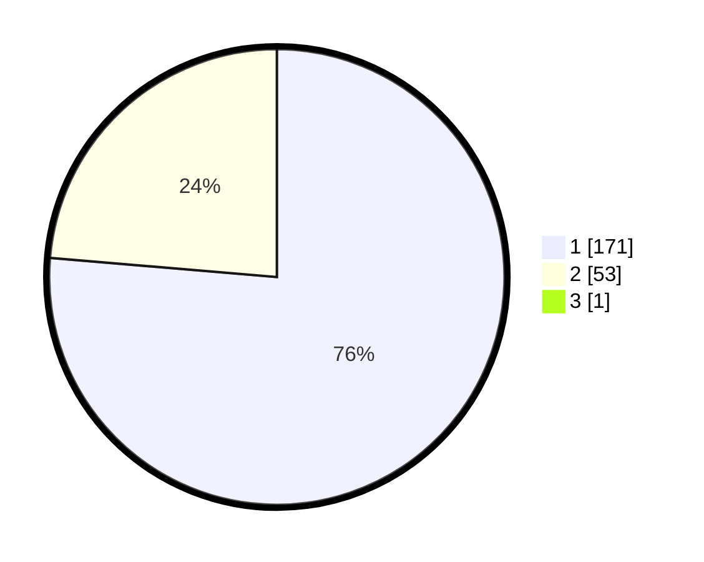

# Hasil

## Grafik

## Tabel

| No. | Nama Paslon    | Suara | Suara (raw) | Persentase |
|:--- |:-------------- | -----:| -----------:| ----------:|
| 1   | ANIES MUHAIMIN | 171   | [171][p-1]  | 76,00      |
| 2   | PRABOWO GIBRAN | 53    | [53][p-2]   | 23,56      |
| 3   | GANJAR MAHFUD  | 1     | [1][p-3]    | 0,44       |

[p-1]: https://github.com/gigit-pemilu/pemilu-2024/blob/main/pilpres/hitung-suara/sub/11-aceh/sub/71-kota-banda-aceh/sub/02-kuta-alam/sub/2008-bandar-baru/sub/007-tps/sub/paslon-1.txt
[p-2]: https://github.com/gigit-pemilu/pemilu-2024/blob/main/pilpres/hitung-suara/sub/11-aceh/sub/71-kota-banda-aceh/sub/02-kuta-alam/sub/2008-bandar-baru/sub/007-tps/sub/paslon-2.txt
[p-3]: https://github.com/gigit-pemilu/pemilu-2024/blob/main/pilpres/hitung-suara/sub/11-aceh/sub/71-kota-banda-aceh/sub/02-kuta-alam/sub/2008-bandar-baru/sub/007-tps/sub/paslon-3.txt

## Foto C Plano

https://sirekap-obj-formc.kpu.go.id/9a40/pemilu/ppwp/11/71/02/20/08/1171022008007-20240214-223223--fe25d653-05b2-4121-977e-5fc7a728ffae.jpg

https://sirekap-obj-formc.kpu.go.id/9a40/pemilu/ppwp/11/71/02/20/08/1171022008007-20240214-223324--13ffd5ee-5b48-407b-93ee-1182d8274b79.jpg

https://sirekap-obj-formc.kpu.go.id/9a40/pemilu/ppwp/11/71/02/20/08/1171022008007-20240214-223411--c0016ea5-4fb5-4dab-979e-eaab8f7a2014.jpg

## Metadata

| Key        | Value               |
| ---------- | ------------------- |
| Time Stamp | 2024-02-15 15:00:29 |

