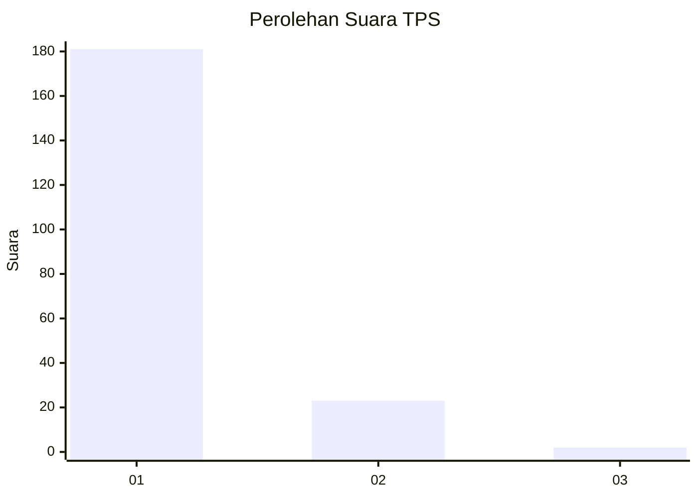
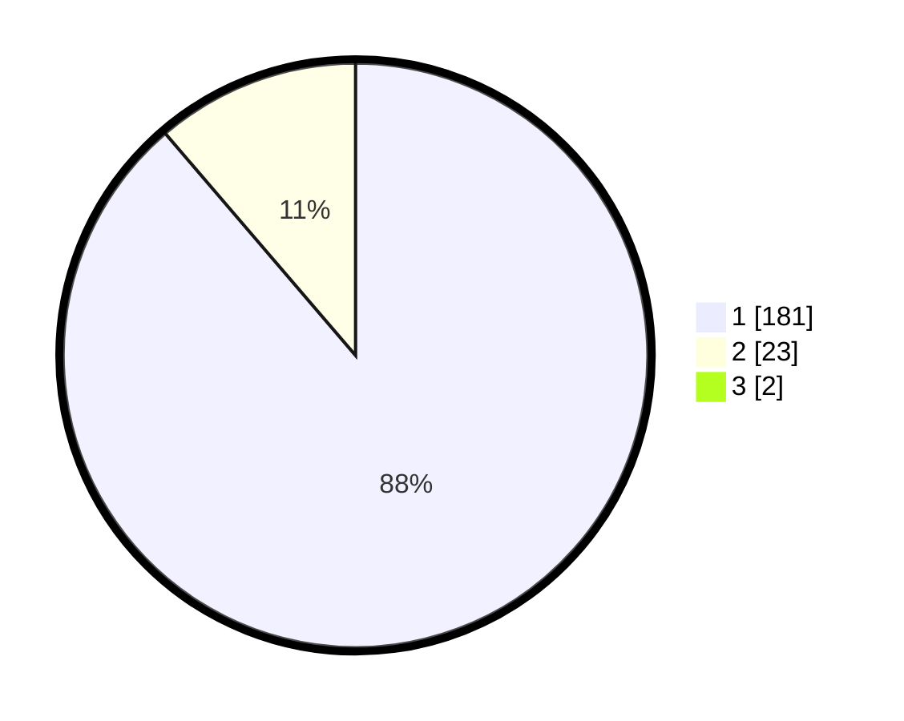

# Hasil

## Grafik

## Tabel

| No. | Nama Paslon    | Suara | Suara (raw) | Persentase |
|:--- |:-------------- | -----:| -----------:| ----------:|
| 1   | ANIES MUHAIMIN | 181   | [181][p-1]  | 87,86      |
| 2   | PRABOWO GIBRAN | 23    | [23][p-2]   | 11,17      |
| 3   | GANJAR MAHFUD  | 2     | [2][p-3]    | 0,97       |

[p-1]: https://github.com/gigit-pemilu/pemilu-2024-11-aceh/blob/main/pilpres/hitung-suara/sub/11-aceh/sub/71-kota-banda-aceh/sub/02-kuta-alam/sub/2009-lamdingin/sub/002-tps/sub/paslon-1.txt
[p-2]: https://github.com/gigit-pemilu/pemilu-2024-11-aceh/blob/main/pilpres/hitung-suara/sub/11-aceh/sub/71-kota-banda-aceh/sub/02-kuta-alam/sub/2009-lamdingin/sub/002-tps/sub/paslon-2.txt
[p-3]: https://github.com/gigit-pemilu/pemilu-2024-11-aceh/blob/main/pilpres/hitung-suara/sub/11-aceh/sub/71-kota-banda-aceh/sub/02-kuta-alam/sub/2009-lamdingin/sub/002-tps/sub/paslon-3.txt

## Foto C Plano

https://sirekap-obj-formc.kpu.go.id/d222/pemilu/ppwp/11/71/02/20/09/1171022009002-20240215-030230--d6746c1a-0630-4fa7-b69e-dc9cf408771f.jpg

https://sirekap-obj-formc.kpu.go.id/d222/pemilu/ppwp/11/71/02/20/09/1171022009002-20240224-125330--71bd79b2-1334-451e-9c20-d8346e0c35e4.jpg

https://sirekap-obj-formc.kpu.go.id/d222/pemilu/ppwp/11/71/02/20/09/1171022009002-20240224-125739--49c66d2d-e201-4bc8-b7d4-7408ae8557e6.jpg

## Metadata

| Key        | Value               |
| ---------- | ------------------- |
| Time Stamp | 2024-02-28 19:00:00 |

