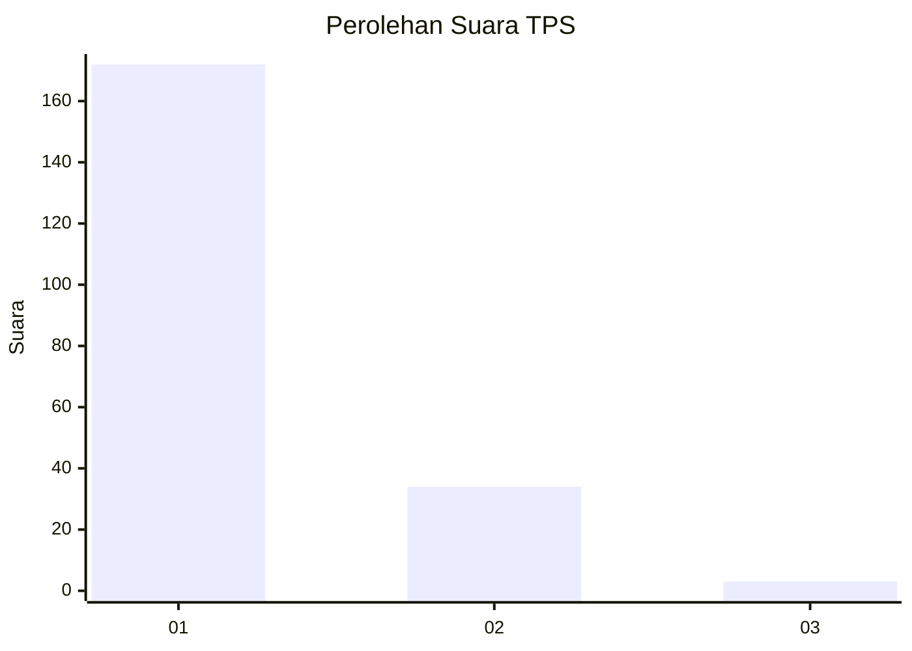
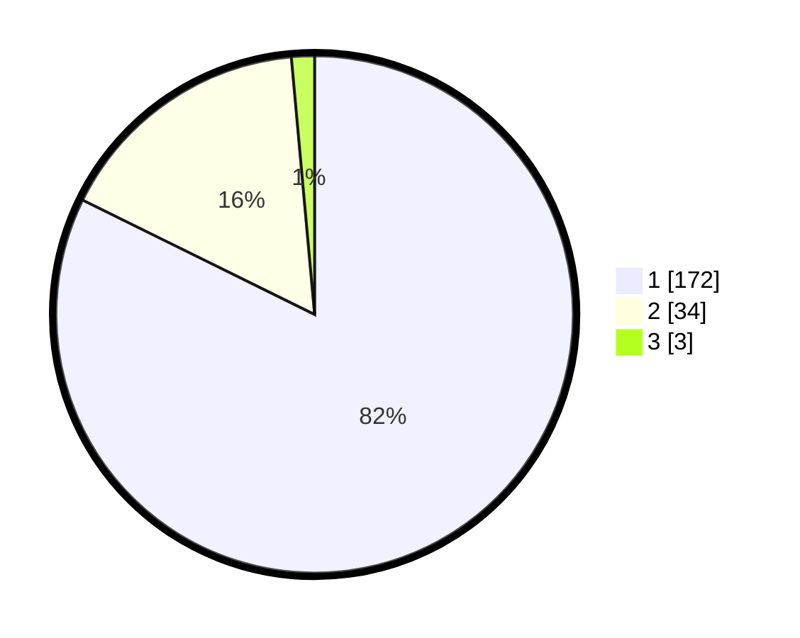

# Hasil

## Grafik

## Tabel

| No. | Nama Paslon    | Suara | Suara (raw) | Persentase |
|:--- |:-------------- | -----:| -----------:| ----------:|
| 1   | ANIES MUHAIMIN | 172   | [172][p-1]  | 82,30      |
| 2   | PRABOWO GIBRAN | 34    | [34][p-2]   | 16,27      |
| 3   | GANJAR MAHFUD  | 3     | [3][p-3]    | 1,44       |

[p-1]: https://github.com/gigit-pemilu/pemilu-2024-11-aceh/blob/main/pilpres/hitung-suara/sub/11-aceh/sub/71-kota-banda-aceh/sub/02-kuta-alam/sub/2009-lamdingin/sub/003-tps/sub/paslon-1.txt
[p-2]: https://github.com/gigit-pemilu/pemilu-2024-11-aceh/blob/main/pilpres/hitung-suara/sub/11-aceh/sub/71-kota-banda-aceh/sub/02-kuta-alam/sub/2009-lamdingin/sub/003-tps/sub/paslon-2.txt
[p-3]: https://github.com/gigit-pemilu/pemilu-2024-11-aceh/blob/main/pilpres/hitung-suara/sub/11-aceh/sub/71-kota-banda-aceh/sub/02-kuta-alam/sub/2009-lamdingin/sub/003-tps/sub/paslon-3.txt

## Foto C Plano

https://sirekap-obj-formc.kpu.go.id/dc97/pemilu/ppwp/11/71/02/20/09/1171022009003-20240214-193724--f6de84bc-bbe4-4df8-b354-fa7345fa10ea.jpg

https://sirekap-obj-formc.kpu.go.id/dc97/pemilu/ppwp/11/71/02/20/09/1171022009003-20240214-193946--e18e96f5-b44e-44c2-8e5a-b1a591021c47.jpg

https://sirekap-obj-formc.kpu.go.id/dc97/pemilu/ppwp/11/71/02/20/09/1171022009003-20240214-194126--e44d1631-c55f-400f-adb5-49e75ed2fc4b.jpg

## Metadata

| Key        | Value               |
| ---------- | ------------------- |
| Time Stamp | 2024-02-15 22:00:27 |

