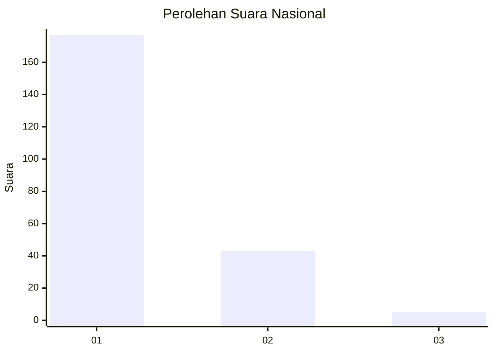
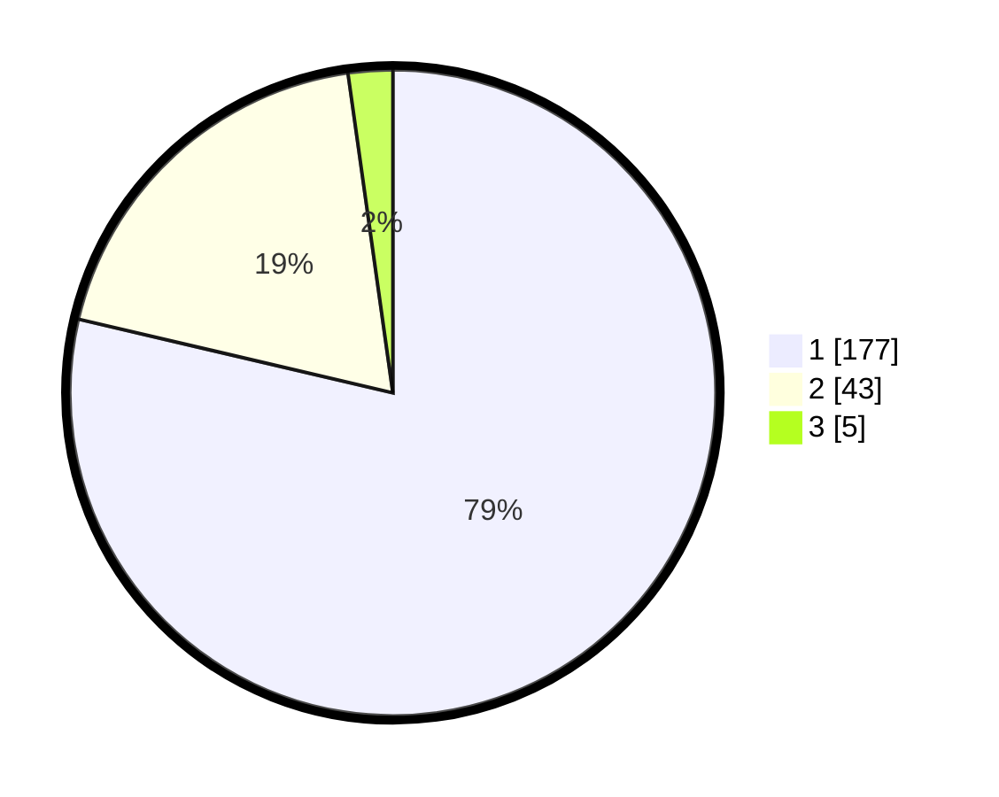

# Hasil

## Grafik

## Tabel

| No. | Nama Paslon    | Suara | Suara (raw) | Persentase |
|:--- |:-------------- | -----:| -----------:| ----------:|
| 1   | ANIES MUHAIMIN | 177   | [177][p-1]  | 78,67      |
| 2   | PRABOWO GIBRAN | 43    | [43][p-2]   | 19,11      |
| 3   | GANJAR MAHFUD  | 5     | [5][p-3]    | 2,22       |

[p-1]: https://github.com/gigit-pemilu/pemilu-2024/blob/main/pilpres/hitung-suara/sub/11-aceh/sub/71-kota-banda-aceh/sub/02-kuta-alam/sub/2009-lamdingin/sub/006-tps/sub/paslon-1.txt
[p-2]: https://github.com/gigit-pemilu/pemilu-2024/blob/main/pilpres/hitung-suara/sub/11-aceh/sub/71-kota-banda-aceh/sub/02-kuta-alam/sub/2009-lamdingin/sub/006-tps/sub/paslon-2.txt
[p-3]: https://github.com/gigit-pemilu/pemilu-2024/blob/main/pilpres/hitung-suara/sub/11-aceh/sub/71-kota-banda-aceh/sub/02-kuta-alam/sub/2009-lamdingin/sub/006-tps/sub/paslon-3.txt

## Foto C Plano

https://sirekap-obj-formc.kpu.go.id/4dfd/pemilu/ppwp/11/71/02/20/09/1171022009006-20240215-024911--2549dd14-e39a-43e8-8806-bb5937b111e7.jpg

https://sirekap-obj-formc.kpu.go.id/4dfd/pemilu/ppwp/11/71/02/20/09/1171022009006-20240224-125942--225d6c61-83e8-4ec1-9b33-3273729e37b6.jpg

https://sirekap-obj-formc.kpu.go.id/4dfd/pemilu/ppwp/11/71/02/20/09/1171022009006-20240215-025222--f4ba5a78-10a2-4279-985f-8bd889a5cfd4.jpg

## Metadata

| Key        | Value               |
| ---------- | ------------------- |
| Time Stamp | 2024-02-24 22:31:28 |

