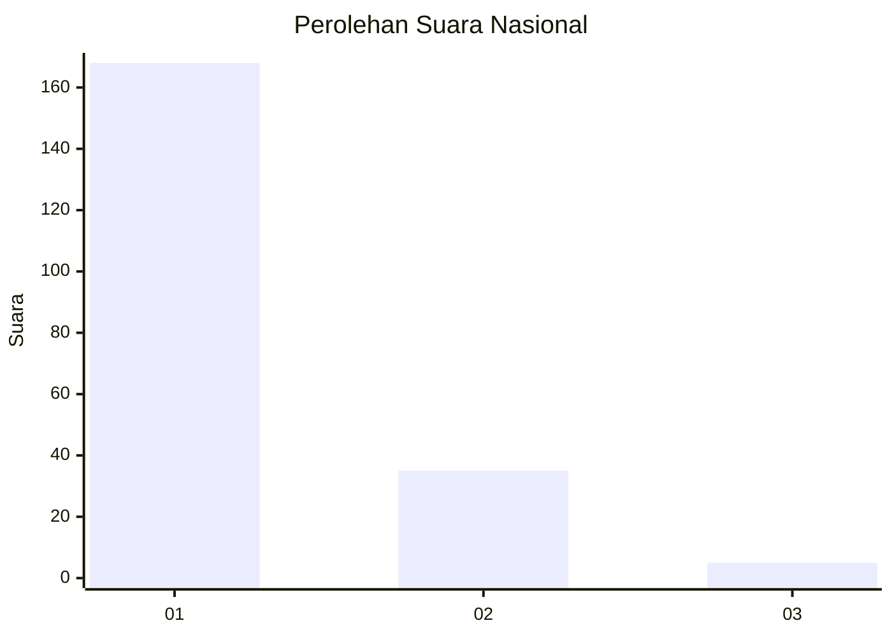
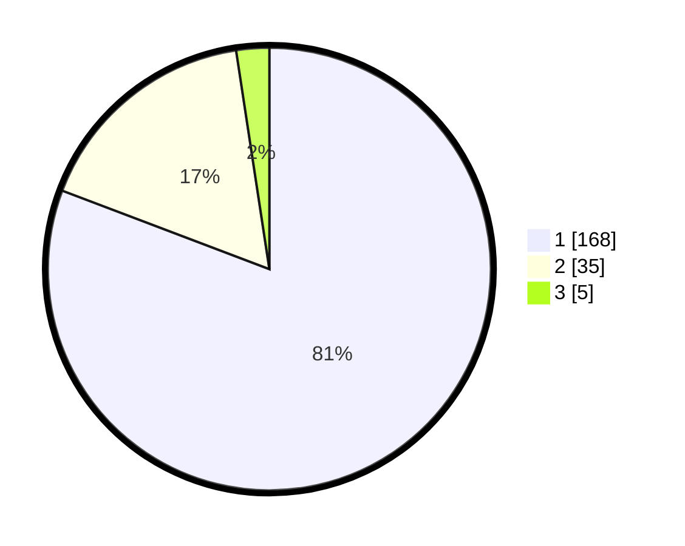

# Hasil

## Grafik

## Tabel

| No. | Nama Paslon    | Suara | Suara (raw) | Persentase |
|:--- |:-------------- | -----:| -----------:| ----------:|
| 1   | ANIES MUHAIMIN | 168   | [168][p-1]  | 80,77      |
| 2   | PRABOWO GIBRAN | 35    | [35][p-2]   | 16,83      |
| 3   | GANJAR MAHFUD  | 5     | [5][p-3]    | 2,40       |

[p-1]: https://github.com/gigit-pemilu/pemilu-2024/blob/main/pilpres/hitung-suara/sub/11-aceh/sub/71-kota-banda-aceh/sub/02-kuta-alam/sub/2009-lamdingin/sub/007-tps/sub/paslon-1.txt
[p-2]: https://github.com/gigit-pemilu/pemilu-2024/blob/main/pilpres/hitung-suara/sub/11-aceh/sub/71-kota-banda-aceh/sub/02-kuta-alam/sub/2009-lamdingin/sub/007-tps/sub/paslon-2.txt
[p-3]: https://github.com/gigit-pemilu/pemilu-2024/blob/main/pilpres/hitung-suara/sub/11-aceh/sub/71-kota-banda-aceh/sub/02-kuta-alam/sub/2009-lamdingin/sub/007-tps/sub/paslon-3.txt

## Foto C Plano

https://sirekap-obj-formc.kpu.go.id/3da0/pemilu/ppwp/11/71/02/20/09/1171022009007-20240214-232110--8bb4d971-5478-4263-bd23-ceac2ed88b66.jpg

https://sirekap-obj-formc.kpu.go.id/3da0/pemilu/ppwp/11/71/02/20/09/1171022009007-20240214-232404--276fc702-cdf7-40cf-a17d-2da39e6e9148.jpg

https://sirekap-obj-formc.kpu.go.id/3da0/pemilu/ppwp/11/71/02/20/09/1171022009007-20240214-232740--fa7b1b05-12f3-4f04-848f-81fa1d6ea703.jpg

## Metadata

| Key        | Value               |
| ---------- | ------------------- |
| Time Stamp | 2024-02-15 22:00:27 |

