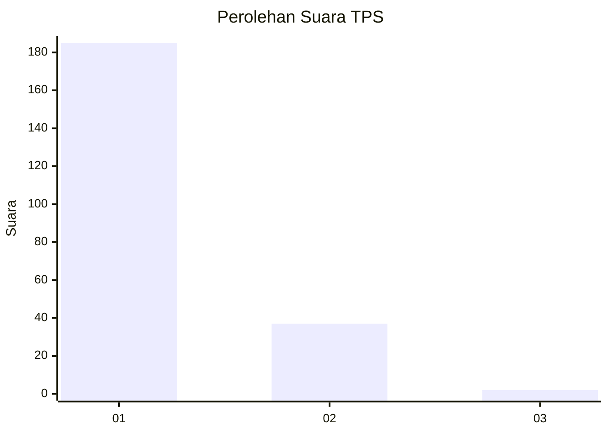
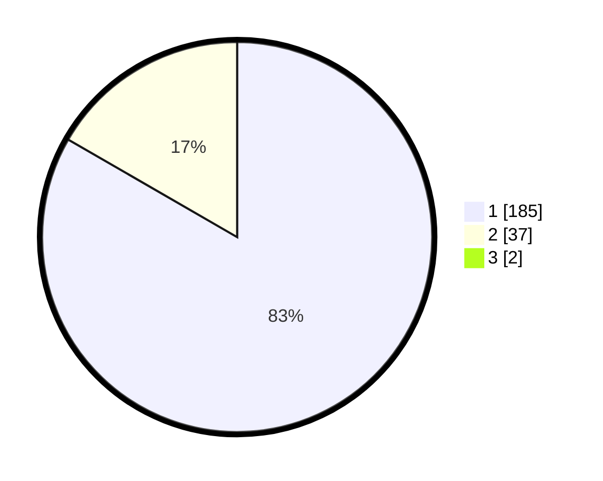

# Hasil

## Grafik

## Tabel

| No. | Nama Paslon    | Suara | Suara (raw) | Persentase |
|:--- |:-------------- | -----:| -----------:| ----------:|
| 1   | ANIES MUHAIMIN | 185   | [185][p-1]  | 82,59      |
| 2   | PRABOWO GIBRAN | 37    | [37][p-2]   | 16,52      |
| 3   | GANJAR MAHFUD  | 2     | [2][p-3]    | 0,89       |

[p-1]: https://github.com/gigit-pemilu/pemilu-2024-11-aceh/blob/main/pilpres/hitung-suara/sub/11-aceh/sub/71-kota-banda-aceh/sub/02-kuta-alam/sub/2010-lampulo/sub/004-tps/sub/paslon-1.txt
[p-2]: https://github.com/gigit-pemilu/pemilu-2024-11-aceh/blob/main/pilpres/hitung-suara/sub/11-aceh/sub/71-kota-banda-aceh/sub/02-kuta-alam/sub/2010-lampulo/sub/004-tps/sub/paslon-2.txt
[p-3]: https://github.com/gigit-pemilu/pemilu-2024-11-aceh/blob/main/pilpres/hitung-suara/sub/11-aceh/sub/71-kota-banda-aceh/sub/02-kuta-alam/sub/2010-lampulo/sub/004-tps/sub/paslon-3.txt

## Foto C Plano

https://sirekap-obj-formc.kpu.go.id/e6cc/pemilu/ppwp/11/71/02/20/10/1171022010004-20240214-211244--4052818d-47ef-4e53-8ef9-a26ec7c37b16.jpg

https://sirekap-obj-formc.kpu.go.id/e6cc/pemilu/ppwp/11/71/02/20/10/1171022010004-20240214-211430--5614ba60-6ca0-40c4-9efa-b49f022e6bb3.jpg

https://sirekap-obj-formc.kpu.go.id/e6cc/pemilu/ppwp/11/71/02/20/10/1171022010004-20240214-211530--05079313-922b-472b-81d4-458e2d056b32.jpg

## Metadata

| Key        | Value               |
| ---------- | ------------------- |
| Time Stamp | 2024-02-15 22:00:27 |

