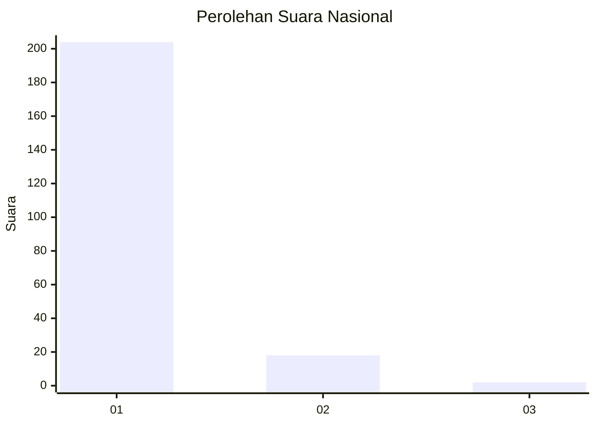
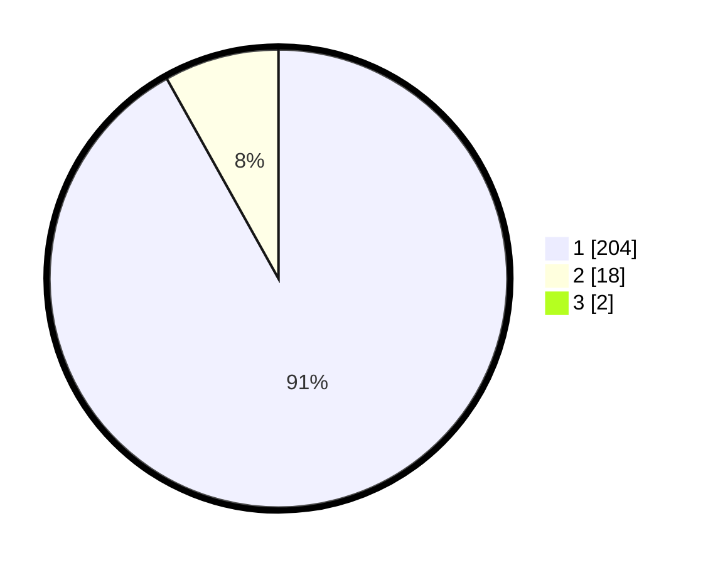

# Hasil

## Grafik

## Tabel

| No. | Nama Paslon    | Suara | Suara (raw) | Persentase |
|:--- |:-------------- | -----:| -----------:| ----------:|
| 1   | ANIES MUHAIMIN | 204   | [204][p-1]  | 91,07      |
| 2   | PRABOWO GIBRAN | 18    | [18][p-2]   | 8,04       |
| 3   | GANJAR MAHFUD  | 2     | [2][p-3]    | 0,89       |

[p-1]: https://github.com/gigit-pemilu/pemilu-2024/blob/main/pilpres/hitung-suara/sub/11-aceh/sub/71-kota-banda-aceh/sub/02-kuta-alam/sub/2010-lampulo/sub/009-tps/sub/paslon-1.txt
[p-2]: https://github.com/gigit-pemilu/pemilu-2024/blob/main/pilpres/hitung-suara/sub/11-aceh/sub/71-kota-banda-aceh/sub/02-kuta-alam/sub/2010-lampulo/sub/009-tps/sub/paslon-2.txt
[p-3]: https://github.com/gigit-pemilu/pemilu-2024/blob/main/pilpres/hitung-suara/sub/11-aceh/sub/71-kota-banda-aceh/sub/02-kuta-alam/sub/2010-lampulo/sub/009-tps/sub/paslon-3.txt

## Foto C Plano

https://sirekap-obj-formc.kpu.go.id/f138/pemilu/ppwp/11/71/02/20/10/1171022010009-20240215-213214--61c01b8d-b83f-43bc-8caf-dce56a353c5d.jpg

https://sirekap-obj-formc.kpu.go.id/f138/pemilu/ppwp/11/71/02/20/10/1171022010009-20240214-190711--856c62d7-6c4a-44f7-bf58-96135f9a20e4.jpg

https://sirekap-obj-formc.kpu.go.id/f138/pemilu/ppwp/11/71/02/20/10/1171022010009-20240214-190509--e278e730-0ed1-4b0b-a94a-e5764c5abffe.jpg

## Metadata

| Key        | Value               |
| ---------- | ------------------- |
| Time Stamp | 2024-02-15 22:00:27 |

