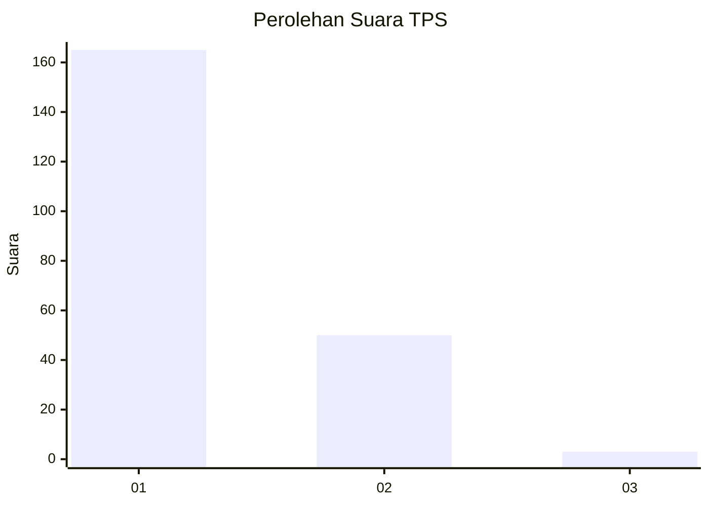
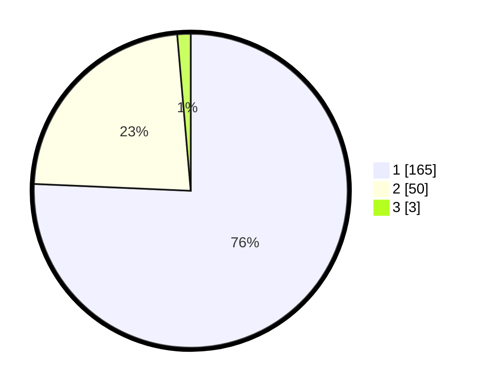

# Hasil

## Grafik

## Tabel

| No. | Nama Paslon    | Suara | Suara (raw) | Persentase |
|:--- |:-------------- | -----:| -----------:| ----------:|
| 1   | ANIES MUHAIMIN | 165   | [165][p-1]  | 75,69      |
| 2   | PRABOWO GIBRAN | 50    | [50][p-2]   | 22,94      |
| 3   | GANJAR MAHFUD  | 3     | [3][p-3]    | 1,38       |

[p-1]: https://github.com/gigit-pemilu/pemilu-2024-11-aceh/blob/main/pilpres/hitung-suara/sub/11-aceh/sub/71-kota-banda-aceh/sub/02-kuta-alam/sub/2011-lambaro-skep/sub/003-tps/sub/paslon-1.txt
[p-2]: https://github.com/gigit-pemilu/pemilu-2024-11-aceh/blob/main/pilpres/hitung-suara/sub/11-aceh/sub/71-kota-banda-aceh/sub/02-kuta-alam/sub/2011-lambaro-skep/sub/003-tps/sub/paslon-2.txt
[p-3]: https://github.com/gigit-pemilu/pemilu-2024-11-aceh/blob/main/pilpres/hitung-suara/sub/11-aceh/sub/71-kota-banda-aceh/sub/02-kuta-alam/sub/2011-lambaro-skep/sub/003-tps/sub/paslon-3.txt

## Foto C Plano

https://sirekap-obj-formc.kpu.go.id/a65b/pemilu/ppwp/11/71/02/20/11/1171022011003-20240215-053624--572db00a-b6eb-4acb-aeb0-488370526853.jpg

https://sirekap-obj-formc.kpu.go.id/a65b/pemilu/ppwp/11/71/02/20/11/1171022011003-20240215-053809--7e784c41-32b6-401d-b319-758bd155ea77.jpg

https://sirekap-obj-formc.kpu.go.id/a65b/pemilu/ppwp/11/71/02/20/11/1171022011003-20240215-054000--788bda01-bc6d-4334-afcb-fa5c94a87e1f.jpg

## Metadata

| Key        | Value               |
| ---------- | ------------------- |
| Time Stamp | 2024-02-15 15:00:29 |

