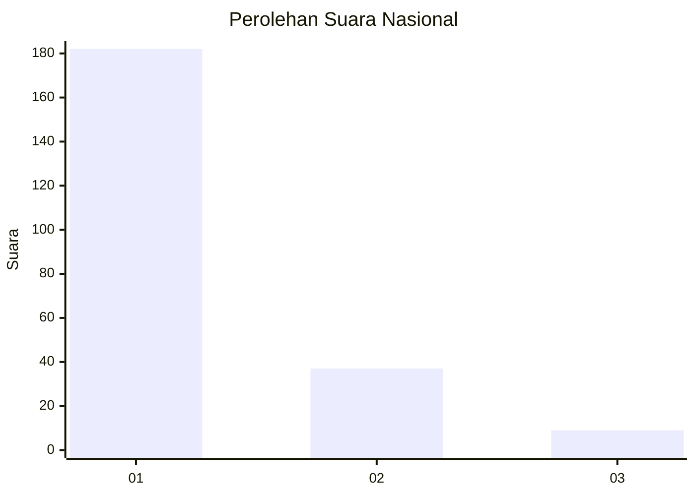
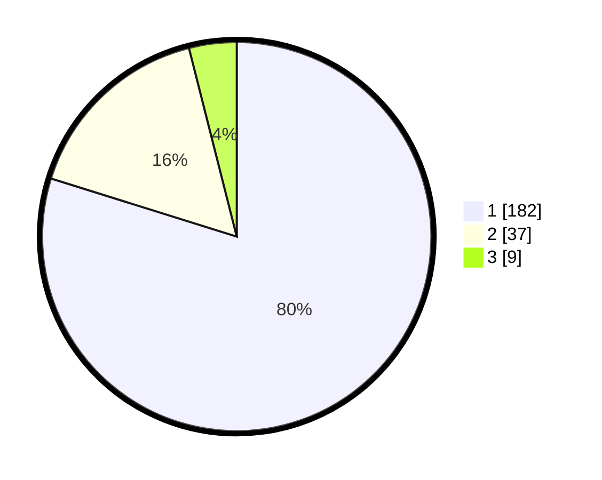

# Hasil

## Grafik

## Tabel

| No. | Nama Paslon    | Suara | Suara (raw) | Persentase |
|:--- |:-------------- | -----:| -----------:| ----------:|
| 1   | ANIES MUHAIMIN | 182   | [182][p-1]  | 79,82      |
| 2   | PRABOWO GIBRAN | 37    | [37][p-2]   | 16,23      |
| 3   | GANJAR MAHFUD  | 9     | [9][p-3]    | 3,95       |

[p-1]: https://github.com/gigit-pemilu/pemilu-2024/blob/main/pilpres/hitung-suara/sub/11-aceh/sub/71-kota-banda-aceh/sub/03-meuraxa/sub/2001-punge-jurong/sub/003-tps/sub/paslon-1.txt
[p-2]: https://github.com/gigit-pemilu/pemilu-2024/blob/main/pilpres/hitung-suara/sub/11-aceh/sub/71-kota-banda-aceh/sub/03-meuraxa/sub/2001-punge-jurong/sub/003-tps/sub/paslon-2.txt
[p-3]: https://github.com/gigit-pemilu/pemilu-2024/blob/main/pilpres/hitung-suara/sub/11-aceh/sub/71-kota-banda-aceh/sub/03-meuraxa/sub/2001-punge-jurong/sub/003-tps/sub/paslon-3.txt

## Foto C Plano

https://sirekap-obj-formc.kpu.go.id/6af5/pemilu/ppwp/11/71/03/20/01/1171032001003-20240220-101503--733c8e71-2470-4d13-beff-23f76e8e28a7.jpg

https://sirekap-obj-formc.kpu.go.id/6af5/pemilu/ppwp/11/71/03/20/01/1171032001003-20240220-102857--c6c94b37-9bb7-4ec7-8e4b-06c6059fb9dc.jpg

https://sirekap-obj-formc.kpu.go.id/6af5/pemilu/ppwp/11/71/03/20/01/1171032001003-20240220-102118--bfa429a8-9159-484c-903c-13f037debedd.jpg

## Metadata

| Key        | Value               |
| ---------- | ------------------- |
| Time Stamp | 2024-02-20 11:00:00 |

## DATA PEMILIH TETAP

Jumlah pemilih dalam DPT: **283**.
 * L: **140**.
 * P: **143**.

## DATA PENGGUNA HAK PILIH

Jumlah pengguna hak pilih dalam DPT: **211**.
 * L: **103**.
 * P: **108**.

Jumlah pengguna hak pilih dalam DPTb: **746**.
 * L: **2**.
 * P: **888**.

Jumlah pengguna hak pilih dalam DPK: **11**.
 * L: **7**.
 * P: **4**.

Jumlah pengguna hak pilih: **228**.
 * L: **112**.
 * P: **116**.

## JUMLAH SUARA SAH DAN TIDAK SAH

JUMLAH SELURUH SUARA SAH: **228**.

JUMLAH SUARA TIDAK SAH: **0**.

JUMLAH SELURUH SUARA SAH DAN SUARA TIDAK SAH: **228**.

